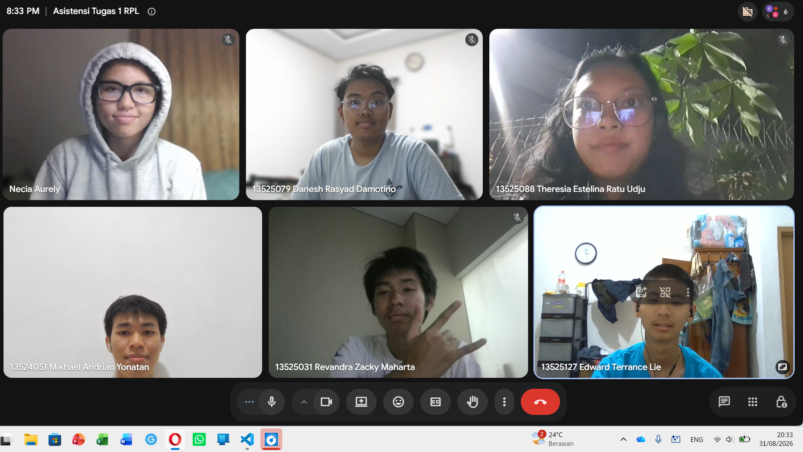

# Form Asistensi

## Tugas Besar IF2150 - Rekayasa Perangkat Lunak

| Informasi | Keterangan |
| --- | --- |
| **Hari** | Senin |
| **Tanggal** | 31/08/2026 |
| **Kelas** | K-01 |
| **Nomor Kelompok** | G-03  |
| **Nama Kelompok** | MAYOOOOOR  |
| **Nama Perangkat Lunak** | CariJasa  |
| **Dokumen** | K01_G03_Template1_TB  |

### Anggota Kelompok

| NIM | Nama |
|---|---|
| 13525031 | Revandra Zacky Maharta |
| 13525079 | Danesh Rasyad Damotino |
| 13525088 | Theresia Estelina Ratu Udju |
| 13525127 | Edward Terrance Lie |
| 13525130 | Necia Aurely Greva Dedevi |

### Catatan

| Catatan |
| --- |
| 1. Tujuan Utama RPL adalah mecari masalah yg mau ditekenin bukan implementasi, tapi fokus ke gimana kalian identifikasi masalah dan mendesainnya Oleh karena itu, DESAIN ADALAH JANTUNGNYA.  |
| 2. Buat Bab 1, Tambahin Daftar Pustaka di Bagian Referensi untuk data-data yang ditampilkan, biar terkonfirmasi sumbernya valid, Kalo semisal data empiris, tinggal masukin SS an terkait hal tersebut. Untuk fokus aplikasi kami fokus ke *digital services*|
| 3. Komentar dan Saran:
Batasan udah oke banget. Buat payment gateway-nya gausah beneran diimplementasiin, simulasi aja button gitu-gitu. Liat repo kelompok Indeks A (untuk deskripsi perangkat lunak) --> udh ngejelasin dari sudut pandang pengguna. Deskripsi seharusnya setelah mendefinisikan. --> di M2 ada spek lebih khusus|
| 4. Aktor dan Kebutuhan: utk developer ganti admin aja namanya. yg jadi aktor tuh bukan pengembang, tapi admin. developer gaada kepentingan dalam sistem solusi. kalo bisa blokir/hapus listing masalah bisa masuk. lebih ke "kira-kira si adminnya tuh ngapain di sini". nanti kalian bikin 3 interface. tabel ini akan sangat kepake. |
| 5. Warna samain aja (hitam putih). Baru fokus ke main content. Tolong mindsetnya: lebih baik ribet sekarang dibanding di tengah-tengah (pelajaran tahun lalu). Contoh: flow login/buat akun, pelacakan penipuan by admin (fitur report).
Bikin diagram baru aja (biar lebih detail), tapi tambahin keterangan.|
| 6. Deskripsi Aktivitas --> tiap node yg ada di model proses bisnis. tinggal mindahin. harus ngetrack ke user story yg mana (US). bakal kepake banget di M2.|
| 7. AI-Usage: sbenernya asisten gapapa-in sih pake AI yang penting dipahami. kasih contoh prompt, klo kepanjangan ..., validasi manusia -> bagian asumsi teknis misal bilang hanya 2/5 yang dipake. |

**Notes for this section:**  
*Catatan dapat dituliskan dalam bentuk paragraf atau poin-poin, disesuaikan saja.* 

## Dokumentasi

<!--  -->

  

  <i>Gambar 1. Dokumentasi kegiatan asistensi Milestone 1.</i>

