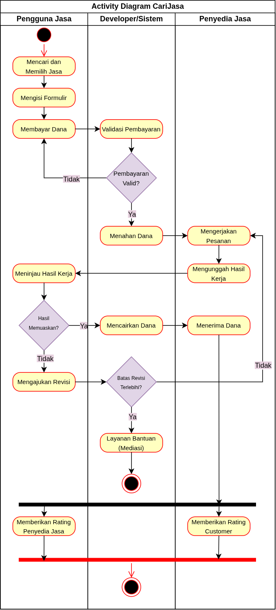

<h1>
IF2150 REKAYASA PERANGKAT LUNAK
 
TUGAS 1
 
TOPIC BRAINSTORMING
</h1>
 

## *CariJasa*

### Untuk: *[Nama Asisten]*

Dipersiapkan oleh:
| Informasi | Keterangan |
| --- | --- |
| Kelas | 01 |
| Kelompok | 03  |

| NIM | Nama |
|---|---|
| 13525031 | Revandra Zacky Maharta |
| 13525079 | Danesh Rasyad Damotino |
| 13525088 | Theresia Estelina Ratu Udju |
| 13525127 | Edward Terrance Lie |
| 13525130 | Necia Aurely Greva Dedevi |
---

 
 

# BAB 1: Analisis Permasalahan

## 1.1 Latar Belakang Masalah

 Perkembangan teknologi dan aktivitas masyarakat saat ini mendorong munculnya berbagai kebutuhan akan layanan jasa, baik untuk keperluan pribadi maupun pekerjaan. Kondisi tersebut dapat menjadi peluang bagi masyarakat untuk memperoleh penghasilan dengan memanfaatkan keterampilan yang dimiliki melalui penyediaan jasa kepada pihak yang membutuhkan, tanpa harus terikat pada hubungan kerja formal. Hal ini semakin relevan karena berdasarkan data dari Badan Pusat Statistik pada Februari 2026, masih terdapat 7,24 juta pengangguran di Indonesia dengan Tingkat Pengangguran Terbuka (TPT) sebesar 4,68%. Dengan tersedianya akses terhadap peluang kerja berbasis jasa, masyarakat yang belum memperoleh pekerjaan dapat memanfaatkan keterampilan yang dimilikinya untuk mendapatkan penghasilan yang layak. 

 Meskipun kebutuhan akan layanan jasa terus meningkat, masyarakat masih menemukan kendala dalam menemukan penyedia jasa yang sesuai dengan kebutuhan, biaya, lokasi, dan waktu yang dimiliki. Informasi mengenai jasa yang tersedia juga tersebar di berbagai platform, sehingga menghambat proses pencarian dan mengakibatkan penawaran jasa jadi tidak terstruktur. Oleh karena itu, platform digital dapat dimanfaatkan untuk mempertemukan pencari dan penyedia jasa dengan lebih efisien. 

CariJasa dikembangkan sebagai platform digital yang dapat membantu masyarakat dalam mencari dan menawarkan jasa dengan lebih terstruktur. Platform ini menyediakan informasi mengenai jasa, keterampilan, harga, lokasi, serta penilaian dari konsumen. Dengan adanya platform yang terintegrasi, penyedia jasa dapat menawarkan jasa yang dimilikinya sedangkan pencari jasa dapat menemukan layanan jasa apa yang dibutuhkan dengan lebih cepat. Pengembangan platform ini sejalan dengan Sustainable Development Goal (SDG) ke-8, yaitu Decent Work and Economic Growth. CariJasa diharapkan dapat mempermudah akses terhadap peluang pekerjaan berbasis keterampilan sekaligus mendukung terciptanya pekerjaan yang produktif dan pertumbuhan ekonomi inklusif.

## 1.2 Analisis Kondisi Saat Ini
### 1. Kondisi Pencari Jasa
Masyarakat yang membutuhkan jasa saat ini dapat mencari penyedia melalui berbagai media, seperti medsos, komunitas, rekomendasi orang lain, atau platform tertentu. Namun, informasi mengenai penyedia jasa tidak berada pada satu tempat yang sama. Pengguna harus mencari dan membandingkan informasi seperti harga, keterampilan, serta pengalaman penyedia secara manual.

### 2. Kondisi Penyedia Jasa
Para penyedia jasa dapat memanfaatkan media sosial atau platform tertentu untuk mempromosikan layanannya secara mandiri, tetapi jangkauan calon konsumen dapat bergantung pada visibilitas atau algoritma di platform tersebut. Para penyedia jasa juga merasa kesulitan untuk  menjangkau calon konsumen yang benar-benar membutuhkan jasanya.

### 3. Kondisi Platform yang Sudah Ada
Berdasarkan perbandingan dengan platform sejenis, Fiverr dan Upwork telah menyediakan fitur utama dalam marketplace jasa, seperti pencarian jasa, penawaran jasa, profil penyedia, portofolio, booking, rating dan review, filter berdasarkan kebutuhan dan harga, chat, request jasa, hingga pembayaran melalui platform. Kedua platform juga memungkinkan pengguna untuk mempertimbangkan berbagai penyedia jasa sebelum melakukan pemesanan. Namun, Fiverr dan Upwork memiliki cakupan pasar yang luas dan bersifat global. Sementara itu, CariJasa memiliki fokus pada pasar lokal Indonesia dan memiliki fitur *compare*, sehingga pengguna dapat membandingkan dua atau lebih jasa secara detil dan mudah.

---

# BAB 2: Analisis Solusi

## 2.1 Deskripsi Perangkat Lunak
Solusi perangkat lunak yang kami usulkan adalah sebuah platform pencarian jasa, yaitu CariJasa. CariJasa merupakan sebuah situs *web* responsif  sehingga dapat menyesuaikan tampilan pada perangkat pengguna. Alasan utama pemilihan situs web responsif adalah untuk mempermudah pengguna mengakses situs web menggunakan berbagai perangkat tanpa perlu mengunduh aplikasi terlebih dahulu. Situs web ini dirancang untuk menghubungkan pencari jasa dan penyedia jasa khususnya di bidang layanan digital. Dari sudut pandang pencari jasa, situs web ini dapat menyediakan akses untuk mencari kebutuhan jasa di bidang digital dengan mudah, seperti jasa pemrograman, penyuntingan video, desain grafis, dan sebagainya yang termasuk dalam *digital services*. Sementara itu, bagi penyedia jasa, situs web ini dapat digunakan sebagai wadah untuk menampilkan portofolio karya, membangun reputasi, mendapatkan pengakuan, serta memperoleh penghasilan. Pada situs web ini, pencari jasa dan penyedia jasa dapat melakukan seluruh proses transaksi pada satu platform yang sama. Pengguna dapat melakukan pemesanan, mendiskusikan rincian jasa, hingga menyelesaikan pembayaran tanpa perlu beralih ke platform lain. Pencari jasa juga dapat menemukan penyedia jasa yang sesuai melalui fitur penyaringan berdasarkan anggaran yang dimiliki dan keahlian yang dibutuhkan. Selain itu, pengguna juga dapat memberikan ulasan maupun membaca ulasan dari pengguna lain. Nilai unik yang membedakan CariJasa dengan solusi yang sudah ada adalah fokus dan model interaksi platformnya. Berbeda dengan platform yang mencampurkan jasa fisik dan digital, CariJasa secara spesifik berfokus pada layanan digital. Oleh karena itu, alur, tampilan, dan interaksi pada situs web ini dirancang khusus untuk memenuhi kebutuhan industri kreatif dan teknologi digital. Selain itu, CariJasa juga dirancang untuk ekosistem dan pasar lokal sehingga lebih ramah dan relevan terhadap pengguna di Indonesia. 

## 2.2 Asumsi dan Batasan
### 2.2.1 Asumsi dari sisi pengguna : 
#### Tingkat Kemampuan Pengguna
- Pengguna diasumsikan sudah terbiasa mengoperasikan situs web standar seperti, OTP, *login* menggunakan google, formulir digital, pembayaran secara digital, dan proses mengunggah dokumen.
- Pengguna diasumsikan memiliki dan familiar media pembayaran digital, seperti QRIS, dompet digital, maupun M-Banking.
#### Perangkat dan/atau Infrastruktur Pengguna 
- Pengguna diasumsikan memiliki perangkat yang mendukung peramban *web* modern.
- Pengguna diasumsikan memiliki internet dengan kecepatan dan latensi yang stabil untuk proses streaming/upload media yang diperlukan.
#### Perilaku Pengguna 
- Pengguna diasumsikan memberikan data berupa identitas, maupun deskripsi jasa yang valid, bukan data palsu yang menyebabkan misinformasi.
- Pengguna diasumsikan memahami workflow yang harus diikuti dalam memesan jasa dan kooperatif dalam pembelian jasa. 
- Pengguna diasumsikan menjaga kredensial dan login aplikasi dengan baik dan benar.
- Penjual memiliki kemampuan dan portofolio yang mencukupi sebelum menawarkan jasa kepada pengguna.
- Penjual memahami workflow laman, termasuk transaksi, proses permintaan jasa, revisi, dan konfirmasi hasil pekerjaan.
- Diasumsikan penjual dan pembeli aktif dalam berkomunikasi melalui platform yang disediakan dalam proses pengerjaan dan revisi dalam penggunaan jasa.
- Diasumsikan portofolio yang dibuat penjual tetap berdasarkan pada keaslian dan legalitas baik secara hukum, maupun etika.
- Pengguna diasumsikan memercayai dan menyetujui pihak CariJasa sebagai pihak penengah dalam proses transaksi dari penahanan dana dari pembayaran di sisi pengguna hingga pencairan dana saat pesanan terkonfirmasi selesai.
- Penjual diasumsikan memiliki komitmen untuk mengerjakan dan menyelesaikan pesanan dan layanan sesuai deadline dan perjanjian yang sudah disetujui
- Penjual diasumsikan dapat menentukan harga layanan yang sesuai dengan kemampuan secara mandiri dan masuk akal.
- Pembeli diasumsikan aktif dalam meninjau dan meminta revisi sesuai waktu yang telah diberikan oleh sistem. 

### 2.2.2 Asumsi dari sisi pengerjaan teknis perangkat lunak
- Media penyimpanan baik lokal ataupun *cloud* diasumsikan memiliki kapasitas yang mencukupi dan mendukung request pengguna, serta menjamin akses baca dan tulis untuk berkas portofolio, *brief* pengguna, dan dokumen transaksi.
- Diasumsikan informasi kredensial yang digunakan telah dienkripsi saat informasi ditransmisikan dari situs web menuju *server*.

### 2.2.3 Batasan dan Ruang Lingkup
#### Batasan regulasi/hukum :
- Sistem yang digunakan harus menjamin keamanan data, kredensial pengguna, informasi transaksi, *brief* dan konten yang dihasilkan, serta komunikasi antar pengguna. Hal ini ditujukan untuk menjamin data pengguna agar tidak terekspos ke publik tanpa perizinan yang sah.
- Sistem harus memfasilitasi pengguna terutama pembeli dalam mengajukan revisi dengan jumlah batas yang wajar sehingga pengguna mendapatkan kualitas terbaik dari uang yang dikeluarkan.
- Sistem hanya berfungsi sebagai perantara yang menghubungkan penjual jasa dan pembeli. Segala bentuk orisinalitas portofolio, karya, dan hasil yang diberikan ditanggungkan kepada masing-masing penjual.
#### Keterbatasan sumber daya 
- Waktu *development* yang terbatas karena dilakukan dalam proses perkuliahan sebagai tugas besar.
- Ketiadaan biaya atau anggaran yang diberikan dalam melakukan *development*.
- Penggunaan server atau infrastruktur *deployment* gratis.
- Keterbatasan jumlah anggota dan kapasitas teknis tim yang melakukan *development*.
- Keterbatasan pengetahuan terkait rekayasa perangkat lunak bagi beberapa anggota.

#### Ruang lingkup solusi :  
- Sistem hanya terbatas pada sirkulasi pembayaran menggunakan uang  *virtual* tanpa adanya sirkulasi uang ril di dalam aplikasi.
- Sistem tidak menyediakan layanan customer service secara real time selama 24 jam, layanan customer service hanya dibatasi pada pengajuan tiket atau formulir.
- Sistem hanya menyediakan komunikasi langsung secara teks, tidak mendukung modul komunikasi dalam bentuk video, maupun audio.
- Sistem hanya menyediakan beberapa jasa pada kategori utama dalam penawaran jasa.

---

# BAB 3: Spesifikasi Kebutuhan dan Proses Bisnis

## 3.1 Identifikasi Aktor
| Aktor | Deskripsi |
| :--: | :-- |
| Penyedia Jasa | Memanfaatkan keterampilan yang dimilikinya untuk menawarkan layanan digital tanpa adanya hubungan kerja formal. Penyedia jasa menampilkan portofolio, menentukan harga, serta mendiskusikan dan menyelesaikan pesanan secara mandi. |
| Pengguna Jasa | Membutuhkan layanan digital untuk kebutuhan pribadi maupun pekerjaan. Pengguna jasa menggunakan platform untuk mencari penyedia jasa (berdasarkan kriteria spesifiknya), melakukan pemesanan serta pembayaran digital, mengajukan revisi, dan memberikan ulasan. |
| Admin | Pengelola operasional situs yang bertugas memantau aktivitas pengguna dan interaksinya, memberi respons pada pengaduan dari pengguna, menindaklanjuti pengaduan dengan memblokir atau menghapus akun, serta bertindak sebagai mediator jika terjadi konflik antara pengguna jasa dengan penyedia jasa. |

## 3.2 Kebutuhan Pengguna Awal
| ID | Aktor | Kebutuhan / Aktivitas | Tujuan / Nilai |
| :--- | :--- | :--- | :--- |
| US-01 | Penyedia Jasa | Menampilkan portofolio dan menentukan harga layanan. | Mempromosikan keahlian dan memperoleh penghasilan. |
| US-02 | Penyedia Jasa | Berinteraksi dengan pencari jasa dan mengirimkan hasil jasa. | Menyelesaikan pesanan dan membangun reputasi. |
| US-03 | Pengguna Jasa | Mencari dan menyaring jasa berdasarkan keahlian serta *budget*. | Menemukan layanan yang sesuai dengan kriteria kebutuhan. |
| US-04 | Pengguna Jasa | Melakukan pemesanan dan pembayaran digital langsung di platform. | Bertransaksi tanpa harus berpindah ke aplikasi lain. |
| US-05 | Pengguna Jasa | Berkomunikasi mengenai *detail* jasa dan mengajukan revisi pekerjaan. | Memastikan hasil akhir sesuai dengan pesanan. |
| US-06 | Pengguna Jasa | Membaca dan memberikan ulasan serta penilaian. | Menilai kualitas penyedia jasa dan membantu pengguna lain. |
| US-07 | Admin | Memantau aktivitas dan merespons pengaduan dari pengguna. | Menjaga keamanan dan kenyamanan penggunaan platform. |
| US-08 | Admin | Memblokir atau menghapus akun berdasarkan pengaduan. | Menindaklanjuti pelanggaran untuk menjaga keberlanjutan platform. |
| US-09 | Admin | Menjadi mediator konflik antara pengguna jasa dan penyedia jasa. | Menyelesaikan permasalahan transaksi secara adil. |

## 3.3 Model Proses Bisnis

<i>Gambar 3.1 Activity Diagram Sederhana dari CariJasa</i>

 

## Daftar Pustaka