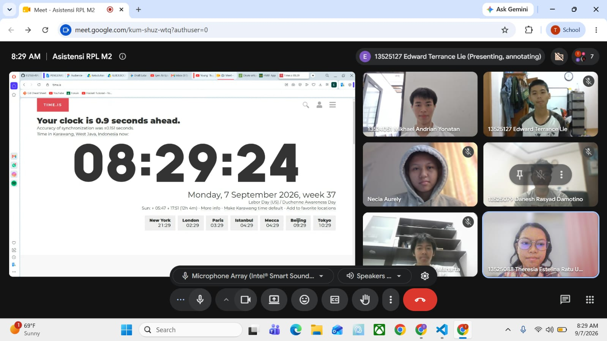

# Form Asistensi

## Tugas Besar IF2150 - Rekayasa Perangkat Lunak

| Informasi | Keterangan |
| --- | --- |
| **Hari** | Senin |
| **Tanggal** | 07/08/2026 |
| **Kelas** | K-01 |
| **Nomor Kelompok** | G-03  |
| **Nama Kelompok** | MAYOOOOOR  |
| **Nama Perangkat Lunak** | CariJasa |
| **Dokumen** | K01_G03_RG.md  |

### Anggota Kelompok

| NIM | Nama |
| --- | --- |
| 13525031 | Revandra Zacky Maharta |
| 13525079 | Danesh Rasyad Damotino |
| 13525088 | Theresia Estelina Ratu Udju |
| 13525127 | Edward Terrance Lie |
| 13525130 | Necia Aurely Greva Dedevi |

### Catatan

| Catatan |
| --- |
| 1. Deskripsi umum sistem berisi tentang alur, harapan, dan ekspetasi tentang apa yang mau dibuat. Referensinya bisa diambil dari latar belakang.  |
| 2. Deskripsi pengguna perangkat lunak sudah baik namun perlu menambahkan karateristik khususnya di poin 2.3. Karakteristik bisa berkaitan dengan UI/UX dan bentuknya mirip seperti *user story* tetapi apa yang membedakan user tersebut dengan user lain. |
| 3. User story bisa *atomic*, yaitu pada satu *user story* hanyak bisa diekstrak menjadi satu fitur. |
| 4. Untuk dapat mencapai goal perlu melakukan aktivitas (general) kemudian dapat didekomposisikan menjadi *action*.  |
| 5. Pada deskripsi aktivitas, aktivitas yang dituliskan harus menggunakan kata kerja aktif dan harus *atomic*. Kemudian melengkapi profil bukanlah suatu aktivitas, namun hal tersebut merupakan bentuk *action*. Deskripsi aktivitas admin dan sistem dipisah. |
| 6. Pada pemetaan kebutuhan, tiap aktivitas minimal memiliki satu sistem. Jenis kebutuhan bisnis tidak wajib namun boleh ada sebagai pemberi regulasi.   |
| 7. Satu ID aktivitas bisa memiliki lebih dari satu ID kebutuhan. |
| 8. Pada bagian kebutuhan fungsional, ikuti format EARS sesuai slide ppt perkuliahan. |
| 9. Kebutuhan fungsional dapat mencakup beberapa R. |
| 10. Kebutuhan fungsional harus atomic, artinya satu kebutuhan harus spesifik kebutuhan itu saja. |
| 11. Untuk sementara KF banyak tidak apa tapi pada fase selanjutnya bisa melakukan grouping KF yang mirip. |
| 12. Pada kebutuhan non fungsional sebaiknya mengikuti format juga. |

**Notes for this section:**  
*Catatan dapat dituliskan dalam bentuk paragraf atau poin-poin, disesuaikan saja.* 

## Dokumentasi

<!--  -->

  

  <i>Gambar 1. Dokumentasi kegiatan asistensi milestone 2.</i>

