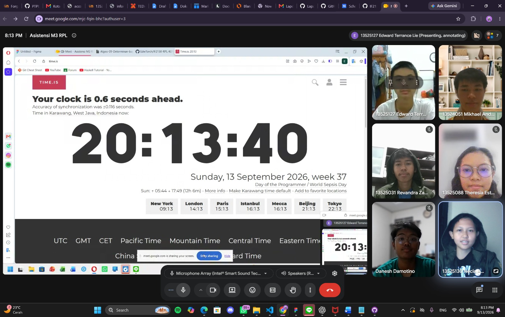

# Form Asistensi

## Tugas Besar IF2150 - Rekayasa Perangkat Lunak

| Informasi | Keterangan |
| --- | --- |
| **Hari** | Minggu |
| **Tanggal** | 13/09/2026 |
| **Kelas** | K-01 |
| **Nomor Kelompok** | G-03  |
| **Nama Kelompok** | MAYOOOOOR  |
| **Nama Perangkat Lunak** | CariJasa |
| **Dokumen** | K01_G03_UC.md  |

### Anggota Kelompok

| NIM | Nama |
| --- | --- |
| 13525031 | Revandra Zacky Maharta |
| 13525079 | Danesh Rasyad Damotino |
| 13525088 | Theresia Estelina Ratu Udju |
| 13525127 | Edward Terrance Lie |
| 13525130 | Necia Aurely Greva Dedevi |

### Catatan

| Catatan |
| --- |
| 1. Milestone 2 dan Kebutuhan Fungsional (KF) sudah bagus.  |
| 2. Beberapa KF dapat dijadikan satu Use Case (UC). |
| 3. Use case adalah fitur yang dapat digunakan pengguna pada *software*. Gunakan kata kerja aktif. |
| 4. Skenario tidak usah berlebihan, *include* yang esensial saja. |
| 5. Komponen Use Case Diagram yang benar adalah inlude dan extend, bukan exclude (kaidah ITB). |
| 6. Include: ketika UC A jalan, UC B jalan. |
| 7. Extend: ketika UC A jalan, UC B belum tentu jalan (opsional). Contoh: melihat detail jasa. |
| 8. Seluruh node yang ada pada Use Case Diagram adalah UC yang telah dibuat. |

**Notes for this section:**  
*Catatan dapat dituliskan dalam bentuk paragraf atau poin-poin, disesuaikan saja.* 

## Dokumentasi

<!--  -->

  

  <i>Gambar 1. Dokumentasi kegiatan asistensi.</i>

