<h1>
IF2150 REKAYASA PERANGKAT LUNAK
 
TUGAS 4
 
CLASS DIAGRAM
</h1>
 

## CariJasa

### Untuk: Kak Mikhael Andrian Yonatan

Dipersiapkan oleh:
| Informasi | Keterangan |
| :--- | :--- |
| Kelas | K-01 |
| Kelompok | G-03  |

| NIM | Nama |
|---|---|
| 13525031 | Revandra Zacky Maharta |
| 13525079 | Danesh Rasyad Damotino |
| 13525088 | Theresia Estelina Ratu Udju |
| 13525127 | Edward Terrance Lie |
| 13525130 | Necia Aurely Greva Dedevi |
---

## Daftar Perubahan

| Revisi | Deskripsi |
| :--- | :--- |
| Aktor UC09 | Penyedia Jasa --> Pengguna Jasa (Typo) |
| *B* |  |
| *C* |  |
| ... |  |

 
 

# BAB 1: Deskripsi Perangkat Lunak

Tuliskan overview perangkat lunak dalam narasi yang dapat memberikan gambaran tentang konteks perangkat lunak aplikasi Anda.

Pada bagian ini, Anda diperbolehkan untuk menyalin dari dokumen sebelumnya.
---
CariJasa adalah perangkat lunak berbasis web responsif yang dirancang untuk memfasilitasi transaksi jasa digital di Indonesia, seperti pemrograman, penyuntingan video, desain grafis, copywriting, dll. Platform ini melibatkan tiga aktor utama, yaitu Pembeli, Penyedia Jasa, dan Admin Sistem. Alur sistem dimulai dari pendaftaran akun dan pemilihan peran oleh pengguna. Pembeli dapat mencari jasa berdasarkan kategori serta berdiskusi dengan Penyedia Jasa melalui fitur *live chat* sebelum membuat pesanan. Setelah pemesanan dilakukan, Penyedia Jasa menerima notifikasi dan mengonfirmasi ketersediaan untuk memproses pekerjaan. Selanjutnya, hasil pekerjaan diserahkan melalui platform untuk ditinjau oleh Pembeli, baik untuk pengajuan revisi maupun konfirmasi penyelesaian proyek. Alur diakhiri dengan penerusan dana pembayaran kepada Penyedia Jasa oleh sistem. Dalam hal ini,  Admin bertindak sebagai pengawas seluruh transaksi dan penanganan kendala layanan yang dialami pengguna. CariJasa difokuskan untuk membantu ekosistem dan pasar lokal sehingga lebih ramah dan relevan terhadap pengguna jasa di Indonesia

---

# BAB 2: Kebutuhan Fungsional

## 2.1 Kebutuhan Fungsional

Salin ulang seluruh Kebutuhan Fungsional (KF) yang telah dirumuskan pada dokumen sebelumnya, lengkap dengan ID KF, ID Kebutuhan (mengacu ke ID pada tabel Pemetaan Kebutuhan di dokumen *Requirement Gathering*), dan penjelasannya.

Pada bagian ini, Anda diperbolehkan untuk menyalin dari dokumen sebelumnya.

 ***Catatan***: *Kebutuhan ditulis mengikuti pola EARS. Pada contoh di bawah, sebagian besar KF dipicu oleh satu aksi pelanggan, sehingga memakai pola event-driven "Ketika ⟨pemicu⟩, sistem harus ⟨respons⟩".*

Tabel 2.1. Daftar Kebutuhan Fungsional

| ID KF | ID Kebutuhan | Penjelasan |
| :--- | :--- | :--- |
| KF01 | R01, R02, R03, R04, R31, R32 | Ketika pengguna mengirimkan formulir registrasi dengan data valid, sistem harus menyimpan informasi data diri pengguna ke dalam basis data | 
| KF02 | R05, R06,R34, R35, R56 | Ketika pengguna memasukkan kredensial login, sistem harus mengautentikasi kesesuaian email dan kata sandi |
| KF03 | R31, R32, R33 | Ketika penyedia jasa mengunggah data portofolio dan lampiran pekerjaan, sistem harus menyimpannya ke dalam basis data |
| KF04 | R33 | Sistem harus menampilkan data portofolio dan proyek yang telah diunggah pada halaman profil penyedia jasa |
| KF05 | R38,R39 | Ketika penyedia jasa mengunggah penawaran jasa baru, sistem harus menyimpan dan menampilkannya sesuai kategori yang dipilih |
| KF06 | R07, R08 | Ketika pengguna memasukkan kata kunci dan/atau memilih kategori, sistem harus menampilkan daftar jasa yang relevan |
| KF07 | R09, R10 | Ketika pengguna menggunakan filter, sistem harus menyaring hasil pencarian berdasarkan kriteria tambahan yang digunakan |
| KF08 | R11,R12 | Ketika pencari jasa memilih suatu listing, sistem harus menampilkan informasi detail terkait jasa tersebut |
| KF09 | R15, R16 | Sistem harus menyediakan fitur *(bookmark/favorite)* pada setiap postingan  jasa |
| KF10 | R15, R16 | Ketika pengguna menekan fitur simpan pada suatu jasa, sistem harus menyimpannya ke dalam daftar jasa tersimpan milik pengguna |
| KF11 | R15, R16 | Sistem harus dapat menampilkan daftar jasa yang telah disimpan pada halaman khusus, seperti "Jasa yang tersimpan" |
| KF12 | R15,R16 | Ketika pengguna membatalkan tanda simpan pada suatu jasa, sistem harus menghapus jasa tersebut dari daftar tersimpan |
| KF13 | R17, R18 | Sistem harus menyediakan fitur pesan instan (*instant messaging*) antara calon pembeli dan penyedia jasa |
| KF14 | R17, R18 | Ketika terdapat pesan baru yang masuk, sistem harus mengirimkan notifikasi kepada penerima pesan |
| KF15 | R17, R18 | Sistem harus dapat menampilkan riwayat pesan antara pembeli dan penyedia jasa |
| KF16 | R13,R14 | Ketika pengguna memilih fitur perbandingan, sistem harus menampilkan perbandingan harga, rating, dan informasi teknis antar dua postingan jasa |
| KF17 | R19,R20 | Ketika pengguna mengirimkan formulir pemesanan, sistem harus membuat data pesanan baru |
| KF18 | R19,R20 | Sistem harus memproses urutan langkah pemesanan jasa oleh pembeli|
| KF19 | R21,R22 | Ketika pembeli diarahkan ke halaman pembayaran, sistem harus menampilkan opsi metode pembayaran digital yang tersedia |
| KF20 | R21, R22, R23 | Ketika pembeli mengonfirmasi metode pembayaran yang dipilih, sistem harus memvalidasi status transaksi pembayaran tersebut |
| KF21 | R43 | Ketika terdapat pesanan baru, sistem harus mengirimkan notifikasi kepada penyedia jasa |
| KF22 | R44,R45 | Ketika penyedia jasa menerima atau menolak pesanan, sistem harus memperbarui status pesanan sesuai keputusan tersebut |
| KF23 | R44, R45 | Bila pesanan ditolak atau dibatalkan oleh penyedia jasa, sistem harus memproses pengembalian dana (*refund*) kepada pembeli. |
| KF24 | R22, R23 | Sistem harus menyimpan dan menampilkan riwayat pembelian jasa beserta statusnya pada akun pembeli maupun penyedia jasa |
| KF25 | R36, R37, R49 | Ketika penyedia jasa menyerahkan hasil pekerjaan, sistem harus meneruskan dan menampilkannya pada layar pembeli |
| KF26 | R22, R23, R40, R41, R42 | Ketika pembeli mengonfirmasi penerimaan jasa tanpa revisi tambahan, sistem harus memperbarui status pesanan menjadi "Selesai"  |
| KF27 | R24, R50 | Selama batas maksimal revisi (3-5 kali) belum tercapai, sistem harus memfasilitasi pengajuan permintaan revisi pekerjaan |
| KF28 | R51, R52 | Ketika pesanan telah dikonfirmasi selesai, sistem harus mencairkan dana pembayaran tertahan ke penyedia jasa |
| KF29 | R25, R26, R53, R54 | Ketika pengguna mengirimkan formulir aduan pelaporan, sistem harus membuat tiket laporan kendala (*ticketing*) baru. |
| KF30 | R27, R28,R29 | Ketika pembeli mengirimkan teks ulasan dan *rating*, sistem harus memproses dan menyimpannya ke listing jasa terkait |
| KF31 | R27, R28,R29 | Ketika pengunjung melihat listing jasa, sistem harus menampilkan daftar ulasan yang telah diberikan oleh pembeli sebelumnya  |
| KF32 | R58 | Ketika admin memberikan tanggapan atau mengubah status pada tiket aduan, sistem harus menyimpannya dan menampilkannya kepada pihak pelapor |
| KF33 | R59 | Ketika admin membuka dasbor peninjauan, sistem harus menampilkan log aktivitas pengguna dan berkas bukti laporan |
| KF34 | R60, R61, R62 | Ketika admin menetapkan sanksi teguran, sistem harus mengirimkan notifikasi peringatan pelanggaran ke akun pengguna |
| KF35 | R60, R61, R62 | Ketika admin menetapkan sanksi pembekuan, sistem harus menonaktifkan sementara fitur transaksional pada akun tersebut |
| KF36 | R60, R61, R62 | Ketika admin menetapkan sanksi pemblokiran, sistem harus mencabut hak akses *login* pengguna tersebut ke dalam platform |
| KF37 | R63, R64 | Sistem harus menyediakan antarmuka ruang mediasi (obrolan) khusus antara admin, pembeli, dan penyedia jasa untuk menyelesaikan sengketa pesanan |
| KF38 | R63, R64| Ketika admin menetapkan keputusan mediasi, sistem harus memproses eksekusi penerusan dana atau pengembalian dana sesuai perintah admin |

---

# BAB 3: Model Use Case

## 3.1 Identifikasi Aktor

Tuliskan kembali daftar aktor yang terlibat dan deskripsi perannya dalam perangkat lunak (P/L). Deskripsi peran harus menjelaskan wewenang aktor tersebut dalam perangkat lunak. Perlu diingat bahwa aktor yang dimaksud adalah pengguna yang berinteraksi langsung dengan P/L. Komponen seperti database, payment gateway, atau library bukan aktor.

Pada bagian ini, Anda diperbolehkan untuk menyalin dari dokumen sebelumnya.

| Aktor | Deskripsi |
| :--- | :--- |
| Penyedia Jasa | Memanfaatkan keterampilan yang dimilikinya untuk menawarkan layanan digital tanpa adanya hubungan kerja formal. Penyedia jasa menampilkan portofolio, mempromosikan jasa, menentukan harga, serta bernegosiasi dan menyelesaikan pesanan (termasuk mengirim draf dan revisi) secara mandiri. Aktor ini juga dapat melaporkan pengguna jasa yang bermasalah. |
| Pengguna Jasa | Membutuhkan layanan digital untuk kebutuhan pribadi maupun pekerjaan. Pengguna jasa menggunakan platform untuk mencari penyedia jasa berdasarkan kriteria spesifiknya (melalui filter, perbandingan, dan fitur simpan jasa), bernegosiasi, melakukan pemesanan serta pembayaran digital, mengajukan revisi, memberikan ulasan, dan mengajukan tiket pengaduan kepada admin. Pengguna jasa dapat ditanyakan mengenai tujuan penggunaan aplikasinya pada saat awal login sehingga menerima rekomendasi jasa dan tampilan antarmuka yang disesuaikan dengan preferensinya. |
| Admin | Pengelola operasional situs yang bertugas memantau aktivitas pengguna dan interaksinya. Admin memberikan respons pada tiket pengaduan, menindaklanjuti pelanggaran sesuai SOP (seperti memblokir atau menghapus akun), bertindak sebagai mediator jika terjadi konflik transaksi, serta mengelola alur keuangan. Admin memiliki hak akses eksklusif terhadap *dashboard* yang mencakup seluruh rekapitulasi data, log aktivitas, dan tiket pengaduan. |

## 3.2 Identifikasi Use Case

Use case berfungsi untuk mendeskripsikan interaksi aktor-aktor yang terlibat dengan sistem. Isi daftar use case dan deskripsi singkatnya dalam tabel di bawah.

Pada bagian ini, Anda diperbolehkan untuk menyalin dari dokumen sebelumnya.

| ID UC | Nama Use Case | Deskripsi Singkat | Aktor Terlibat | ID KF Terkait |
| :--- | :--- | :--- | :--- | :--- |
| UC01 | Melakukan Registrasi Akun | Penyedia & Pengguna Jasa mengisi dan mengirimkan formulir registrasi terkait data diri | User Penyedia & Pengguna Jasa | KF01 |
| UC02 | Melakukan *Login* | Pengguna Jasa atau Penyedia Jasa atau Admin melakukan login menggunakan kredensial akun pengguna | Pengguna Jasa, Penyedia Jasa, Admin | KF02 |
| UC03 | Mengisi Portofolio | Penyedia Jasa mengisi portofolio dan lampiran pengalaman kerja | Penyedia Jasa  | KF03, KF04 |
| UC04 | Mengunggah Penawaran Jasa | Penyedia Jasa mengunggah jasa yang ia tawarkan | Penyedia Jasa | KF05 |
| UC05 | Mencari Penawaran Jasa | Pengguna Jasa melakukan pencarian jasa dengan memasukkan kata kunci, menggunakan filter, sekaligus dapat membandingkan jasa yang ditawarkan | Pengguna Jasa | KF06, KF07,  KF16 |
| UC06 | Melihat Informasi Jasa| Pengguna dapat melihat informasi detail terkait jasa yang dipilih | Pengguna Jasa | KF08 |
| UC07 | Menggunakan *Bookmark* | Pengguna Jasa menggunakan *bookmark* untuk menyimpan jasa yang menarik | Pengguna Jasa | KF09, KF10, KF11, KF12 |
| UC08 | Melakukan Komunikasi | Pengguna Jasa dan Penyedia Jasa dapat berkomunikasi melalui *chat* instan untuk bernegosiasi, bertanya, ataupun berkoordinasi dalam pemesanan jasa | Pengguna Jasa, Penyedia Jasa, Admin | KF13, KF14, KF15 |
| UC09 | Melakukan Pemesanan Jasa | Pengguna mengisi formulir pemesanan, memilih metode, dan menyelesaikan  transaksi | Pengguna Jasa | KF17, KF18, KF19, KF20 |
| UC10 | Melakukan Konfirmasi Pesanan | Penyedia Jasa menerima notifikasi pemesanan, lalu melakukan konfirmasi (mengambil/tidak mengambil) | Penyedia Jasa | KF21, KF22, KF23, KF24 |
| UC11 | Menyerahkan hasil Pekerjaan | Setelah Penyedia Jasa menyelesaikan hasil pekerjaan, Penyedia Jasa mengirimkannya melalui platform yang sudah disediakan | Penyedia Jasa | KF25 |
| UC12 | Mengonfirmasi Hasil Pekerjaan | Pengguna Jasa melakukan konfirmasi terkait penerimaan jasa. Jika pekerjaan sudah sesuai, dilanjutkan dengan penyelesaian pemesanan seperti pencairan dana. Jika belum sesuai, Pengguna Jasa dapat mengajukan revisi terkait pekerjaan yang diberikan sesuai batas yang diberikan dan Penyedia Jasa harus melakukan revisi sesuai dengan permintaan Pengguna Jasa | Penyedia Jasa, Pengguna Jasa| KF26, KF27, KF28|
| UC13 | Melaporkan pengguna Lain | Saat Pengguna Jasa maupun Penyedia Jasa terkendala, Pengguna dapat mengirimkan laporan melalui fitur *ticketing*  | Penyedia Jasa, Pengguna Jasa | KF29 |
| UC14 | Memberikan Ulasan terhadap jasa yang dipesan | Pengguna Jasa memberikan ulasan dan *rating* terkait jasa yang telah dipesan | Pengguna Jasa | KF30, KF31 |
| UC15 | Memproses Laporan | Admin memberikan tanggapan terkait laporan yang diberikan, meninjau laporan dengan bukti yang ada, dan menetapkan sanksi atau teguran jika diperlukan | Admin | KF32, KF33, KF34, KF35, KF36 |
| UC16 | Melakukan Proses Mediasi | Admin dapat menyediakan jika terjadi sengketa pesanan antar Penyedia Jasa dan Pengguna Jasa | Admin, Penyedia Jasa, Pengguna Jasa | KF37, KF38 |

## 3.3 Use Case Diagram
Buatlah diagram use case keseluruhan berdasarkan identifikasi use case beserta aktor yang melakukan use case tersebut. Perhatikan garis `<<extend>>` dan `<<include>>`.

Pada bagian ini, Anda diperbolehkan untuk menyalin dari dokumen sebelumnya.

 

<i>Gambar 1. Use Case Diagram CariJasa</i>

 

## 3.4 Skenario Use Case
Salin ulang skenario **setiap** use case (skenario normal dan alternatif) dari dokumen *Use Case & Scenario Use Case*. Skenario ini menjadi dasar penentuan atribut dan metode/operasi kelas pada BAB 4.

Pada bagian ini, Anda diperbolehkan untuk menyalin dari dokumen sebelumnya.

### 3.4.1 Skenario UC01

**Nama Use Case:** Melakukan Registrasi Akun

**Skenario Normal**

| No | Aksi Aktor                                                   | Reaksi Perangkat Lunak                                            |
|----|--------------------------------------------------------------|-------------------------------------------------------------------|
| 1  | Pengguna memilih menu registrasi.                            | Sistem menampilkan halaman registrasi akun.                       |
| 2  | Pengguna mengisi nama, email, nomor telepon, dan kata sandi. | Sistem menerima dan menampilkan data yang dimasukkan pada form.   |
| 3  | Pengguna menekan tombol daftar.                              | Sistem memvalidasi data pengguna yang dimasukkan.                 |
| 4  |  -                                                           | Sistem memeriksa apakah email atau nomor telepon sudah terdaftar. |
| 5  | -                                                            | Sistem membuat akun baru berdasarkan data yang telah diberikan.   |
| 6  | -                                                            | Sistem menampilkan notifikasi bahwa registrasi berhasil.          |
| 7  | Pengguna memilih untuk masuk ke halaman login.               | Sistem menampilkan halaman login.                                 |
---
 

**Skenario Alternatif 1: Data Registrasi Tidak Valid**

| No | Aksi Aktor                                                   | Reaksi Perangkat Lunak                                                                |
|----|--------------------------------------------------------------|---------------------------------------------------------------------------------------|
| 1  | Pengguna memilih menu registrasi.                            | Sistem menampilkan halaman registrasi akun.                                           |
| 2  | Pengguna mengisi nama, email, nomor telepon, dan kata sandi. | Sistem menerima dan menampilkan data yang dimasukkan pada form.                       |
| 3  | Pengguna menekan tombol daftar.                              | Sistem memvalidasi data pengguna yang dimasukkan dan menemukan data yang tidak valid. |
| 4  |  -                                                           | Sistem menampilkan pesan kesalahan dan meminta pengguna memperbaikki data registrasi. |
| 5  | Pengguna memperbaiki data yang tidak valid.                  | Sistem memperbarui data pada form..                                                   |
| 6  | Pengguna menekan tombol daftar kembali.                      | Sistem melakukan validasi ulang terhadap data registrasi.                             |
| 7  | -                                                            | Sistem melanjutkan proses registrasi apabila seluruh data telah valid.                |
---
**Skenario Alternatif 2: Email atau Nomor Telepon Sudah Terdaftar**

| No | Aksi Aktor                                                                    | Reaksi Perangkat Lunak                                                   |
|----|-------------------------------------------------------------------------------|--------------------------------------------------------------------------|
| 1  | Pengguna memilih menu registrasi.                                             | Sistem menampilkan halaman registrasi akun.                              |
| 2  | Pengguna mengisi nama, email, nomor telepon, dan kata sandi.                  | Sistem menerima dan menampilkan data yang dimasukkan pada form.          |
| 3  | Pengguna menekan tombol daftar.                                               | Sistem memvalidasi data pengguna yang dimasukkan.                        |
| 4  |  -                                                                            | Sistem memeriksa apakah email atau nomor telepon sudah terdaftar.        |
| 5  | -                                                                             | Sistem menemukan bahwa email atau nomor telepon telah terdaftar.         |
| 6  | -                                                                             | Sistem menampilkan pesan bahwa email atau nomor telepon telah digunakan. |
| 7  | Pengguna mengganti email atau nomor telepon dengan data yang belum terdaftar. | Sistem memperbarui data pada form.                                       |
| 8  | Pengguna menekan tombol daftar kembali.                                       | Sistem memvalidasi kembali data yang dimasukkan pengguna.                |
---
### 3.4.2 Skenario UC02

**Nama Use Case:** Melakukan *login*

**Skenario Normal**

| No | Aksi Aktor                                | Reaksi Perangkat Lunak                                                          |
|----|-------------------------------------------|---------------------------------------------------------------------------------|
| 1  | Pengguna memilih menu Login.              | Sistem menampilkan halaman login.                                               |
| 2  | Pengguna memasukkan email dan kata sandi. | Sistem menampilkan data yang dimasukkan pada form login.                        |
| 3  | Pengguna menekan tombol Login.            | Sistem memvalidasi data login yang dimasukkan.                                  |
| 4  | Pengguna menunggu proses login.           | Sistem memeriksa kesesuaian email dan password dengan data akun yang terdaftar. |
| 5  | Pengguna menunggu proses login.           | Sistem membuat sesi login pengguna.                                             |
| 6  | Pengguna masuk ke halaman utama.          | Sistem mengarahkan pengguna ke halaman utama CariJasa.                          |
---
**Skenario Alternatif 1: Email atau Password Salah**

| No | Aksi Aktor                                            | Reaksi Perangkat Lunak                                                           |
|----|-------------------------------------------------------|----------------------------------------------------------------------------------|
| 1  | Pengguna memasukkan email atau kata sandi yang salah. | Sistem menampilkan data yang dimasukkan pada form login.                         |
| 2  | Pengguna menekan tombol Login.                        | Sistem memvalidasi data login.                                                   |
| 3  | Pengguna menunggu proses login.                       | Sistem menemukan bahwa email atau kata sandi tidak sesuai dengan data akun.      |
| 4  | Pengguna memperbaiki email atau kata sandi.           | Sistem menampilkan kembali form login yang dapat diisi ulang.                    |
| 5  | Pengguna menekan tombol Login kembali.                | Sistem memvalidasi kembali data login dan melanjutkan proses apabila data benar. |
---
**Skenario Alternatif 2: Data Login Tidak Lengkap**

| No | Aksi Aktor                                                                    | Reaksi Perangkat Lunak                                                                         |
|----|-------------------------------------------------------------------------------|------------------------------------------------------------------------------------------------|
| 1  | Pengguna tidak mengisi email atau kata sandi.                                 | Sistem menampilkan form login dengan data yang belum lengkap.                                  |
| 2  | Pengguna menekan tombol Login.                                                | Sistem memvalidasi kelengkapan data login.                                                     |
| 3  | Pengguna memperbaiki data login dengan mengisi seluruh kolom yang diperlukan. | Sistem menerima data yang telah dilengkapi.                                                    |
| 4  | Pengguna menekan tombol Login kembali.                                        | Sistem melakukan validasi terhadap data login dan melanjutkan proses login apabila data valid. |
---
### 3.4.3 Skenario UC03

**Nama Use Case:** Mengisi Portofolio

**Skenario Normal**

| No | Aksi Aktor                                                                                                  | Reaksi Perangkat Lunak                                      |
|----|-------------------------------------------------------------------------------------------------------------|-------------------------------------------------------------|
| 1  | Pengguna memilih menu Portofolio pada profil.                                                               | Sistem menampilkan halaman portofolio pengguna.             |
| 2  | Pengguna memilih opsi Tambah Portofolio.                                                                    | Sistem menampilkan form untuk mengisi portofolio.           |
| 3  | Pengguna mengisi judul, deskripsi, dan informasi portofolio serta mengunggah gambar atau dokumen pendukung. | Sistem menampilkan data dan berkas yang telah dimasukkan.   |
| 4  | Pengguna menekan tombol Simpan.                                                                             | Sistem memvalidasi data portofolio yang dimasukkan.         |
| 5  | Pengguna menunggu proses penyimpanan.                                                                       | Sistem menyimpan data portofolio ke dalam profil pengguna.  |
| 6  | Pengguna melihat portofolio yang telah ditambahkan.                                                         | Sistem menampilkan portofolio pada halaman profil pengguna. |
---
**Skenario Alternatif 1: Data Portofolio Tidak Lengkap**

| No | Aksi Aktor                                                              | Reaksi Perangkat Lunak                                                        |
|----|-------------------------------------------------------------------------|-------------------------------------------------------------------------------|
| 1  | Pengguna mengisi form portofolio tanpa melengkapi data yang diperlukan. | Sistem menampilkan data yang telah dimasukkan.                                |
| 2  | Pengguna menekan tombol Simpan.                                         | Sistem memvalidasi kelengkapan data portofolio.                               |
| 3  | Pengguna melihat pesan kesalahan pada form.                             | Sistem menampilkan pesan bahwa data yang diperlukan belum lengkap.            |
| 4  | Pengguna melengkapi data portofolio.                                    | Sistem menerima data yang telah dilengkapi.                                   |
| 5  | Pengguna menekan tombol Simpan kembali.                                 | Sistem memvalidasi dan menyimpan portofolio apabila seluruh data telah valid. |
---

### 3.4.4 Skenario UC04

**Nama Use Case:** Mengunggah Penawaran Jasa

**Skenario Normal**
| No | Aksi Aktor | Reaksi Perangkat Lunak |
| :--- | :--- | :--- |
| 1. | Penyedia Jasa memilih menu tambah penawaran jasa. | Sistem menampilkan formulir penawaran jasa (judul, kategori, deskripsi, harga, dan lampiran gambar). |
| 2. | Penyedia Jasa mengisi detail jasa dan mengunggah gambar, lalu menekan tombol "Unggah". | Sistem memvalidasi kelengkapan data dan format berkas yang diunggah. |
| 3. | - | Sistem menyimpan data penawaran jasa ke dalam *database*. |
| 4. | - | Sistem menampilkan notifikasi berhasil dan memunculkan jasa tersebut di halaman profil Penyedia Jasa sesuai kategori yang dipilih. |
---

**Skenario Alternatif: Data atau Format Berkas Tidak Valid**
| No | Aksi Aktor | Reaksi Perangkat Lunak |
| :--- | :--- | :--- |
| 1. | Penyedia Jasa memilih menu tambah penawaran jasa. | Sistem menampilkan formulir penawaran jasa. |
| 2. | Penyedia Jasa mengosongkan kolom wajib atau mengunggah berkas yang tidak didukung, lalu menekan tombol "Unggah". | Sistem memvalidasi kelengkapan data dan format berkas yang dimasukkan. |
| 3. | - | Sistem mendeteksi adanya ketidaksesuaian data. |
| 4. | - | Sistem menolak proses simpan dan menampilkan pesan peringatan pada form. |
| 5. | Penyedia Jasa memperbaiki data dan menekan tombol "Unggah" kembali. | Sistem memvalidasi ulang dan melanjutkan proses penyimpanan ke dalam *database*. |
---

### 3.4.5 Skenario UC05

**Nama Use Case:** Mencari Penawaran Jasa

**Skenario Normal**
| No | Aksi Aktor | Reaksi Perangkat Lunak |
| :--- | :--- | :--- |
| 1. | Pengguna Jasa memasukkan kata kunci pencarian dan menekan tombol "Cari". | Sistem menampilkan daftar jasa yang relevan dengan kata kunci tersebut. |
| 2. | Pengguna Jasa memilih menu filter (berdasarkan harga, waktu pengerjaan, atau *rating*) dan menekan "Terapkan". | Sistem menyaring hasil pencarian dan memperbarui daftar jasa sesuai dengan kriteria filter yang digunakan. |
| 3. | Pengguna Jasa memilih dua *listing* jasa dan menekan tombol "Bandingkan". | Sistem menampilkan matriks perbandingan harga, *rating*, dan informasi teknis antar kedua *listing* jasa tersebut. |
---

**Skenario Alternatif: Hasil Pencarian Tidak Ditemukan**
| No | Aksi Aktor | Reaksi Perangkat Lunak |
| :--- | :--- | :--- |
| 1. | Pengguna Jasa memasukkan kata kunci pencarian yang tidak memiliki kecocokan, lalu menekan tombol "Cari". | Sistem mencari kecocokan data pada *database*. |
| 2. | - | Sistem mendeteksi ketiadaan hasil yang cocok. |
| 3. | - | Sistem menampilkan pesan "Jasa tidak ditemukan" beserta saran kategori atau kata kunci populer lainnya. |
---

### 3.4.6 Skenario UC06

**Nama Use Case:** Melihat Informasi Jasa

**Skenario Normal**
| No | Aksi Aktor | Reaksi Perangkat Lunak |
| :--- | :--- | :--- |
| 1. | Pengguna Jasa menekan satu *listing* jasa dari daftar hasil pencarian. | Sistem memproses permintaan dan mengambil detail informasi jasa dari *database*. |
| 2. | - | Sistem menampilkan halaman detail jasa yang berisikan informasi seperti deskripsi, harga, profil penyedia, dan riwayat ulasan. |
---

**Skenario Alternatif**
| No | Aksi Aktor | Reaksi Perangkat Lunak |
| :--- | :--- | :--- |
|   |   |   |
---

### 3.4.7 Skenario UC07

**Nama Use Case:** Menggunakan *Bookmark*

**Skenario Normal**
| No | Aksi Aktor | Reaksi Perangkat Lunak |
| :--- | :--- | :--- |
| 1. | Pengguna Jasa menekan ikon *bookmark*. | Sistem menyimpan data *listing* tersebut ke dalam daftar jasa tersimpan milik pengguna. |
| 2. | - | Sistem mengubah ikon *bookmark* menjadi status aktif dan menampilkan notifikasi "Jasa berhasil disimpan". |
| 3. | Pengguna Jasa membuka menu "Jasa Tersimpan" di profilnya. | Sistem menampilkan daftar seluruh jasa yang telah disimpan oleh pengguna. |
| 4. | Pengguna Jasa menekan kembali ikon *bookmark* aktif pada salah satu *listing*. | Sistem menghapus jasa tersebut dari daftar tersimpan milik pengguna. |
| 5. | - | Sistem menampilkan notifikasi "Jasa dihapus dari daftar tersimpan". |
---

**Skenario Eksepsi: Pengguna Belum Terautentikasi (Belum Login)**
| No | Aksi Aktor | Reaksi Perangkat Lunak |
| :--- | :--- | :--- |
| 1. | Pengguna (*guest*) menekan ikon *bookmark* pada suatu *listing* jasa. | Sistem memeriksa status sesi *login* pengguna saat ini. |
| 2. | - | Sistem mendeteksi pengguna belum terautentikasi. |
| 3. | - | Sistem membatalkan aksi dan memunculkan *pop-up* yang meminta pengguna untuk *login* terlebih dahulu. |
---

### 3.4.8 Skenario UC08

**Nama Use Case:** Melakukan Komunikasi

**Skenario Normal**
| No | Aksi Aktor | Reaksi Perangkat Lunak |
| :--- | :--- | :--- |
| 1.  | Pengguna Jasa membuka platform chat.                            | Menampilkan menu chat beserta riwayat pesan jika ada.                                   |
| 2.  | Pengguna Jasa mengetik dan mengirim pesan kepada Penyedia Jasa. | Menampilkan pesan di layar dan mengirimkan pesan serta notifikasi kepada Penyedia Jasa. |
| 3.  | Pengguna Jasa mengetik dan mengirim pesan kepada Admin.         | Menampilkan pesan di layar dan mengirimkan pesan serta notifikasi kepada Admin.         |
| 4.  | Penyedia Jasa membuka platform chat.                            | Menampilkan menu chat beserta riwayat pesan jika ada.                                   |
| 5.  | Penyedia Jasa mengetik dan mengirim pesan kepada Pengguna Jasa. | Menampilkan pesan di layar dan mengirimkan pesan serta notifikasi kepada Pengguna Jasa. |
| 6.  | Penyedia Jasa mengetik dan mengirim pesan kepada Admin.         | Menampilkan pesan di layar dan mengirimkan pesan serta notifikasi kepada Admin.         |
| 7.  | Admin membuka platform chat                                     | Menampilkan menu chat beserta riwayat pesan jika ada.                                   |
| 8.  | Admin mengetik dan mengirim pesan kepada pengguna.              | Menampilkan pesan di layar dan mengirim notifikasi kepada pengguna.                     |
---

**Skenario Alternatif 1: Pengiriman Pesan Gagal**
| No | Aksi Aktor | Reaksi Perangkat Lunak |
| :--- | :--- | :--- |
| 1.  | Pengguna Jasa membuka platform chat.                           | Menampilkan menu chat beserta riwayat pesan jika ada.         |
| 2.  | Pengguna Jasa mengirim pesan kosong kepada Penyedia Jasa.      | Memvalidasi input dan tidak mengirimkan pesan apa pun.        |
| 3.  | Pengguna Jasa mengirim pesan ketika koneksi internet terputus. | Menampilkan notifikasi atau icon bahwa pesan belum terkirim.  |
| 4.  | Penyedia Jasa membuka platform chat.                           | Menampilkan menu chat beserta riwayat pesan jika ada.         |
| 5.  | Penyedia Jasa mengirim pesan kosong kepada Pengguna Jasa.      | Memvalidasi input dan tidak mengirimkan pesan apa pun.        |
| 6.  | Penyedia Jasa mengirim pesan ketika koneksi internet terputus. | Menampilkan notifikasi atau icon bahwa pesan belum terkirim.  |
| 7.  | Admin mengirim pesan kosong kepada pengguna.                   | Memvalidasi input dan tidak mengirimkan pesan apa pun.        |
| 8.  | Admin mengirim pesan ketika koneksi internet terputus.         | Menampilkan notifikasi atau icon bahwa pesan belum terkirim.  |
---

### 3.4.9 Skenario UC09

**Nama Use Case:** Melakukan Pemesanan Jasa

**Skenario Normal**
| No | Aksi Aktor | Reaksi Perangkat Lunak |
| :--- | :--- | :--- |
| 1.  | Pengguna Jasa memilih jasa yang ingin dipesan dan menekan tombol pesan.     | Menampilkan formulir pemesanan jasa.                                                                        |
| 2.  | Pengguna Jasa mengisi formulir pemesanan dan mengirimkan formulir tersebut. | Menerima data pesanan dan memproses pesanan tersebut.                                                       |
| 3.  | Pengguna Jasa masuk ke halaman pembayaran.                                  | Menampilkan metode pembayaran yang tersedia beserta rincian pembayaran.                                     |
| 4.  | Pengguna Jasa memilih metode pembayaran dan melakukan pembayaran.           | Memvalidasi status bahwa pembayaran tersebut berhasil dan menampilkan notifikasi bahwa pembayaran berhasil. |
---

**Skenario Alternatif 1: Formulir Pemesanan Tidak Lengkap**
| No | Aksi Aktor | Reaksi Perangkat Lunak |
| :--- | :--- | :--- |
| 1.  | Pengguna Jasa memilih jasa yang ingin dipesan dan menekan tombol pesan.                            | Menampilkan formulir pemesanan jasa.                                  |
| 2.  | Pengguna Jasa mengosongkan beberapa bagian wajib pada formulir pemesanan dan menekan tombol kirim. | Memvalidasi input dan menampilkan pesan pada bagian yang belum diisi. |
---

**Skenario Alternatif 2: Pembayaran Gagal**
| No | Aksi Aktor | Reaksi Perangkat Lunak |
| :--- | :--- | :--- |
| 1.  | Pengguna Jasa masuk ke halaman pembayaran.                        | Menampilkan metode pembayaran yang tersedia beserta rincian pembayaran. |
| 2.  | Pengguna Jasa memilih metode pembayaran dan melakukan pembayaran. | Memvalidasi status dan mendeteksi adanya kegagalan.                     |
| 3.  |                                                                   | Menampilkan pesan bahwa pembayaran tidak berhasil.                      |

### 3.4.10 Skenario UC10

**Nama Use Case:** Melakukan Konfirmasi Pesanan

**Skenario Normal**
| No | Aksi Aktor | Reaksi Perangkat Lunak |
| :--- | :--- | :--- |
| 1.  | Penyedia Jasa mendapatkan notifikasi pesanan baru.     | Mengirimkan notifikasi pesanan ke akun Penyedia Jasa.                                                          |
| 2.  | Penyedia Jasa membuka notifikasi pesanan.              | Menampilkan detail pesanan.                                                                                    |
| 3.  | Penyedia Jasa mengonfirmasi menerima pesanan tersebut. | Menyimpan dan menampilkan status bahwa pesanan tersebut sudah diterima dan sedang diproses oleh Penyedia Jasa. |
---

**Skenario Alternatif 1: Penyedia Jasa Menolak Pesanan**
| No | Aksi Aktor | Reaksi Perangkat Lunak |
| :--- | :--- | :--- |
| 1.  | Pengguna Jasa masuk ke halaman pembayaran. | Menampilkan metode pembayaran yang tersedia beserta rincian pembayaran.             |
| 2.  | Penyedia Jasa membuka notifikasi pesanan.  | Menampilkan detail pesanan.                                                         |
| 3.  | Penyedia Jasa menolak pesanan tersebut.    | Menyimpan dan menampilkan status bahwa pesanan tersebut ditolak oleh Penyedia Jasa. |
---

### 3.4.11 Skenario UC11

**Nama Use Case:** 	Menyerahkan hasil Pekerjaan

**Skenario Normal**
| No | Aksi Aktor | Reaksi Perangkat Lunak |
| :--- | :--- | :--- |
| 1. | Penyedia Jasa memilih pekerjaan aktif yang ingin diselesaikan | Menampilkan halaman detail pekerjaan dan tempat pengumpulan hasil kerja |
| 2. | Penyedia Jasa mengunggah berkas hasil pekerjaan, lalu menekan tombol "Kirim Hasil pekerjaan" | Sistem memvalidasi kelengkapan data, ukuran berkas dan menyimpan berkas ke dalam *database* |
| 3. | | Mengirimkan Notifikasi "Pekerjaan Berhasil Dikirim"|
---

**Skenario Alternatif 1 :** Menyerahkan / Mengirim Ulang Hasil Pekerjaan (Revisi)
| No | Aksi Aktor | Reaksi Perangkat Lunak |
| :--- | :--- | :--- |
| 1. | Penyedia Jasa memilih pekerjaan dengan status "Revisi" yang ingin diselesaikan | Menampilkan halaman detail pekerjaan dan tempat pengumpulan hasil kerja |
| 2. | Penyedia Jasa mengunggah berkas hasil revisi pekerjaan, lalu menekan tombol "Kirim hasil pekerjaan" | Sistem memvalidasi kelengkapan data, ukuran berkas dan menyimpan berkas ke dalam *database* |
| 3. | | Mengirimkan Notifikasi "Pekerjaan Berhasil Dikirim"|

**Skenario Alternatif 2 :** Penyedia Jasa Mengirimkan Hasil Pekerjaan berupa URL atau tautan
| No | Aksi Aktor | Reaksi Perangkat Lunak |
| :--- | :--- | :--- |
| 1. | Penyedia Jasa memilih pekerjaan aktif yang ingin diselesaikan | Menampilkan halaman detail pekerjaan dan tempat pengumpulan hasil kerja |
| 2. | Penyedia Jasa melampirkan tautan hasil pekerjaan dan deskripsi singkat, lalu menekan tombol "Kirim hasil pekerjaan" | Sistem memvalidasi format tautan (URL) dan menyimpan berkas ke dalam *database* |
| 3. | | Mengirimkan Notifikasi "Pekerjaan Berhasil Dikirim"|

**Skenario Eksepsi 1 :** Koneksi Terputus atau Kegagalan Server saat *upload* berkas

| No | Aksi Aktor | Reaksi Perangkat Lunak |
| :--- | :--- | :--- |
| 1. | Penyedia Jasa memilih pekerjaan aktif yang ingin diselesaikan | Menampilkan halaman detail pekerjaan dan tempat pengumpulan hasil kerja |
| 2. | Penyedia Jasa mengunggah berkas hasil pekerjaan, lalu menekan tombol "Kirim Hasil pekerjaan" | Sistem memvalidasi kelengkapan data, ukuran berkas dan menyimpan berkas ke dalam *database* |
| 3. | | Mengirimkan Notifikasi "Proses *upload* gagal. Periksa koneksi internet Anda dan coba lagi." |

**Skenario Eksepsi 2 :** Ukuran Berkas Hasil Pekerjaan terlalu besar

| No | Aksi Aktor | Reaksi Perangkat Lunak |
| :--- | :--- | :--- |
| 1. | Penyedia Jasa memilih pekerjaan aktif yang ingin diselesaikan | Menampilkan halaman detail pekerjaan dan tempat pengumpulan hasil kerja |
| 2. | Penyedia Jasa mengunggah berkas hasil pekerjaan, lalu menekan tombol "Kirim Hasil pekerjaan" | Sistem memvalidasi kelengkapan data, ukuran berkas dan menyimpan berkas ke dalam *database* |
| 3. | | Mengirimkan Notifikasi "Ukuran Berkas yang diunggah terlalu besar, maksimal 50 MB. Jika lebih, silahkan melampirkan tautan untuk berkas yang anda kumpulkan" |
---

### 3.4.12 Skenario UC12

**Nama Use Case:** Mengonfirmasi Hasil Pekerjaan

**Skenario Normal**
| No | Aksi Aktor | Reaksi Perangkat Lunak |
| :--- | :--- | :--- |
| 1. | Pengguna Jasa membuka daftar pesanan yang sudah diselesaikan | Menampilkan daftar pesanan yang telah dilakukan Pengguna jasa  |
| 2. | Pengguna Jasa melakukan evaluasi dan pengecekan terhadap hasil pekerjaan yang diberikan Penyedia Jasa | Menampilkan hasil pekerjaan yang telah diunggah oleh Penyedia Jasa |
| 3. | Pengguna Jasa mengonfirmasi pesanan (sudah sesuai) dengan menandai pesanan sebagai "Selesai" | Memproses status konfirmasi pengguna jasa ke dalam sistem pencairan dana agar Penyedia Jasa mendapatkan haknya|
---

**Skenario Alternatif 1 :** Penggguna Mengajukan Revisi
| No | Aksi Aktor | Reaksi Perangkat Lunak |
| :--- | :--- | :--- |
| 1. | Pengguna Jasa membuka daftar pesanan yang sudah diselesaikan | Menampilkan daftar pesanan yang telah dilakukan Pengguna jasa  |
| 2. | Pengguna Jasa melakukan evaluasi dan pengecekan terhadap hasil pekerjaan | Menampilkan hasil pekerjaan yang telah diunggah oleh Penyedia Jasa |
| 3. | Pengguna Jasa mengajukan revisi | Memproses status konfirmasi kepada pihak Penyedia Jasa agar pihak tersebut dapat melakukan revisi |

**Skenario Alternatif 2 :** Pengguna Jasa tidak mengonfirmasi hasil pekerjaan dalam waktu yang telah ditentukan
| No | Aksi Aktor | Reaksi Perangkat Lunak |
| :--- | :--- | :--- |
| 1. | Pengguna Jasa membuka daftar pesanan yang sudah diselesaikan | Menampilkan daftar pesanan yang telah dilakukan Pengguna jasa  |
| 2. | - | Menampilkan hasil pekerjaan yang telah diunggah oleh Penyedia Jasa tanpa dapat mengajukan revisi |

**Skenario Eksepsi 1 :** Server tidak menanggapi saat Pengguna Jasa melakukan konfirmasi 
| No | Aksi Aktor | Reaksi Perangkat Lunak |
| :--- | :--- | :--- |
| 1. | Pengguna Jasa membuka daftar pesanan yang sudah diselesaikan | Menampilkan daftar pesanan yang telah dilakukan Pengguna jasa  |
| 2. | Pengguna Jasa melakukan evaluasi dan pengecekan terhadap hasil pekerjaan | Menampilkan hasil pekerjaan yang telah diunggah oleh Penyedia Jasa |
| 3. | Pengguna Jasa mengajukan revisi atau mengonfirmasi pesanan | Tidak merespons dalam kurun waktu >10 detik |
| 4. | - | Menampilkan Pesan Error Berupa "Proses Konfirmasi Gagal. Periksa koneksi internet Anda dan coba lagi."|

**Skenario Eksepsi 2 :** Pengguna Jasa mengajukan Revisi melebihi kuota yang telah disediakan
| No | Aksi Aktor | Reaksi Perangkat Lunak |
| :--- | :--- | :--- |
| 1. | Pengguna Jasa membuka daftar pesanan yang sudah diselesaikan | Menampilkan daftar pesanan yang telah dilakukan Pengguna jasa  |
| 2. | Pengguna Jasa melakukan evaluasi dan pengecekan terhadap hasil pekerjaan | Menampilkan hasil pekerjaan yang telah diunggah oleh Penyedia Jasa |
| 3. | Pengguna Jasa mengajukan revisi | Menampilkan Pesan Error Berupa "Kuota Revisi yang diajukan sudah habis. Jika dirasa kualitas masih jauh dari kata sesuai dengan kesepakatan awal, silahkan ajukan tiket laporan." |
---

### 3.4.13 Skenario UC13

**Nama Use Case:** 	Melaporkan pengguna Lain

**Skenario Normal**
| No | Aksi Aktor | Reaksi Perangkat Lunak |
| :--- | :--- | :--- |
| 1. | Memilih opsi "Laporkan Pengguna" | Menampilkan formulir pelaporan (berisi kategori pelanggaran, deskripsi masalah, dan lampiran bukti)  |
| 2. | Memilih kategori pelanggaran dan mengisi deskripsi laporan, serta mengunggah bukti yang diperlukan, lalu tekan tombol "Kirim Laporan" | Melakukan validasi kelengkapan pengisian formulir dan ukuran berkas bukti |
| 3. | | Menyimpan data tiket laporan ke dalam *database* dengan status *Pending* |
| 4. | | Menampilkan pesan konfirmasi laporan berhasil dikirim beserta nomor unik tiket|
| 5. | | Mengirimkan notifikasi tiket baru ke *dashboard* Admin |

---

**Skenario Alternatif 1 :** Formulir / Deskripsi Belum Lengkap
| No | Aksi Aktor | Reaksi Perangkat Lunak |
| :--- | :--- | :--- |
| 1. | Memilih opsi "Laporkan Pengguna" | Menampilkan formulir pelaporan (berisi kategori pelanggaran, deskripsi masalah, dan lampiran bukti)  |
| 2. | Memilih kategori pelanggaran dan mengisi deskripsi laporan, serta mengunggah bukti yang diperlukan, lalu tekan tombol "Kirim Laporan" | Melakukan validasi kelengkapan pengisian formulir dan ukuran berkas bukti |
| 3. | | Menampilkan pesan error sesuai bagian yang belum diisi, sebagai contoh : "Kategori Pelanggaran dan Deskripsi Wajib diisi" |
| 4. | Mengisi kembali kategori yang belum diisi, lalu menekan tombol "Kirim Laporan" | Melakukan validasi kelengkapan pengisian formulir dan ukuran berkas bukti |
| 5. | | Menyimpan data tiket laporan ke dalam *database* dengan status *Pending* |
| 6. | | Menampilkan pesan konfirmasi laporan berhasil dikirim beserta nomor unik tiket|
| 7. | | Mengirimkan notifikasi tiket baru ke *dashboard* Admin |

**Skenario Alternatif 2 :** Formulir / Deskripsi Belum Lengkap
| No | Aksi Aktor | Reaksi Perangkat Lunak |
| :--- | :--- | :--- |
| 1. | Memilih opsi "Laporkan Pengguna" | Menampilkan formulir pelaporan (berisi kategori pelanggaran, deskripsi masalah, dan lampiran bukti)  |
| 2. | Memilih kategori pelanggaran dan mengisi deskripsi laporan, serta mengunggah bukti yang diperlukan, lalu tekan tombol "Kirim Laporan" | Melakukan validasi kelengkapan pengisian formulir dan ukuran berkas bukti |
| 3. | | Menampilkan pesan error sesuai bagian yang belum diisi, "Ukuran atau Format Ekstensi Bukti Tidak didukung. Gunakan Ekstensi PDF, png, jpg, jpeg, xlsx, atau docx" |
| 4. | Memperbaiki berkas laporan, lalu menekan tombol "Kirim Laporan" | Melakukan validasi kelengkapan pengisian formulir dan ukuran berkas bukti |
| 5. | | Menyimpan data tiket laporan ke dalam *database* dengan status *Pending* |
| 6. | | Menampilkan pesan konfirmasi laporan berhasil dikirim beserta nomor unik tiket|
| 7. | | Mengirimkan notifikasi tiket baru ke *dashboard* Admin |

**Skenario Eksepsi 1 :** Server tidak merespons
| No | Aksi Aktor | Reaksi Perangkat Lunak |
| :--- | :--- | :--- |
| 1. | Memilih opsi "Laporkan Pengguna" | Menampilkan formulir pelaporan (berisi kategori pelanggaran, deskripsi masalah, dan lampiran bukti)  |
| 2. | Memilih kategori pelanggaran dan mengisi deskripsi laporan, serta mengunggah bukti yang diperlukan, lalu tekan tombol "Kirim Laporan" | Melakukan validasi kelengkapan pengisian formulir dan ukuran berkas bukti |
| 3. | | Menampilkan pesan error "Pengiriman Laporan Gagal. Periksa Koneksi Internet anda atau tunggu 10 menit" |
---

### 3.4.14 Skenario UC14

**Nama Use Case:** Memberikan Ulasan terhadap jasa yang dipesan

**Skenario Normal**
| No | Aksi Aktor | Reaksi Perangkat Lunak |
| :--- | :--- | :--- |
| 1. | Pengguna Jasa memilih opsi "Beri Ulasan" pada pesanan jasa yang telah selesai. | Menampilkan halaman pengisian ulasan (terdapat penilaian bintang, fitur unggah dokumentasi, dan kolom komentar). |
| 2. | Pengguna Jasa memberikan penilaian bintang, mengunggah dokumentasi (opsional), mengisi komentar (opsional), lalu menekan tombol "Kirim Ulasan". | Melakukan validasi terhadap kelengkapan dan kesesuaian data ulasan yang dimasukkan. |
| 3. |  | Menyimpan ulasan ke dalam *database*, memperbarui rata-rata rating pada profil Penyedia Jasa, dan menampilkan ulasan tersebut pada halaman jasa. |
| 4. |  | Menampilkan notifikasi bahwa ulasan berhasil dikirim. |
---

**Skenario Alternatif 1: Formulir Ulasan Tidak Lengkap**
| No | Aksi Aktor | Reaksi Perangkat Lunak |
| :--- | :--- | :--- |
| 1. | Pengguna Jasa memilih opsi "Beri Ulasan" pada pesanan jasa yang telah selesai. | Menampilkan halaman pengisian ulasan (terdapat penilaian bintang, fitur unggah dokumentasi, dan kolom komentar). |
| 2. | Pengguna Jasa mengisi ulasan, tidak memilih jumlah bintang, lalu menekan tombol "Kirim Ulasan". | Melakukan validasi terhadap kelengkapan dan kesesuaian data ulasan yang dimasukkan. |
| 3. |  | Menampilkan pesan peringatan bahwa penilaian bintang wajib diisi. |
| 4. | Pengguna Jasa melengkapi penilaian bintang dan menekan tombol "Kirim Ulasan". | Melakukan validasi terhadap kelengkapan dan kesesuaian data ulasan yang dimasukkan. |
| 5. |  | Menyimpan ulasan ke dalam *database*, memperbarui rata-rata rating pada profil Penyedia Jasa, dan menampilkan ulasan tersebut pada halaman jasa. |
| 6. |  | Menampilkan notifikasi bahwa ulasan berhasil dikirim. |
---

**Skenario Alternatif 2: Kriteria Berkas Dokumentasi Tidak Sesuai**
| No | Aksi Aktor | Reaksi Perangkat Lunak |
| :--- | :--- | :--- |
| 1. |  Pengguna Jasa memilih opsi "Beri Ulasan" pada pesanan jasa yang telah selesai. | Menampilkan halaman pengisian ulasan (terdapat penilaian bintang, fitur unggah dokumentasi, dan kolom komentar). |
| 2. | Pengguna Jasa memberikan penilaian bintang dan mengunggah berkas dokumentasi yang format atau ukurannya tidak sesuai, lalu menekan tombol "Kirim Ulasan". | Melakukan validasi terhadap kelengkapan dan kesesuaian data ulasan yang dimasukkan. |
| 3. |  | Menampilkan pesan *error* bahwa berkas tidak didukung (contoh: "Gunakan ekstensi .jpeg, .jpg, atau .png dengan ukuran maksimal 10 MB"). |
| 4. | Pengguna Jasa mengunggah berkas baru yang sesuai dengan kriteria dan menekan tombol "Kirim Ulasan". | Melakukan validasi terhadap kelengkapan dan kesesuaian data ulasan yang dimasukkan. |
| 5. |  | Menyimpan ulasan ke dalam *database*, memperbarui rata-rata rating pada profil Penyedia Jasa, dan menampilkan ulasan tersebut pada halaman jasa. |
| 6. |  | Menampilkan notifikasi bahwa ulasan berhasil dikirim. |
---

**Skenario Alternatif 3: Kriteria Komentar Tidak Sesuai**
| No | Aksi Aktor | Reaksi Perangkat Lunak |
| :--- | :--- | :--- |
| 1. |  Pengguna Jasa memilih opsi "Beri Ulasan" pada pesanan jasa yang telah selesai. | Menampilkan halaman pengisian ulasan (terdapat penilaian bintang, fitur unggah dokumentasi, dan kolom komentar). |
| 2. | Pengguna Jasa memberikan penilaian bintang dan mengisi komentar yang melebihi batas karakter, lalu menekan tombol "Kirim Ulasan". | Melakukan validasi terhadap kelengkapan dan kesesuaian data ulasan yang dimasukkan. |
| 3. |  | Menampilkan pesan *error* bahwa komentar terlalu panjang (contoh: "Komentar maksimal terdiri dari 300 kata"). |
| 4. | Pengguna Jasa memendekkan komentar agar sesuai kriteria dan menekan tombol "Kirim Ulasan". | Melakukan validasi terhadap kelengkapan dan kesesuaian data ulasan yang dimasukkan. |
| 5. |  | Menyimpan ulasan ke dalam *database*, memperbarui rata-rata rating pada profil Penyedia Jasa, dan menampilkan ulasan tersebut pada halaman jasa. |
| 6. |  | Menampilkan notifikasi bahwa ulasan berhasil dikirim. |
---

**Skenario Eksepsi 1: Server tidak merespons**
| No | Aksi Aktor | Reaksi Perangkat Lunak |
| :--- | :--- | :--- |
| 1. | Pengguna Jasa memilih opsi "Beri Ulasan" pada pesanan jasa yang telah selesai. | Menampilkan halaman pengisian ulasan (terdapat penilaian bintang, fitur unggah dokumentasi, dan kolom komentar). |
| 2. | Pengguna Jasa memberikan penilaian bintang, mengunggah dokumentasi (opsional), mengisi komentar (opsional), lalu menekan tombol "Kirim Ulasan". | Melakukan validasi terhadap kelengkapan dan kesesuaian data ulasan yang dimasukkan. |
| 3. |  | Menampilkan pesan *error* berupa "Pengiriman ulasan gagal. Periksa koneksi internet Anda atau coba beberapa saat lagi." |
---

### 3.4.15 Skenario UC15

**Nama Use Case:** Memproses Laporan

**Skenario Normal**
| No | Aksi Aktor | Reaksi Perangkat Lunak |
| :--- | :--- | :--- |
| 1. | Admin membuka tiket laporan yang masuk melalui *dashboard*. | Menampilkan detail dari tiket laporan (berisi kategori pelanggaran, deskripsi masalah, dan lampiran bukti). |
| 2. | Admin memeriksa bukti dan memilih jenis tindakan yang sesuai (pilihan: tidak ada sanksi, teguran, pembekuan sementara, atau pemblokiran akun). | Sistem menerima input pilihan tindakan dari Admin. |
| 3. | Admin menekan tombol "Selesaikan Laporan". | Menerapkan sanksi pada akun terkait sesuai dengan pilihan Admin (misalnya mengirimkan notifikasi peringatan pelanggaran, menonaktifkan fitur transaksi, atau mencabut hak akses login). |
| 4. |  | Mengubah status tiket laporan menjadi "Selesai" pada *database*. |
---

**Skenario Alternatif 1: Bukti Tidak Mencukupi**
| No | Aksi Aktor | Reaksi Perangkat Lunak |
| :--- | :--- | :--- |
| 1. | Admin membuka tiket laporan yang masuk melalui *dashboard*. | Menampilkan detail dari tiket laporan (berisi kategori pelanggaran, deskripsi masalah, dan lampiran bukti). |
| 2. | Admin meninjau laporan dan menemukan bahwa bukti yang diberikan tidak cukup untuk menentukan tindakan lanjut. | |
| 3. | Admin menekan tombol "Mulai Mediasi" untuk menggali informasi lebih lanjut dari kedua belah pihak. | Memvalidasi perintah dan mengubah status tiket laporan menjadi "Mediasi". |
| 3. |  | Menampilkan antarmuka ruang mediasi. |
---

**Skenario Eksepsi 1: Server tidak merespons**
| No | Aksi Aktor | Reaksi Perangkat Lunak |
| :--- | :--- | :--- |
| 1. | Admin membuka tiket laporan yang masuk melalui *dashboard*. | Menampilkan detail dari tiket laporan (berisi kategori pelanggaran, deskripsi masalah, dan lampiran bukti). |
| 2. | Admin memeriksa bukti dan memilih jenis tindakan yang sesuai (pilihan: tidak ada sanksi, teguran, pembekuan sementara, atau pemblokiran akun). | Sistem menerima input pilihan tindakan dari Admin. |
| 3. | Admin menekan tombol "Selesaikan Laporan". | Gagal memproses data dan menampilkan pesan *error* "Penyelesaian laporan gagal. Periksa koneksi internet Anda atau coba beberapa saat lagi." |
---

### 3.4.16 Skenario UC16

**Nama Use Case:** Melakukan Proses Mediasi

**Skenario Normal**
| No | Aksi Aktor | Reaksi Perangkat Lunak |
| :--- | :--- | :--- |
| 1. | Admin membuka tiket laporan pada *dashboard* dan memilih opsi "Mulai Mediasi". | Menampilkan antarmuka ruang mediasi (berupa *chat*) yang menghubungkan Admin, Pengguna Jasa, dan Penyedia Jasa. |
| 2. | Admin, Pengguna Jasa, dan Penyedia Jasa berdiskusi melalui ruang obrolan untuk mencari solusi atas permasalahan. | Menyimpan riwayat pesan dan menampilkannya pada layar ruang mediasi |
| 3. | Admin memilih jenis tindakan yang sesuai (pilihan: tidak ada sanksi, teguran, pembekuan sementara, atau pemblokiran akun). | Sistem menerima input pilihan tindakan dari Admin. |
| 4. | Admin menekan tombol "Akhiri Mediasi". | Menerapkan sanksi pada akun terkait sesuai dengan pilihan Admin (misalnya mengirimkan notifikasi peringatan pelanggaran, menonaktifkan fitur transaksi, atau mencabut hak akses login). |
| 5. |  | Menutup akses ruang mediasi, memperbarui status tiket laporan menjadi "Selesai" pada *database*, dan menampilkan notifikasi bahwa proses mediasi telah selesai. |
---

**Skenario Alternatif 1: Salah Satu Pihak Tidak Merespons**
| No | Aksi Aktor | Reaksi Perangkat Lunak |
| :--- | :--- | :--- |
| 1. | Admin membuka tiket laporan pada *dashboard* dan memilih opsi "Mulai Mediasi". | Menampilkan antarmuka ruang mediasi (berupa *chat*) yang menghubungkan Admin, Pengguna Jasa, dan Penyedia Jasa. |
| 2. | Admin, Pengguna Jasa, dan Penyedia Jasa berdiskusi melalui ruang obrolan untuk mencari solusi atas permasalahan, tetapi salah satu pihak tidak membalas pesan dalam batas waktu yang ditentukan. | Menyimpan riwayat pesan dan menampilkannya pada layar ruang mediasi |
| 3. | Admin memilih jenis tindakan yang sesuai berdasarkan bukti sebelumnya dan tambahan dari pihak yang merespons (pilihan: tidak ada sanksi, teguran, pembekuan sementara, atau pemblokiran akun). | Sistem menerima input pilihan tindakan dari Admin. |
| 4. | Admin menekan tombol "Akhiri Mediasi". | Menerapkan sanksi pada akun terkait sesuai dengan pilihan Admin (misalnya mengirimkan notifikasi peringatan pelanggaran, menonaktifkan fitur transaksi, atau mencabut hak akses login). |
| 5. |  | Menutup akses ruang mediasi, memperbarui status tiket laporan menjadi "Selesai" pada *database*, dan menampilkan notifikasi bahwa proses mediasi telah selesai. |
---

**Skenario Eksepsi 1: Server tidak merespons**
| No | Aksi Aktor | Reaksi Perangkat Lunak |
| :--- | :--- | :--- |
| 1. | Admin membuka tiket laporan pada *dashboard* dan memilih opsi "Mulai Mediasi". | Menampilkan pesan *error* "Gagal membuka ruang mediasi. Periksa koneksi internet Anda atau coba beberapa saat lagi." |
---

# BAB 4: Diagram Kelas
Bagian ini berisi identifikasi kelas dan pemodelan struktur kelas yang diperlukan untuk merealisasikan use case pada BAB 3. Gunakan skenario use case (3.4) sebagai dasar untuk menentukan kelas, atribut, metode, dan hubungan antarkelas.

## 4.1 Identifikasi Kelas
Identifikasi seluruh kelas yang diperlukan berdasarkan use case dan skenarionya. Satu kelas boleh terkait dengan lebih dari satu use case.

| ID Kelas | Nama Kelas | Deskripsi Kelas | ID Use Case |
| :--- | :--- | :--- | :--- |
| C01 | Pengguna | Menyimpan data diri pengguna, informasi akun, statusAkun, sanksiPengguna, statusOnline, dan kredensial akun | UC01, UC02,UC08, UC13 |
| C02 | PenyediaJasa | Menyimpan Profil Detail dan portofolio milik Penyedia Jasa, daftar penawaran jasa, hasil pekerjaan, status komunikasi *(online, offline, typing)*, serta mengumpulkan hasil revisi | UC01, UC02, UC03, UC04, UC06, UC08, UC10, UC11, UC12, UC13 |
| C03 | PenggunaJasa | Menyimpan Profil umum, pencarian jasa, dan pemesanan jasa, pengajuan revisi, status komunikasi *(online, offline, typing)*, konfirmasi pesanan dan pengajuan revisi, laporan yang dibuat, dan ulasan yang diberikan | UC01, UC02, UC05, UC06, UC07, UC08, UC09, UC12, UC13, UC14 |
| C04 | HalamanRegistrasi |  Menyediakan antarmuka registrasi akun pengguna: form nama, form email, form no telp, form password, pesan error/validasi, tombol daftar | UC01 |
| C05 | LayananRegistrasi | Memproses validasi pengisian data diri akun pengguna | UC01 |
| C06 | HalamanLogin | Menyediakan antarmuka login: input email, input password, pesan error kredensial, tombol login | UC02 |
| C07 | Autentikator | Memvalidasi kredensial login pengguna dan memberikan akses berupa sesi login pengguna jika valid dan pesan error jika salah | UC02 |
| C08 | HalamanPortofolio | Menyediakan antarmuka portofolio: Daftar portofolio, form judul, form deskripsi, upload gambar/dokumen, tombol simpan, pesan validasi, tampilan portofolio yang berhasil ditambahkan. | UC03 |
| C09 | Portofolio | *Menyimpan karya, proyek, dan pengalaman kerja yang diunggah oleh Penyedia Jasa  | UC03 |
| C10 | PengontrolPortofolio | Mengelola logika pengisian portofolio, input dan validasi berkas, hingga pemrosesan dan penyimpanan data portofolio | UC03 |
| C11 | LayananUploadFile| Menangani proses *upload* berkas berupa dokumen atau media ke dalam server, dan memberikan status penanganan prosesnya | UC03, UC04, UC11 |
| C12 | Jasa | Menyimpan Informasi Jasa yang ditawarkan (Harga, deskripsi, dan durasi pengerjaan) | UC04, UC05, UC06, UC07 |
| C13 | HalamanUploadJasa | menyediakan antarmuka untuk mengunggah jasa: form nama jasa, pilihan kategori jasa, form deskripsi jasa, form harga, upload gambar/dokumen, pesan error | UC04 |
| C14 | JasaController | Menangani proses pengisian deskripsi jasa, harga yang ditawarkan, pemasangan kategori, dan availability yang diatur Penyedia Jasa | UC04, UC06 |
| C15 | HalamanPencarian| menyediakan antarmuka pencarian: search bar, filter harga, filter waktu pengerjaan, filter rating, daftar hasil pencarian, pesan error | UC05 |
| C16 | HasilPencarian |  menyediakan antarmuka hasil pencarian: daftar hasil pencarian, nama jasa, harga jasa, kategori jasa, rating, durasi pengerjaan, pesan error| UC05 |
| C17 | LayananPencarian | Melakukan pencarian jasa berdasarkan kata kunci, filter yang digunakan | UC05 |
| C18 | LayananPembandingJasa| Melakukan perbandingan jasa yang diminati pengguna jasa | UC05 |
| C19 | HalamanDetailJasa | Menyediakan antarmuka untuk menampilkan informasi lengkap listing jasa: deskripsi, paket harga, profil penyedia, dan ulasan. | UC06 |
| C20 | *Bookmark* | menyimpan informasi jasa yang menarik bagi pengguna | UC07 |
| C21 | HalamanBookmark |  Menampilkan antarmuka dalam bookmark: daftar jasa tersimpan, pilihan hapus bookmark, notifikasi berhasil disimpan/dihapus | UC07 |
| C22 |  PengontrolBookmark |  Menangani penambahan dan pengurangan jasa yang disimpan pengguna | UC07 |
| C23 | *ChatRoom* | Menyediakan sesi komunikasi antar dua atau lebih pengguna | UC08, UC16 |
| C24 | HalamanChat | Menyediakan antarmuka ruang obrolan: riwayat pesan, input pesan, kirim pesan, pesan error/gagal terkirim, notifikasi pesan | UC08, UC16 |
| C25 | LayananPesanInstan | Mengelola logika komunikasi  seperti, membuat sesi ChatRoom, validasi input pesan, penyimpanan ke dalam basis data, dan status baca pesan | UC08, UC16 |
| C26 | LayananNotifikasiChat | Mengirimkan notifikasi atau pop-up kepada lawan bicara saat pesan masuk | UC08, UC16 |
| C27 | Pesanan | Menyimpan informasi jasa (brief) yang dipesan pengguna dan konfirmasi Penyedia Jasa | UC09, UC10, UC12, UC14 |
| C28 | HalamanPemesanan | Menyediakan antarmuka pemesanan: detail pemesanan yang dipilih, harga, tombol pesan | UC09 |
| C29 | HalamanPembayaran | Menyediakan antarmuka pembayaran: total harga, pilihan metode pembayaran, tombol bayar, status pembayaran, pesan error | UC09 |
| C30 | HalamanRiwayatTransaksi | Menyediakan antarmuka riwayat transaksi: daftar transaksi yang telah dilakukan, harga, status transaksi | UC09, UC14 |
| C31 | PengontrolPesanan  | Menangani pembuatan pesanan baru, total biaya, dan mengatur status pesanan, dan menerima konfirmasi Penyedia Jasa maupun pengguna jasa | UC09, UC10, UC12, UC14 |
| C32 | PengontrolTransaksi  | Mengelola logika transaksi keuangan, konektivitas  sistem pembayaran, validasi pembayaran, dan pembaruan status pembayaran, dan pencairan dana | UC09, UC12, UC14 |
| C33 | MetodePembayaran | Merepresentasikan pilihan metode pembayaran yang tersedia bagi pelanggan | UC09 |
| C34 | RiwayatTransaksi | Menyimpan Informasi Jasa yang telah dipesan beserta status pengerjaannya. | UC09, UC10, UC14 |
| C35 | HalamanKonfirmasi | Menyediakan antarmuka konfirmasi pesanan: daftar pesanan, pilihan tolak/terima pesanan, status pesanan | UC10 |
| C36 | ProdukAkhir| Menyimpan hasil produk akhir yang dikerjakan Penyedia Jasa untuk diperiksa oleh (Pengguna Jasa).  | UC11 |
| C37 | HalamanPengumpulan | Menyediakan antarmuka pengumpulan pesanan: upload gambar/dokumen/link pengerjaan, deskripsi hasil, tombol kirim, pesan error | UC11 |
| C38 | HalamanDeliverables | Menyediakan antarmuka pengumpulan dari sisi pengguna: daftar hasil pekerjaan, tampilan hasil pekerjaan, status pekerjaan, tombol revisi, tombol konfirmasi selesai, pesan error | UC12 |
| C39 | PengajuanRevisi | Menyimpan Permintaan Perbaikan dari Pengguna Jasa saat pekerjaan belum sesuai | UC12 |
| C40 | HalamanRequestRevisi | Menyediakan antarmuka revisi pekerjaan bagi pengguna: detail pekerjaan, input permintaan revisi, informasi mengenai kuota revisi, tombol ajukan revisi, pesan | UC12 |
| C41 | RevisiHandler |  Menangani logika pengajuan revisi, seperti validasi jumlah revisi, kelengkapan deskripsi perbaikan yang diajukan, pengiriman informasi revisi pada Penyedia Jasa, dan notifikasi pada Penyedia Jasa | UC12 |
| C42 | PencairanDana | Menyimpan transaksi pelepasan  dana dari sistem menuju Penyedia Jasa setelah konfirmasi disetujui  | UC12 |
| C43 | TiketLaporan | Menyimpan keluhan, kendala, bukti, dan aduan pengguna untuk ditinjau oleh Admin.  | UC13, UC15, UC16 |
| C44 | HalamanPelaporan | Menyediakan antarmuka untuk melaporkan pengguna: form laporan, pilihan kategori pelanggaran, input deskripsi pelanggaran, upload bukti, tombol kirim laporan, status laporan, nomor tiket, pesan error, dan tanggapan laporan. | UC13 |
| C45 | LaporanHandler  | Menangani proses pengisian laporan, seperti validasi struktur laporan (judul, deskripsi, dan bukti), pembuatan tiket laporan, dan pengiriman notifikasi pada admin, mengambil data laporan, mencatat tanggapan admin, memperbarui status laporan, eksekusi sanksi, dan mengubah status akun terlapor | UC13, UC15, UC16 |
| C46 | Ulasan | Menyimpan feedback dan rating oleh Pengguna Jasa terhadap jasa yang telah dipesan  | UC06, UC14 |
| C47 | HalamanUlasan | Menyediakan antarmuka ulasan bagi pengguna: rating, input komentar, upload dokumentasi, tombol kirim ulasan, pesan error, notifikasi ulasan terkirim | UC14 |
| C48 | UlasanHandler  | Menangani proses pengisian laporan, validasi kelengkapan pengisian, dan penyimpanan data pada basis data server. | UC14 |
| C49 | TanggapanLaporan | Mencatat balasan, analisis internal, dan keputusan peninjauan terkait laporan tersebut. | UC15, UC16 |
| C50 | HalamanPengajuanMediasi  | Menyediakan antarmuka pengajuan mediasi: detail pelaporan, status mediasi, tombol ajukan mediasi, pesan error. | UC16 |
| C51 | MediasiHandler  | Menangani permintaan mediasi, dan membuka RoomChat berisikan admin, penyedia jasa, dan pengguna jasa. | UC16 |
| C52 | Admin | Meninjau laporan pengguna, mempertimbangkan sanksi yang diperlukan, membantu dalam proses mediasi, memberikan tanggapan terkait laporan pengguna | UC15, UC16 |
| C53 | HalamanDashboardAdmin | Menyediakan antarmuka panel kerja khusus bagi Admin untuk meninjau tiket laporan, menetapkan sanksi, dan membuka ruang mediasi | UC15, UC16 |

Pastikan setiap kelas memiliki tanggung jawab yang jelas dan memang diperlukan untuk merealisasikan fungsi yang dimodelkan. Hindari kelas yang tidak memiliki keterkaitan dengan KF atau use case manapun.

## 4.2 Diagram Kelas per Use Case
Buat diagram kelas untuk setiap use case pada 3.2.

### 4.2.1 Use Case UC01

**Nama Use Case:** Melakukan Registrasi Akun

#### Identifikasi Kelas

| ID Kelas | Nama Kelas               | Deskripsi Kelas                                                                                                                                                                                                             |
|----------|--------------------------|-----------------------------------------------------------------------------------------------------------------------------------------------------------------------------------------------------------------------------|
| C01 | Pengguna | Menyimpan data diri pengguna, informasi akun, statusAkun, sanksiPengguna, statusOnline, dan kredensial akun                                                                                                                                                        |
| C02 | PenyediaJasa | Menyimpan Profil Detail dan portofolio milik Penyedia Jasa, daftar penawaran jasa, hasil pekerjaan, status komunikasi *(online, offline, typing)*, serta mengumpulkan hasil revisi | 
| C03 | Pengguna Jasa | Menyimpan Profil umum, pencarian jasa, dan pemesanan jasa, pengajuan revisi, status komunikasi *(online, offline, typing)*, konfirmasi pesanan dan pengajuan revisi, laporan yang dibuat, dan ulasan yang diberikan |
| C04      | HalamanRegistrasi        | Menyediakan antarmuka registrasi akun pengguna: form nama, form email, form no telp, form password, pesan error/validasi, tombol daftar                                                                                     |
| C05      | LayananRegistrasi        | Memproses validasi pengisian data diri akun pengguna.                                                                                                                                                                       |

#### Diagram Kelas

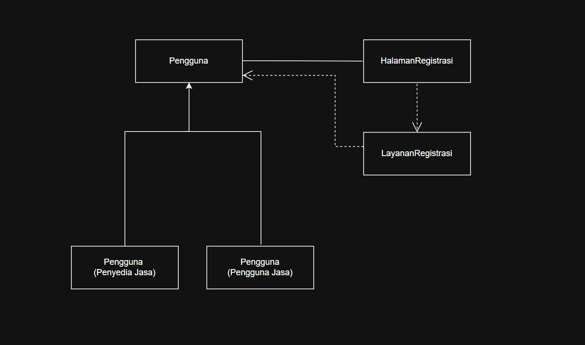

<i>Gambar 4.1 Diagram Kelas Use Case UC01</i>

 

Pada diagram kelas, cukup tampilkan nama kelas saja. Atribut dan metode/operasi milik setiap kelas dapat dituliskan pada tabel di bawah ini. Pastikan hubungan antarkelas menggunakan jenis relasi yang sesuai (asosiasi, agregasi, komposisi, generalisasi, atau dependensi).

| ID Kelas | Nama Kelas              | Atribut                                                                 | Metode/Operasi                                                   |
|----------|-------------------------|-------------------------------------------------------------------------|------------------------------------------------------------------|
| C01 | Pengguna | nama, email, noTelepon, password, statusOnline, statusAkun,sanksi| buatAkun(), simpanProfil(), login(), setStatusAkun(), setSanksi() | 
| C02 | PenyediaJasa | idPenyediaJasa, daftarPenawaranJasa, pengalaman, prestasi | isiPortofolio(), unggahPortofolio(), tambahPenawaranJasa(), bukaNotifikasiPesanan(), terimaPesanan(), tolakPesanan(), kumpulkanProdukAkhir(), getStatusPengerjaan(), kumpulkanRevisi(), cekPengirimanDana(), getRevisi() |
| C03 | PenggunaJasa | idPenggunaJasa, daftarJasa,  minatkategoriJasa, statusKonfirmasi | cariJasa(), gunakanFilter(), bukaDetailJasa(), bukaDaftarBoomark(), pilihJasa(), isiFormPemesanan(), getStatusPengerjaan(), getDeliverables(), selesaikanPesanan(), AjukanRevisi(), BeriUlasan(), beriPenilaian(), pilihMetodePembayaran() |
| C04      | HalamanRegistrasi       | formRegistrasi, pesanError                                              | tampilkanForm(), kirimRegistrasi(), tampilkanError()              |
| C05      | LayananRegistrasi       | -                                                                       | validasiData(), cekEmail(), cekNoTelepon(), registrasiPengguna() |

### 4.2.2 Use Case UC02

**Nama Use Case:** Melakukan *Login*

#### Identifikasi Kelas

| ID Kelas | Nama Kelas               | Deskripsi Kelas                                                                                                                                                                                                             |
|----------|--------------------------|-----------------------------------------------------------------------------------------------------------------------------------------------------------------------------------------------------------------------------|
| C01 | Pengguna | Menyimpan data diri pengguna, informasi akun, statusAkun, sanksiPengguna, statusOnline, dan kredensial akun  |
| C02 | PenyediaJasa | Menyimpan Profil Detail dan portofolio milik Penyedia Jasa, daftar penawaran jasa, hasil pekerjaan, status komunikasi *(online, offline, typing)*, serta mengumpulkan hasil revisi |
| C03 | Pengguna Jasa | Menyimpan Profil umum, pencarian jasa, dan pemesanan jasa, pengajuan revisi, status komunikasi *(online, offline, typing)*, konfirmasi pesanan dan pengajuan revisi, laporan yang dibuat, dan ulasan yang diberikan |
| C06      | HalamanLogin             | Menyediakan antarmuka login: input email, input password, pesan error kredensial, tombol login                                                                                                                              |
| C07      | Autentikator             | Memvalidasi kredensial login pengguna dan memberikan akses berupa sesi login pengguna jika valid dan pesan error jika salah                                                                                                 |

#### Diagram Kelas

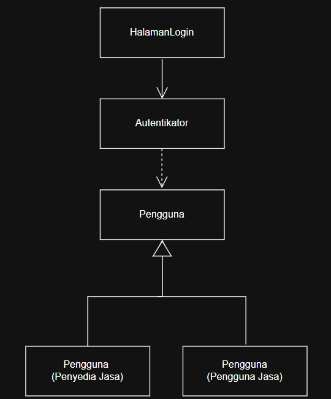

<i>Gambar 4.2 Diagram Kelas Use Case UC02</i>

 

| ID Kelas | Nama Kelas               | Atribut                               | Metode/Operasi                              |
|----------|--------------------------|---------------------------------------|---------------------------------------------|
| C01 | Pengguna | nama, email, noTelepon, password, statusOnline, statusAkun,sanksi| buatAkun(), simpanProfil(), login(), setStatusAkun(), setSanksi() | 
| C02 | PenyediaJasa | idPenyediaJasa, daftarPenawaranJasa, pengalaman, prestasi | isiPortofolio(), unggahPortofolio(), tambahPenawaranJasa(), bukaNotifikasiPesanan(), terimaPesanan(), tolakPesanan(), kumpulkanProdukAkhir(), getStatusPengerjaan(), kumpulkanRevisi(), cekPengirimanDana(), getRevisi(), getProfilDetail() |
| C03 | PenggunaJasa | idPenggunaJasa, daftarJasa,  minatkategoriJasa, statusKonfirmasi | cariJasa(), gunakanFilter(), bukaDetailJasa(), bukaDaftarBoomark(), pilihJasa(), isiFormPemesanan(), getStatusPengerjaan(), getDeliverables(), selesaikanPesanan(), AjukanRevisi(), BeriUlasan(), beriPenilaian(), pilihMetodePembayaran() |
| C06      | HalamanLogin             | inputEmail, inputPassword, pesanError | tampilkanForm(), kirimLogin(), pesanError() |
| C07      | Autentikator             | -                                     | validasiKredensial(), sesiLogin()           |

### 4.2.3 Use Case UC03

**Nama Use Case:** Mengisi Portofolio

#### Identifikasi Kelas

| ID Kelas | Nama Kelas               | Deskripsi Kelas                                                                                                                                                                      |
|----------|--------------------------|--------------------------------------------------------------------------------------------------------------------------------------------------------------------------------------|
| C02 | PenyediaJasa | Menyimpan Profil Detail dan portofolio milik Penyedia Jasa, daftar penawaran jasa, hasil pekerjaan, status komunikasi *(online, offline, typing)*, serta mengumpulkan hasil revisi | 
| C08      | HalamanPortofolio        | Menyediakan antarmuka portofolio: Daftar portofolio, form judul, form deskripsi, upload gambar/dokumen, tombol simpan, pesan validasi, tampilan portofolio yang berhasil ditambahkan |
| C09      | Portofolio               | Menyimpan karya, proyek, dan pengalaman kerja yang diunggah oleh Penyedia Jasa                                                                                                       |
| C10      | PengontrolPortofolio     | Mengelola logika pengisian portofolio, input dan validasi berkas, hingga pemrosesan dan penyimpanan data portofolio                                                                  |
| C11      | LayananUploadFile        | Menangani proses upload berkas berupa dokumen atau media ke dalam server, dan memberikan status penanganan prosesnya                                                                 |

#### Diagram Kelas

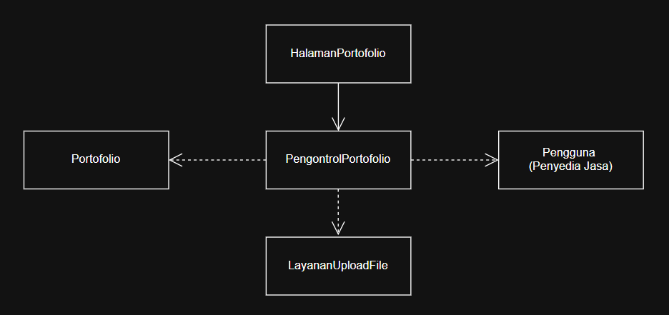

<i>Gambar 4.3 Diagram Kelas Use Case UC03</i>

 

| ID Kelas | Nama Kelas               | Atribut                           | Metode/Operasi                                                               |
|----------|--------------------------|-----------------------------------|------------------------------------------------------------------------------|
| C02 | PenyediaJasa | idPenyediaJasa, daftarPenawaranJasa, pengalaman, prestasi | isiPortofolio(), unggahPortofolio(), tambahPenawaranJasa(), bukaNotifikasiPesanan(), terimaPesanan(), tolakPesanan(), kumpulkanProdukAkhir(), getStatusPengerjaan(), kumpulkanRevisi(), cekPengirimanDana(), getRevisi(), getProfilDetail() |
| C08      | HalamanPortofolio        | formPortofolio, pesanError        | tampilkanPortofolio(), tampilkanForm(), kirimPortofolio(), tampilkanError(), |
| C09      | Portofolio               | judul, deskripsi, berkasPendukung | simpanPortofolio()                                                           |
| C10      | PengontrolPortofolio     | -                                 | validasiInputBerkas(),  SimpanPortofolio()                 |
| C11      | LayananUploadFile        | -                                 | uploadFile(), getStatusUpload(), validasiFormatUkuran(), saveDeliverables() |

### 4.2.4 Use Case UC04

**Nama Use Case:** Mengunggah Penawaran Jasa

#### Identifikasi Kelas

| ID Kelas | Nama Kelas | Deskripsi Kelas |
| :--- | :--- | :--- |
| C02 | PenyediaJasa | Menyimpan Profil Detail dan portofolio milik Penyedia Jasa, daftar penawaran jasa, hasil pekerjaan, status komunikasi *(online, offline, typing)*, serta mengumpulkan hasil revisi |
| C11 | LayananUploadFile | Menangani proses upload berkas berupa dokumen atau media ke dalam server, dan memberikan status penanganan prosesnya |
| C12 | Jasa | Menyimpan Informasi Jasa yang ditawarkan (Harga, deskripsi, dan durasi pengerjaan) |
| C13 | HalamanUploadJasa | Menyediakan antarmuka untuk mengunggah jasa: form nama jasa, pilihan kategori jasa, form deskripsi jasa, form harga, upload gambar/dokumen, pesan error |
| C14 | JasaController | Menangani proses pengisian deskripsi jasa, harga yang ditawarkan, pemasangan kategori, dan availability yang diatur Penyedia Jasa |

#### Diagram Kelas

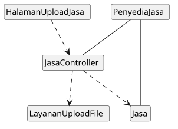

<i>Gambar 4.4 Diagram Kelas Use Case UC04</i>

 

| ID Kelas | Nama Kelas | Atribut | Metode/Operasi |
| :--- | :--- | :--- | :--- |
| C02 | PenyediaJasa | idPenyediaJasa, daftarPenawaranJasa, pengalaman, prestasi | isiPortofolio(), unggahPortofolio(), tambahPenawaranJasa(), bukaNotifikasiPesanan(), terimaPesanan(), tolakPesanan(), kumpulkanProdukAkhir(), getStatusPengerjaan(), kumpulkanRevisi(), cekPengirimanDana(), getRevisi(), getProfilDetail() |
| C11      | LayananUploadFile        | -                                 | uploadFile(), getStatusUpload(), validasiFormatUkuran(), saveDeliverables() |
| C12 | Jasa | idJasa, idPenyediaJasa, namaJasa, deskripsi, kategori, harga, statusAktif | simpanJasa(), dapatkanDetailJasa(), perbaruiJasa(), hapusJasa() |
| C13 | HalamanUploadJasa | formNamaJasa, formKategori, formDeskripsi, formHarga, inputUploadBerkas, tombolUnggah, pesanError | tampilkanForm(), klikUnggah(), tampilkanPesanError(), tampilkanNotifikasiBerhasil() |
| C14 | JasaController | - |ambilDetailJasa(), validasiDataJasa(), simpanPenawaranJasa() |

### 4.2.5 Use Case UC05

**Nama Use Case:** Mencari Penawaran Jasa

#### Identifikasi Kelas

| ID Kelas | Nama Kelas | Deskripsi Kelas |
| :--- | :--- | :--- |
| C03 | Pengguna Jasa | Menyimpan Profil umum, pencarian jasa, dan pemesanan jasa, pengajuan revisi, status komunikasi *(online, offline, typing)*, konfirmasi pesanan dan pengajuan revisi, laporan yang dibuat, dan ulasan yang diberikan |
| C12 | Jasa | Menyimpan Informasi Jasa yang ditawarkan untuk ditarik datanya pada hasil pencarian |
| C15 | HalamanPencarian | Menyediakan antarmuka pencarian: search bar, filter harga, filter waktu pengerjaan, filter rating, daftar hasil pencarian, pesan error |
| C16 | HasilPencarian | Menyediakan antarmuka hasil pencarian: daftar hasil pencarian, nama jasa, harga jasa, kategori jasa, rating, durasi pengerjaan, pesan error |
| C17 | LayananPencarian | Melakukan pencarian jasa berdasarkan kata kunci, filter yang digunakan |
| C18 | LayananPembandingJasa | Melakukan perbandingan jasa yang diminati pengguna jasa |

#### Diagram Kelas

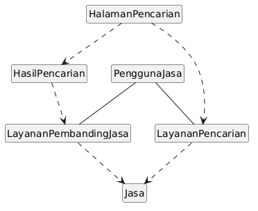

<i>Gambar 4.5 Diagram Kelas Use Case UC05</i>

 

| ID Kelas | Nama Kelas | Atribut | Metode/Operasi |
| :--- | :--- | :--- | :--- |
| C03 | PenggunaJasa | idPenggunaJasa, daftarJasa,  minatkategoriJasa, statusKonfirmasi | cariJasa(), gunakanFilter(), bukaDetailJasa(), bukaDaftarBoomark(), pilihJasa(), isiFormPemesanan(), getStatusPengerjaan(), getDeliverables(), selesaikanPesanan(), AjukanRevisi(), BeriUlasan(), beriPenilaian(), pilihMetodePembayaran() |
| C12 | Jasa | idJasa, idPenyediaJasa, namaJasa, deskripsi, kategori, harga, statusAktif | simpanJasa(), dapatkanDetailJasa(), perbaruiJasa(), hapusJasa() |
| C15 | HalamanPencarian | searchBar, filterHarga, filterDurasi, filterRating, tombolCari, pesanError | tampilkanHalaman(), inputKataKunci(), klikCari(), tampilkanPesanError() |
| C16 | HasilPencarian | daftarListingJasa, tombolBandingkan | tampilkanDaftarHasil(), pilihJasaUntukDibandingkan(), klikBandingkan() |
| C17 | LayananPencarian | - | cariJasaBerdasarkanKeyword(), terapkanFilterPencarian() |
| C18 | LayananPembandingJasa | - | bandingkanSpesifikasiJasa() |

### 4.2.6 Use Case UC06

**Nama Use Case:** Melihat Informasi Jasa

#### Identifikasi Kelas

| ID Kelas | Nama Kelas | Deskripsi Kelas |
| :--- | :--- | :--- |
| C02 | PenyediaJasa | Menyimpan Profil Detail dan portofolio milik Penyedia Jasa, daftar penawaran jasa, hasil pekerjaan, status komunikasi *(online, offline, typing)*, serta mengumpulkan hasil revisi |
| C03 | Pengguna Jasa | Menyimpan Profil umum, pencarian jasa, dan pemesanan jasa, pengajuan revisi, status komunikasi *(online, offline, typing)*, konfirmasi pesanan dan pengajuan revisi, laporan yang dibuat, dan ulasan yang diberikan |
| C12 | Jasa | Menyimpan Informasi Jasa yang ditawarkan (Harga, deskripsi, dan durasi pengerjaan) |
| C14 | JasaController | Menangani proses pengisian deskripsi jasa, harga yang ditawarkan, pemasangan kategori, dan availability yang diatur Penyedia Jasa serta menarik data detail jasa |
| C46 | Ulasan | Menyimpan feedback dan rating oleh Pengguna Jasa terhadap jasa yang telah dipesan |
| C19 | HalamanDetailJasa | Menyediakan antarmuka untuk menampilkan informasi lengkap listing jasa: deskripsi, paket harga, profil penyedia, dan ulasan. |

#### Diagram Kelas

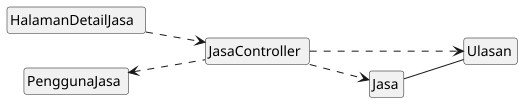

<i>Gambar 4.6 Diagram Kelas Use Case UC06</i>

 

| ID Kelas | Nama Kelas | Atribut | Metode/Operasi |
| :--- | :--- | :--- | :--- |
| C02 | PenyediaJasa | idPenyediaJasa, daftarPenawaranJasa, pengalaman, prestasi | isiPortofolio(), unggahPortofolio(), tambahPenawaranJasa(), bukaNotifikasiPesanan(), terimaPesanan(), tolakPesanan(), kumpulkanProdukAkhir(), getStatusPengerjaan(), kumpulkanRevisi(), cekPengirimanDana(), getRevisi(), getProfilDetail() |
| C03 | PenggunaJasa | idPenggunaJasa, daftarJasa,  minatkategoriJasa, statusKonfirmasi | cariJasa(), gunakanFilter(), bukaDetailJasa(), bukaDaftarBoomark(), pilihJasa(), isiFormPemesanan(), getStatusPengerjaan(), getDeliverables(), selesaikanPesanan(), AjukanRevisi(), BeriUlasan(), beriPenilaian(), pilihMetodePembayaran() |
| C12 | Jasa | idJasa, idPenyediaJasa, namaJasa, deskripsi, kategori, harga, statusAktif | simpanJasa(), dapatkanDetailJasa(), perbaruiJasa(), hapusJasa() |
| C14 | JasaController | - | ambilDetailJasa(), validasiDataJasa(), simpanPenawaranJasa() |
| C46 | Ulasan | idUlasan, idPesanan, idPenyediaJasa,rating, komentar, dokumentasi | simpanUlasan(), getDetailUlasan() |
| C19 | HalamanDetailJasa | tampilanDeskripsi, tampilanHarga, infoProfilPenyedia, tampilanRiwayatUlasan, pesanError | tampilkanDetailJasa(), tampilkanPesanError() |

### 4.2.7 Use Case UC07

**Nama Use Case:** Menggunakan *Bookmark*

#### Identifikasi Kelas

| ID Kelas | Nama Kelas | Deskripsi Kelas |
| :--- | :--- | :--- |
| C03 | Pengguna Jasa | Menyimpan Profil umum, pencarian jasa, dan pemesanan jasa, pengajuan revisi, status komunikasi *(online, offline, typing)*, konfirmasi pesanan dan pengajuan revisi, laporan yang dibuat, dan ulasan yang diberikan |
| C12 | Jasa | Menyimpan Informasi Jasa yang ditawarkan (Harga, deskripsi, dan durasi pengerjaan) |
| C20 | Bookmark | menyimpan informasi jasa yang menarik bagi pengguna |
| C21 | HalamanBookmark | Menampilkan antarmuka dalam bookmark: daftar jasa tersimpan, pilihan hapus bookmark, notifikasi berhasil disimpan/dihapus |
| C22 | PengontrolBookmark | Menangani penambahan dan pengurangan jasa yang disimpan pengguna |

#### Diagram Kelas

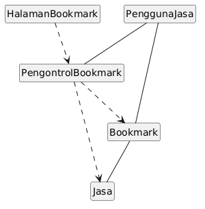

<i>Gambar 4.5 Diagram Kelas Use Case UC07</i>

 

| ID Kelas | Nama Kelas | Atribut | Metode/Operasi |
| :--- | :--- | :--- | :--- |
| C03 | PenggunaJasa | idPenggunaJasa, daftarJasa,  minatkategoriJasa, statusKonfirmasi | cariJasa(), gunakanFilter(), bukaDetailJasa(), bukaDaftarBoomark(), pilihJasa(), isiFormPemesanan(), getStatusPengerjaan(), getDeliverables(), selesaikanPesanan(), AjukanRevisi(), BeriUlasan(), beriPenilaian(), pilihMetodePembayaran() |
| C12 | Jasa | idJasa, idPenyediaJasa, namaJasa, deskripsi, kategori, harga, statusAktif | simpanJasa(), dapatkanDetailJasa(), perbaruiJasa(), hapusJasa() |
| C20 | Bookmark | idBookmark, idPenggunaJasa, idJasa, waktuDisimpan, daftarBookmark | simpanBookmark(), hapusBookmark(), lihatBookmark() |
| C21 | HalamanBookmark | daftarJasaTersimpan, ikonBookmarkAktif, ikonBookmarkNonaktif, tombolHapusBookmark | tampilkanDaftarTersimpan(), klikIkonBookmark(), klikIkonHapus(), tampilkanNotifikasi() |
| C22 | PengontrolBookmark | - | tambahDataBookmark(), hapusDataBookmark(), ambilDaftarBookmarkPengguna() |

### 4.2.8 Use Case UC08

**Nama Use Case:** Melakukan Komunikasi

#### Identifikasi Kelas

| ID Kelas | Nama Kelas | Deskripsi Kelas |
| :--- | :--- | :--- |
| C01 | Pengguna | Menyimpan data diri pengguna, informasi akun, statusAkun, sanksiPengguna, statusOnline, dan kredensial akun                                                                                                                                               |
| C02 | PenyediaJasa | Menyimpan Profil Detail dan portofolio milik Penyedia Jasa, daftar penawaran jasa, hasil pekerjaan, status komunikasi *(online, offline, typing)*, serta mengumpulkan hasil revisi |
| C03 | Pengguna Jasa | Menyimpan Profil umum, pencarian jasa, dan pemesanan jasa, pengajuan revisi, status komunikasi *(online, offline, typing)*, konfirmasi pesanan dan pengajuan revisi, laporan yang dibuat, dan ulasan yang diberikan |
| C23  | ChatRoom                 | Menyediakan sesi komunikasi antar dua atau lebih pengguna                                                                                                                                                                  |
| C24  | HalamanChat              | Menyediakan antarmuka ruang obrolan: riwayat pesan, input pesan, kirim pesan, pesan error/gagal terkirim, notifikasi pesan                                                                                                 |
| C25  | LayananPesanInstan       | Mengelola logika komunikasi seperti, membuat sesi ChatRoom, validasi input pesan, penyimpanan ke dalam basis data, dan status baca pesan                                                                                   |
| C26  | LayananNotifikasiChat    | Mengirimkan notifikasi atau pop-up kepada lawan bicara saat pesan masuk            |

#### Diagram Kelas

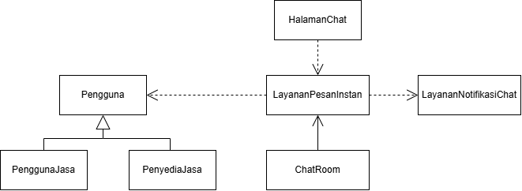

<i>Gambar 4.8 Diagram Kelas Use Case UC08</i>

 

| ID Kelas | Nama Kelas | Atribut | Metode/Operasi |
| :--- | :--- | :--- | :--- |
| C01 | Pengguna | nama, email, noTelepon, password, statusOnline, statusAkun,sanksi| buatAkun(), simpanProfil(), login(), setStatusAkun(), setSanksi() |
| C02 | PenyediaJasa | idPenyediaJasa, daftarPenawaranJasa, pengalaman, prestasi | isiPortofolio(), unggahPortofolio(), tambahPenawaranJasa(), bukaNotifikasiPesanan(), terimaPesanan(), tolakPesanan(), kumpulkanProdukAkhir(), getStatusPengerjaan(), kumpulkanRevisi(), cekPengirimanDana(), getRevisi(), getProfilDetail() | 
| C03 | PenggunaJasa | idPenggunaJasa, daftarJasa,  minatkategoriJasa, statusKonfirmasi | cariJasa(), gunakanFilter(), bukaDetailJasa(), bukaDaftarBoomark(), pilihJasa(), isiFormPemesanan(), getStatusPengerjaan(), getDeliverables(), selesaikanPesanan(), AjukanRevisi(), BeriUlasan(), beriPenilaian(), pilihMetodePembayaran() |
| C23 | ChatRoom | idChatRoom, idAnggota, riwayatPesan, waktuDibuat | getRiwayatPesan() |
| C24 | HalamanChat | idSesiChat, inputPesan, statusKoneksi | tampilkanMenuChat(), tampilkanRiwayatPesan(), inputPesan(), tombolKirimTerklik(), tampilkanPesanError(), tampilkanStatusBelumTerkirim() |
| C25 | LayananPesanInstan | idLayanan | buatSesiChat(), validasiInputPesan(), kirimPesan(),bukaChat(),  simpanKeDatabase(), updateStatusBaca() |
| C26 | LayananNotifikasiChat | idNotifikasi | kirimNotifikasiPesan(), tampilkanPopUpNotifikasi() |
### 4.2.9 Use Case UC09

**Nama Use Case:** Melakukan Pemesanan Jasa

#### Identifikasi Kelas

| ID Kelas | Nama Kelas | Deskripsi Kelas |
| :--- | :--- | :--- |
| C03 | Pengguna Jasa | Menyimpan Profil umum, pencarian jasa, dan pemesanan jasa, pengajuan revisi, status komunikasi *(online, offline, typing)*, konfirmasi pesanan dan pengajuan revisi, laporan yang dibuat, dan ulasan yang diberikan |
| C27  | Pesanan                  | Menyimpan informasi jasa (brief) yang dipesan pengguna dan konfirmasi Penyedia Jasa                                                                                                                                        |
| C28  | HalamanPemesanan         | Menyediakan antarmuka pemesanan: detail pemesanan yang dipilih, harga, tombol pesan                                                                                                                                        |
| C29  | HalamanPembayaran        | Menyediakan antarmuka pembayaran: total harga, pilihan metode pembayaran, tombol bayar, status pembayaran, pesan error                                                                                                     |
| C30  | HalamanRiwayatTransaksi	  | Menyediakan antarmuka riwayat transaksi: daftar transaksi yang telah dilakukan, harga, status transaksi                                                                                                                    |
| C31  | PengontrolPesanan        | Menangani pembuatan pesanan baru, total biaya, dan mengatur status pesanan, dan menerima konfirmasi Penyedia Jasa maupun pengguna jasa                                                                                     |
| C32  | PengontrolTransaksi      | Mengelola logika transaksi keuangan, konektivitas sistem pembayaran, validasi pembayaran, dan pembaruan status pembayaran, dan pencairan dana                                                                              |
| C33  | MetodePembayaran         | Merepresentasikan pilihan metode pembayaran yang tersedia bagi pelanggan                                                                                                                                                   |
| C34  | RiwayatTransaksi         | Menyimpan Informasi Jasa yang telah dipesan beserta status pengerjaannya.|

#### Diagram Kelas

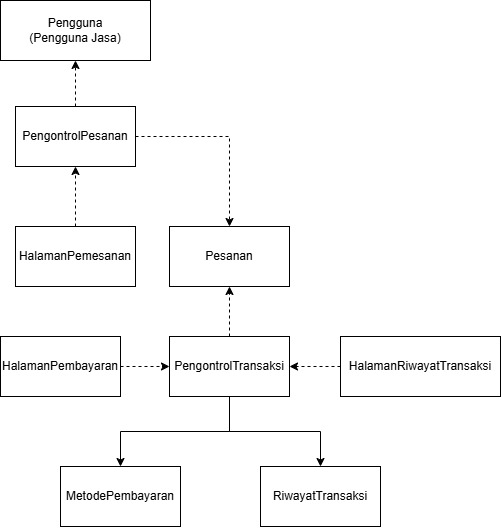

<i>Gambar 4.9 Diagram Kelas Use Case UC09</i>

 

| ID Kelas | Nama Kelas | Atribut | Metode/Operasi |
| :--- | :--- | :--- | :--- |
| C03 | PenggunaJasa | idPenggunaJasa, daftarJasa,  minatkategoriJasa, statusKonfirmasi | cariJasa(), gunakanFilter(), bukaDetailJasa(), bukaDaftarBoomark(), pilihJasa(), isiFormPemesanan(), getStatusPengerjaan(), getDeliverables(), selesaikanPesanan(), AjukanRevisi(), BeriUlasan(), beriPenilaian(), pilihMetodePembayaran() |
| C27 | Pesanan | idPesanan, idPenggunaJasa, idPenyediaJasa, idJasa, brief, totalBiaya, statusPesanan | getDetailPesanan(), setStatusDiproses(), setStatusSelesai() |
| C28 | HalamanPemesanan | idJasaDipilih, briefPemesanan | tampilkanFormPemesanan(), inputBriefPemesanan(), tombolPesanTerklik() |
| C29 | HalamanPembayaran | totalHarga, idMetodePembayaran | tampilkanPilihanPembayaran(), tampilkanRincianPembayaran(), tombolBayarTerklik(), tampilkanNotifikasiBerhasil() |
| C30 | HalamanRiwayatTransaksi | idTransaksi,daftarPesananSelesai | tampilkanRiwayatTransaksi() |
| C31 | PengontrolPesanan | idPengontrolPesanan | buatPesananBaru(), hitungTotalBiaya(), updateStatusPesanan(), konfirmasiPesanan() |
| C32 | PengontrolTransaksi | idPengontrolTransaksi | prosesPembayaran(), validasiPembayaran(), cairkanDana(), getStatusPencairan(), updateStatusPembayaran() |
| C33 | MetodePembayaran | idMetode, namaMetode, nomorRekeningVA | getDetailMetode() |
| C34 | RiwayatTransaksi | idRiwayat, idPesanan, tanggalTransaksi, statusTransaksi | simpanTransaksi(), updateStatusTransaksi(), getDataRiwayat() |

### 4.2.10 Use Case UC10

**Nama Use Case:** Melakukan Konfirmasi Pesanan

#### Identifikasi Kelas

| ID Kelas | Nama Kelas | Deskripsi Kelas |
| :--- | :--- | :--- |
| C02 | PenyediaJasa | Menyimpan Profil Detail dan portofolio milik Penyedia Jasa, daftar penawaran jasa, hasil pekerjaan, status komunikasi *(online, offline, typing)*, serta mengumpulkan hasil revisi |
| C27 | Pesanan                  | Menyimpan informasi jasa (brief) yang dipesan pengguna dan konfirmasi Penyedia Jasa                                                                                |
| C31 | PengontrolPesanan        | Menangani pembuatan pesanan baru, total biaya, dan mengatur status pesanan, dan menerima konfirmasi Penyedia Jasa maupun pengguna jasa                             |
| C34 | RiwayatTransaksi         | Menyimpan Informasi Jasa yang telah dipesan beserta status pengerjaannya.                                                                                          |
| C35 | HalamanKonfirmasi        | Menyediakan antarmuka konfirmasi pesanan: daftar pesanan, pilihan tolak/terima pesanan, status pesanan |

#### Diagram Kelas

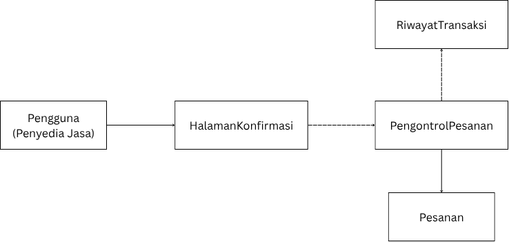

<i>Gambar 4.10 Diagram Kelas Use Case UC10</i>

 

| ID Kelas | Nama Kelas | Atribut | Metode/Operasi |
| :--- | :--- | :--- | :--- |
| C02 | PenyediaJasa | idPenyediaJasa, daftarPenawaranJasa, pengalaman, prestasi | isiPortofolio(), unggahPortofolio(), tambahPenawaranJasa(), bukaNotifikasiPesanan(), terimaPesanan(), tolakPesanan(), kumpulkanProdukAkhir(), getStatusPengerjaan(), kumpulkanRevisi(), cekPengirimanDana(), getRevisi(), getProfilDetail() |
| C27 | Pesanan | idPesanan, idPenggunaJasa, idPenyediaJasa, idJasa, brief, totalBiaya, statusPesanan | getDetailPesanan(), setStatusDiproses(), setStatusSelesai() |
| C31 | PengontrolPesanan | idPengontrolPesanan | buatPesananBaru(), hitungTotalBiaya(), updateStatusPesanan(), konfirmasiPesanan() |
| C34 | RiwayatTransaksi | idRiwayat, idPesanan, tanggalTransaksi, statusTransaksi | simpanTransaksi(), updateStatusTransaksi(), getDataRiwayat() |
| C35 | HalamanKonfirmasi | idPesanan, detailBrief | tampilkanDetailPesanan(), tombolTerimaTerklik(), tombolTolakTerklik(), tampilkanStatusPesanan() |

### 4.2.11 Use Case UC11

**Nama Use Case:** Menyerahkan Hasil Pekerjaan

#### Identifikasi Kelas

| ID Kelas | Nama Kelas | Deskripsi Kelas |
| :--- | :--- | :--- |
| C02 | PenyediaJasa | Menyimpan Profil Detail dan portofolio milik Penyedia Jasa, daftar penawaran jasa, hasil pekerjaan, status komunikasi *(online, offline, typing)*, serta mengumpulkan hasil revisi |
| C11 | LayananUploadFile | Menangani proses *upload* berkas berupa dokumen atau media ke dalam server, dan memberikan status penanganan prosesnya |
| C36 | ProdukAkhir | Menyimpan hasil produk akhir yang dikerjakan Penyedia Jasa untuk diperiksa oleh (Pengguna Jasa). |
| C37 | HalamanPengumpulan | Menyediakan antarmuka pengumpulan pesanan: upload gambar/dokumen/link pengerjaan, deskripsi hasil, tombol kirim, pesan error |

#### Diagram Kelas

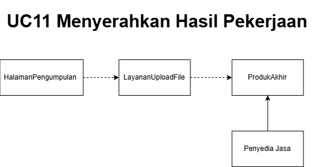

<i>Gambar 4.11 Diagram Kelas Use Case UC11</i>

 

| ID Kelas | Nama Kelas | Atribut | Metode/Operasi |
| :--- | :--- | :--- | :--- |
| C02 | PenyediaJasa | idPenyediaJasa, daftarPenawaranJasa, pengalaman, prestasi | isiPortofolio(), unggahPortofolio(), tambahPenawaranJasa(), bukaNotifikasiPesanan(), terimaPesanan(), tolakPesanan(), kumpulkanProdukAkhir(), getStatusPengerjaan(), kumpulkanRevisi(), cekPengirimanDana(), getRevisi(), getProfilDetail() |
| C11      | LayananUploadFile        | -                                 | uploadFile(), getStatusUpload(), validasiFormatUkuran(), saveDeliverables() |
| C36 | ProdukAkhir | idProdukAkhir, idPesanan, outputpath, deskripsiProdukAkhir, tanggalPengumpulan,  statusPemeriksaan, fileURL | simpanProdukAkhir(), updateStatusPengerjaan(), getDetailJasa() | 
| C37 | HalamanPengumpulan | deskripsiHasil, fileURL, tombolKirim, pesanError  | tampilkanFormPengumpulan(), inputDeskripsiHasil(), unggahDeliverables(), tampilkanPesanError(), kirimHasil(), inputLink(), tampilkanStatusPengiriman() |

### 4.2.12 Use Case UC12

**Nama Use Case:** Mengonfirmasi Hasil Pekerjaan

#### Identifikasi Kelas

| ID Kelas | Nama Kelas | Deskripsi Kelas |
| :--- | :--- | :--- |
| C02 | PenyediaJasa | Menyimpan Profil Detail dan portofolio milik Penyedia Jasa, daftar penawaran jasa, hasil pekerjaan, status komunikasi *(online, offline, typing)*, serta mengumpulkan hasil revisi |
| C03 | Pengguna Jasa | Menyimpan Profil umum, pencarian jasa, dan pemesanan jasa, pengajuan revisi, status komunikasi *(online, offline, typing)*, konfirmasi pesanan dan pengajuan revisi, laporan yang dibuat, dan ulasan yang diberikan |
| C27 | Pesanan | Menyimpan informasi jasa (brief) yang dipesan pengguna dan konfirmasi Penyedia Jasa | 
| C31 | PengontrolPesanan  | Menangani pembuatan pesanan baru, total biaya, dan mengatur status pesanan, dan menerima konfirmasi Penyedia Jasa maupun pengguna jasa | 
| C32 | PengontrolTransaksi  | Mengelola logika transaksi keuangan, konektivitas sistem pembayaran, validasi pembayaran, dan pembaruan status pembayaran, dan pencairan dana |
| C38 | HalamanDeliverables | Menyediakan antarmuka pengumpulan dari sisi pengguna: daftar hasil pekerjaan, tampilan hasil pekerjaan, status pekerjaan, tombol revisi, tombol konfirmasi selesai, pesan error |
| C39 | PengajuanRevisi | Menyimpan Permintaan Perbaikan dari Pengguna Jasa saat pekerjaan belum sesuai | 
| C40 | HalamanRequestRevisi | Menyediakan antarmuka revisi pekerjaan bagi pengguna: detail pekerjaan, input permintaan revisi, informasi mengenai kuota revisi, tombol ajukan revisi, pesan | 
| C41 | RevisiHandler |  Menangani logika pengajuan revisi, seperti validasi jumlah revisi, kelengkapan deskripsi perbaikan yang diajukan, pengiriman informasi revisi pada Penyedia Jasa, dan notifikasi pada Penyedia Jasa | 
| C42 | PencairanDana | Menyimpan transaksi pelepasan  dana dari sistem menuju Penyedia Jasa setelah konfirmasi disetujui  |

#### Diagram Kelas

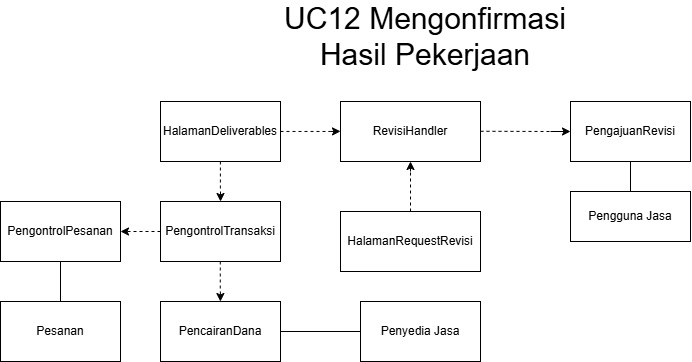

<i>Gambar 4.12 Diagram Kelas Use Case UC12</i>

 

| ID Kelas | Nama Kelas | Atribut | Metode/Operasi |
| :--- | :--- | :--- | :--- |
| C02 | PenyediaJasa | idPenyediaJasa, daftarPenawaranJasa, pengalaman, prestasi | isiPortofolio(), unggahPortofolio(), tambahPenawaranJasa(), bukaNotifikasiPesanan(), terimaPesanan(), tolakPesanan(), kumpulkanProdukAkhir(), getStatusPengerjaan(), kumpulkanRevisi(), cekPengirimanDana(), getRevisi(), getProfilDetail() |
| C03 | PenggunaJasa | idPenggunaJasa, daftarJasa,  minatkategoriJasa, statusKonfirmasi | cariJasa(), gunakanFilter(), bukaDetailJasa(), bukaDaftarBoomark(), pilihJasa(), isiFormPemesanan(), getStatusPengerjaan(), getDeliverables(), selesaikanPesanan(), AjukanRevisi(), BeriUlasan(), beriPenilaian(), pilihMetodePembayaran() |
| C27 | Pesanan | idPesanan, idPenggunaJasa, idPenyediaJasa, idJasa, brief, totalBiaya, statusPesanan | getDetailPesanan(), setStatusDiproses(), setStatusSelesai() |
| C31 | PengontrolPesanan | idPengontrolPesanan | buatPesananBaru(), hitungTotalBiaya(), updateStatusPesanan(), konfirmasiPesanan() |
| C32 | PengontrolTransaksi | idPengontrolTransaksi | prosesPembayaran(), validasiPembayaran(), cairkanDana(), getStatusPencairan(), updateStatusPembayaran() |
| C38 | HalamanDeliverables | deskripsiHasil, fileURL, tombolKonfirmasi, tombolRevisi, jumlahRevisi, pesanError, tombolBantuan, lampiranDeliverables | tampilkanDeliverables(), ajukanRevisi(), konfirmasiPesanan(), tampilkanError, panggilBantuan() |
| C39 | PengajuanRevisi | deskripsiRevisi, jmlRevisiTersedia, lampiranRevisi, idRevisi, idPesanan, statusPengerjaan | setStatusPengerjaan(), getStatusPengerjaan(), setDeskripsiRevisi(), getDeskripsiRevisi(), setjmlRevisi(), getjmlRevisi() setIdRevisi(), getIdPesanan(), getIdRevisi() |
| C40 | HalamanRequestRevisi | formRevisi, detailRevisi, kuotaRevisi, tombolRevisi, pesanUntukPenyedia  | tampilkanformRevisi(), tampilkanFieldPengisianRevisi(), tampilkanKuotaRevisi(), isTombolRevisiPressed(), tampilkanPesan()  |
| C41 | RevisiHandler | - | isJumlahRevisiValid(), isDeskripsiComplete(), sendRevisi(), setNotifikasiRevisi(), updateStatusPengerjaan(), updateIdRevisi()  |
| C42 | PencairanDana | stateTransaksi, statePencairanDana | setKondisiTransaksi(), setPencairanDana() |
### 4.2.13 Use Case UC13

**Nama Use Case:** Melaporkan Pengguna Lain

#### Identifikasi Kelas

| ID Kelas | Nama Kelas | Deskripsi Kelas |
| :--- | :--- | :--- |
| C01 | Pengguna | Menyimpan data diri pengguna, informasi akun, statusAkun, sanksiPengguna, statusOnline, dan kredensial akun |
| C02 | PenyediaJasa | Menyimpan Profil Detail dan portofolio milik Penyedia Jasa, daftar penawaran jasa, hasil pekerjaan, status komunikasi *(online, offline, typing)*, serta mengumpulkan hasil revisi |
| C03 | Pengguna Jasa | Menyimpan Profil umum, pencarian jasa, dan pemesanan jasa, pengajuan revisi, status komunikasi *(online, offline, typing)*, konfirmasi pesanan dan pengajuan revisi, laporan yang dibuat, dan ulasan yang diberikan |n pengguna jika dibutuhkan, dan memberi ulasan |
| C43 | TiketLaporan | Menyimpan keluhan, kendala, bukti, dan aduan pengguna untuk ditinjau oleh Admin.  
| C44 | HalamanPelaporan | Menyediakan antarmuka untuk melaporkan pengguna: form laporan, pilihan kategori pelanggaran, input deskripsi pelanggaran, upload bukti, tombol kirim laporan, status laporan, nomor tiket, pesan error, dan tanggapan laporan. | 
| C45 | LaporanHandler  | Menangani proses pengisian laporan, seperti validasi struktur laporan (judul, deskripsi, dan bukti), pembuatan tiket laporan, dan pengiriman notifikasi pada admin, mengambil data laporan, mencatat tanggapan admin, memperbarui status laporan, eksekusi sanksi, dan mengubah status akun terlapor |

#### Diagram Kelas

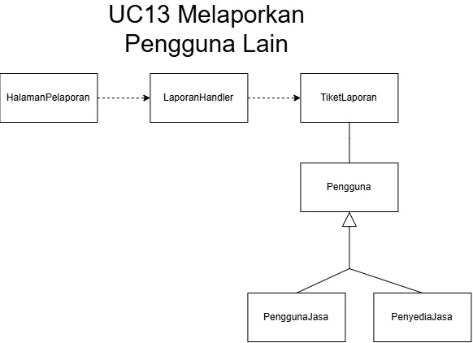

<i>Gambar 4.13 Diagram Kelas Use Case UC13</i>

 

| ID Kelas | Nama Kelas | Atribut | Metode/Operasi |
| :--- | :--- | :--- | :--- |
| C01 | Pengguna | nama, email, noTelepon, password, statusOnline, statusAkun,sanksi| buatAkun(), simpanProfil(), login(), setStatusAkun(), setSanksi() | 
| C02 | PenyediaJasa | idPenyediaJasa, daftarPenawaranJasa, pengalaman, prestasi | isiPortofolio(), unggahPortofolio(), tambahPenawaranJasa(), bukaNotifikasiPesanan(), terimaPesanan(), tolakPesanan(), kumpulkanProdukAkhir(), getStatusPengerjaan(), kumpulkanRevisi(), cekPengirimanDana(), getRevisi(), getProfilDetail() |
| C03 | PenggunaJasa | idPenggunaJasa, daftarJasa,  minatkategoriJasa, statusKonfirmasi | cariJasa(), gunakanFilter(), bukaDetailJasa(), bukaDaftarBoomark(), pilihJasa(), isiFormPemesanan(), getStatusPengerjaan(), getDeliverables(), selesaikanPesanan(), AjukanRevisi(), BeriUlasan(), beriPenilaian(), pilihMetodePembayaran() |
| C43 | TiketLaporan | idTiket, deskripsiLaporan, urlbukti, lampiranBukti, statusTiket, TanggapanAdmin | setIdTiket(), getIdTiket(), setURLBukti(), getURLBukti(), setStatusTiket, UpdateStatusTiket(), getStatusTicket(), setTanggapan(), getTanggapan(), setStatusLaporan()  |
| C44 | HalamanPelaporan | formLaporan, kategoriPelanggaran, deskripsiPelanggaran, kolomBukti, statusLaporan, noTiket, pesanError, tanggapanAdmin | tampilkanFormLaporan(), tampilkanOpsiKategoriPelanggaran(), tampilkanDeskripsiPelanggaran, tampilkanNomorTiket(), tampilkanPesanError(), tampilkanTanggapanAdmin(), tampilkanPesanError() | 
| C45 | LaporanHandler  | - | validasiFormatLaporan(), createTiket(), getStatusTiket(), kirimNotifAdmin(), simpanData(), banPengguna(), skorsPengguna(), kirimTanggapan(), saveTanggapan(), saveLaporan(), updateStatusTiket() | 

### 4.2.14 Use Case UC14

**Nama Use Case:** Memberikan Ulasan terhadap jasa yang dipesan

#### Identifikasi Kelas

| ID Kelas | Nama Kelas | Deskripsi Kelas |
| :--- | :--- | :--- |
| C03 | PenggunaJasa | Menyimpan Profil umum, pencarian jasa, dan pemesanan jasa, pengajuan revisi, status komunikasi *(online, offline, typing)*, konfirmasi pesanan dan pengajuan revisi, laporan yang dibuat, dan ulasan yang diberikan |
| C27 | Pesanan | Menyimpan informasi jasa (brief) yang dipesan pengguna dan konfirmasi Penyedia Jasa |
| C30 | HalamanRiwayatTransaksi | Menyediakan antarmuka riwayat transaksi: daftar transaksi yang telah dilakukan, harga, status transaksi |
| C31 | PengontrolPesanan  | Menangani pembuatan pesanan baru, total biaya, dan mengatur status pesanan, dan menerima konfirmasi Penyedia Jasa maupun pengguna jasa |
| C32 | PengontrolTransaksi | Mengelola logika transaksi keuangan, konektivitas sistem pembayaran, validasi pembayaran, dan pembaruan status pembayaran, dan pencairan dana |
| C34 | RiwayatTransaksi | Menyimpan Informasi Jasa yang telah dipesan beserta status pengerjaannya |
| C46 | Ulasan | Menyimpan feedback dan rating oleh Pengguna Jasa terhadap jasa yang telah dipesan |
| C47 | HalamanUlasan | Menyediakan antarmuka ulasan bagi pengguna: rating, input komentar, upload dokumentasi, tombol kirim ulasan, pesan error, notifikasi ulasan terkirim |
| C48 | UlasanHandler | Menangani proses pengisian laporan, validasi kelengkapan pengisian, dan penyimpanan data pada basis data server |

#### Diagram Kelas

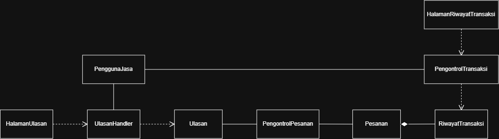

<i>Gambar 4.14. Diagram Kelas Use Case UC14</i>

 

| ID Kelas | Nama Kelas | Atribut | Metode/Operasi |
| :--- | :--- | :--- | :--- |
| C03 | PenggunaJasa | idPenggunaJasa, daftarJasa,  minatkategoriJasa, statusKonfirmasi | cariJasa(), gunakanFilter(), bukaDetailJasa(), bukaDaftarBoomark(), pilihJasa(), isiFormPemesanan(), getStatusPengerjaan(), getDeliverables(), selesaikanPesanan(), AjukanRevisi(), BeriUlasan(), beriPenilaian(), pilihMetodePembayaran() |
| C27 | Pesanan | idPesanan, idPenggunaJasa, idPenyediaJasa, idJasa, brief, totalBiaya, statusPesanan | getDetailPesanan(), setStatusDiproses(), setStatusSelesai() |
| C30 | HalamanRiwayatTransaksi | idTransaksi,daftarPesananSelesai | tampilkanRiwayatTransaksi() |
| C31 | PengontrolPesanan | idPengontrolPesanan | buatPesananBaru(), hitungTotalBiaya(), updateStatusPesanan(), konfirmasiPesanan() |
| C32 | PengontrolTransaksi | idPengontrolTransaksi | prosesPembayaran(), validasiPembayaran(), cairkanDana(), getStatusPencairan(), updateStatusPembayaran() |
| C34 | RiwayatTransaksi | idRiwayat, idPesanan, tanggalTransaksi, statusTransaksi | simpanTransaksi(), updateStatusTransaksi(), getDataRiwayat() |
| C46 | Ulasan | idUlasan, idPesanan, idPenyediaJasa,rating, komentar, dokumentasi | simpanUlasan(), getDetailUlasan() |
| C47 | HalamanUlasan | rating, teksKomentar, fileDokumentasi, pesanError | tampilkanFormUlasan(), inputRatingBintang(), inputKomentar(), unggahDokumentasi(), tampilkanPesanError(), tampilkanNotifikasiBerhasil() |
| C48 | UlasanHandler | - | validasiKelengkapanRating(), validasiFormatBerkas(), validasiPanjangKomentar(), prosesUlasan(), perbaruiRating() |

### 4.2.15 Use Case UC15

**Nama Use Case:** Memproses Laporan

#### Identifikasi Kelas

| ID Kelas | Nama Kelas | Deskripsi Kelas |
| :--- | :--- | :--- |
| C43 | TiketLaporan | Menyimpan keluhan, kendala, bukti, dan aduan pengguna untuk ditinjau oleh Admin. |
| C45 | LaporanHandler | Menangani proses pengisian laporan, seperti validasi struktur laporan (judul, deskripsi, dan bukti), pembuatan tiket laporan, dan pengiriman notifikasi pada admin, mengambil data laporan, mencatat tanggapan admin, memperbarui status laporan, eksekusi sanksi, dan mengubah status akun terlapor |
| C49 | TanggapanLaporan | Mencatat balasan, analisis internal, dan keputusan peninjauan terkait laporan tersebut |
| C52 | Admin | Meninjau laporan pengguna, mempertimbangkan sanksi yang diperlukan, membantu dalam proses mediasi, memberikan tanggapan terkait laporan pengguna |
| C53 | HalamanDashboardAdmin | Menyediakan antarmuka panel kerja khusus bagi Admin untuk meninjau tiket laporan, menetapkan sanksi, dan membuka ruang mediasi |

#### Diagram Kelas

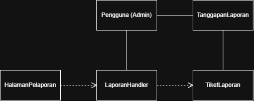

<i>Gambar 4.15. Diagram Kelas Use Case UC15</i>

 

| ID Kelas | Nama Kelas | Atribut | Metode/Operasi |
| :--- | :--- | :--- | :--- |
| C43 | TiketLaporan | idTiket, deskripsiLaporan, urlbukti, lampiranBukti, statusTiket, TanggapanAdmin | setIdTiket(), getIdTiket(), setURLBukti(), getURLBukti(), setStatusTiket, UpdateStatusTiket(), getStatusTicket(), setTanggapan(), getTanggapan(), setStatusLaporan()  |
| C45 | LaporanHandler  | - | validasiFormatLaporan(), createTiket(), getStatusTiket(), kirimNotifAdmin(), simpanData(), banPengguna(), skorsPengguna(), kirimTanggapan(), saveTanggapan(), saveLaporan(), updateStatusTiket() | 
| C49 | TanggapanLaporan | idTanggapan, idTiket, jenisTindakan, catatanTanggapan | catatKeputusanTindakan(), getDetailTanggapan() |
| C52 | Admin | idAdmin, nama | mulaiMediasi(), bukaTiketLaporan(), selesaikanLaporan(), kirimPesanMediasi(), pilihJenisTindakan(), akhiriMediasi() |
| C53 | HalamanDashboardAdmin | daftarTiket, detailTiket, opsiTindakan, pesanError | tampilkanDetailTiket(), inputTindakan(), selesaikanTiket(), mulaiMediasi(), tampilkanPesanError() |

### 4.2.16 Use Case UC16

**Nama Use Case:** Melakukan Proses Mediasi

#### Identifikasi Kelas

| ID Kelas | Nama Kelas | Deskripsi Kelas |
| :--- | :--- | :--- |
| C43 | TiketLaporan | Menyimpan keluhan, kendala, bukti, dan aduan pengguna untuk ditinjau oleh Admin |
| C23 | *ChatRoom* | Menyediakan sesi komunikasi antar dua atau lebih pengguna | 
| C24  | HalamanChat              | Menyediakan antarmuka ruang obrolan: riwayat pesan, input pesan, kirim pesan, pesan error/gagal terkirim, notifikasi pesan                                                                                                 |
| C25  | LayananPesanInstan       | Mengelola logika komunikasi seperti, membuat sesi ChatRoom, validasi input pesan, penyimpanan ke dalam basis data, dan status baca pesan                                                                                   |
| C26  | LayananNotifikasiChat    | Mengirimkan notifikasi atau pop-up kepada lawan bicara saat pesan masuk            |
| C45 | LaporanHandler | Menangani proses pengisian laporan, seperti validasi struktur laporan (judul, deskripsi, dan bukti), pembuatan tiket laporan, dan pengiriman notifikasi pada admin, mengambil data laporan, mencatat tanggapan admin, memperbarui status laporan, eksekusi sanksi, dan mengubah status akun terlapor |
| C49 | TanggapanLaporan | Mencatat balasan, analisis internal, dan keputusan peninjauan terkait laporan tersebut. |
| C50 | HalamanPengajuanMediasi | Menyediakan antarmuka pengajuan mediasi: detail pelaporan, status mediasi, tombol ajukan mediasi, pesan error |
| C51 | MediasiHandler | Menangani permintaan mediasi, dan membuka RoomChat berisikan admin, penyedia jasa, dan pengguna jasa |
| C52 | Admin | Meninjau laporan pengguna, mempertimbangkan sanksi yang diperlukan, membantu dalam proses mediasi, memberikan tanggapan terkait laporan pengguna |
| C53 | HalamanDashboardAdmin | Menyediakan antarmuka panel kerja khusus bagi Admin untuk meninjau tiket laporan, menetapkan sanksi, dan membuka ruang mediasi |

#### Diagram Kelas

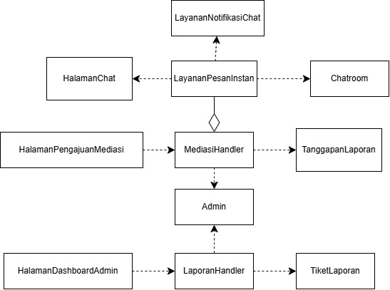

<i>Gambar 4.16. Diagram Kelas Use Case UC16</i>

 

| ID Kelas | Nama Kelas | Atribut | Metode/Operasi |
| :--- | :--- | :--- | :--- |
| C23 | ChatRoom | idChatRoom, idAnggota, riwayatPesan, waktuDibuat | getRiwayatPesan() |
| C24 | HalamanChat | idSesiChat, inputPesan, statusKoneksi | tampilkanMenuChat(), tampilkanRiwayatPesan(), inputPesan(), tombolKirimTerklik(), tampilkanPesanError(), tampilkanStatusBelumTerkirim() |
| C25 | LayananPesanInstan | idLayanan | buatSesiChat(), validasiInputPesan(), kirimPesan(), simpanKeDatabase(), updateStatusBaca() |
| C26 | LayananNotifikasiChat | idNotifikasi | kirimNotifikasiPesan(), tampilkanPopUpNotifikasi() |
| C43 | TiketLaporan | idTiket, deskripsiLaporan, urlbukti, lampiranBukti, statusTiket, TanggapanAdmin | setIdTiket(), getIdTiket(), setURLBukti(), getURLBukti(), setStatusTiket, UpdateStatusTiket(), getStatusTicket(), setTanggapan(), getTanggapan(), setStatusLaporan()  |
| C45 | LaporanHandler  | - | validasiFormatLaporan(), createTiket(), getStatusTiket(), kirimNotifAdmin(), simpanData(), banPengguna(), skorsPengguna(), kirimTanggapan(), saveTanggapan(), saveLaporan(), updateStatusTiket() | 
| C49 | TanggapanLaporan | idTanggapan, idTiket, jenisTindakan, catatanTanggapan | catatKeputusanTindakan(), getDetailTanggapan() |
| C50 | HalamanPengajuanMediasi | detailPelaporan, riwayatPesan, opsiTindakan, pesanError | - |
| C51 | MediasiHandler | idSesiMediasi | inputTindakan(), akhiriMediasi(), tampilkanPesanError(), tampilkanNotifikasiSelesai() |
| C52 | Admin | idAdmin, nama | mulaiMediasi(), bukaTiketLaporan(), selesaikanLaporan(), kirimPesanMediasi(), pilihJenisTindakan(), akhiriMediasi() |
| C53 | HalamanDashboardAdmin | daftarTiket, detailTiket, opsiTindakan, pesanError | tampilkanDetailTiket(), inputTindakan(), selesaikanTiket(), mulaiMediasi(), tampilkanPesanError() |

> Lanjutkan pola **4.2.x** untuk setiap use case pada 3.2.

## 4.3 Diagram Kelas Keseluruhan

Gabungkan seluruh kelas dan hubungan antarkelas dari diagram kelas setiap use case menjadi satu diagram kelas keseluruhan. Pastikan tidak ada kelas yang terduplikasi.

<i>Gambar X. Diagram Kelas Keseluruhan</i>

 

| ID Kelas | Nama Kelas | Atribut | Metode/Operasi |
| :--- | :--- | :--- | :--- |
| *C01* | *Pelanggan* | *idPelanggan, nama, email* | *lihatRiwayatPesanan()* |
| *C02* | *Pesanan* | *idPesanan, total, status* | *hitungTotal(), perbaruiStatus()* |
| *C03* | *Keranjang* | *daftarItem* | *tambahItem(), checkout()* |
| *C04* | *MetodePembayaran* | *-* | *kirimKePaymentGatewayDummy()* |
| *C05* | *Kartu* | *nomorKartu, masaBerlaku* | *kirimKePaymentGatewayDummy()* |
| *C06* | *EWallet* | *saldo, idAkun* | *cekSaldo(), kirimKePaymentGatewayDummy()* |
| *C07* | *RiwayatTransaksi* | *idTransaksi, waktu, status* | *catatTransaksi(), tampilkanNotifikasi()* |
| *...* | *...* | *...* | *...* |

---

# BAB 5: Traceability
Cocokkan setiap kebutuhan fungsional, use case, dengan diagram kelas yang mendukung atau mengimplementasikan kebutuhan tersebut.

| ID Kelas | ID Use Case | ID KF |
| :--- | :--- | :--- |
| C01 | UC01, UC02, UC08, UC13 | KF01, KF02, KF13, KF14, KF15, KF29 |
| C02 | UC01, UC02, UC03, UC04, UC06, UC08, UC10, UC11, UC12, UC13 | KF01, KF02, KF03, KF04, KF05, KF08, KF13, KF14, KF15, KF21, KF22, KF23, KF24, KF25, KF26, KF27, KF28, KF29 |
| C03 | UC01, UC02, UC05, UC06, UC07, UC08, UC09, UC12, UC13, UC14 | KF01, KF02, KF06, KF07, KF08, KF09, KF10, KF11, KF12, KF13, KF14, KF15, KF17, KF18, KF19, KF20, KF26. KF27, KF28, KF29, KF30, KF31 |
| C04 | UC01 | KF01 |
| C05 | UC01 | KF01 |
| C06 | UC02 | KF02 |
| C07 | UC02 | KF02 |
| C08 | UC03 | KF03, KF04 |
| C09 | UC03 | KF03, KF04 |
| C10 | UC03, UC04, UC11 | KF03, KF04, KF05, KF25 |
| C11 | UC04, UC05, UC06, UC07 | KF03, KF04, KF05, KF06, KF07, KF08, KF09, KF10, KF11, KF12 KF16 |
| C12 | UC04 | KF05 |
| C13 | UC04 | KF05 |
| C14 | UC04, UC06 | KF05, KF08 |
| C15 | UC05 | KF06, KF07, KF16 |
| C16 | UC05 | KF06, KF07, KF16 |
| C17 | UC05 | KF06, KF07, KF16 |
| C18 | UC05 | KF06, KF07, KF16 |
| C19 | UC06 | KF08 |
| C20 | UC07 | KF09, KF10, KF11, KF12 |
| C21 | UC07 | KF09, KF10, KF11, KF12 |
| C22 | UC07 | KF09, KF10, KF11, KF12 |
| C23 | UC08, UC16 | KF13, KF14, KF15, KF37, KF38 |
| C24 | UC08, UC16 | KF13, KF14, KF15, KF37, KF38 |
| C25 | UC08, UC16 | KF13, KF14, KF15, KF37, KF38 |
| C26 | UC08, UC16 | KF13, KF14, KF15, KF37, KF38 |
| C27 | UC09, UC10, UC12, UC14 | KF17, KF18, KF19, KF20, KF21, KF22, KF23, KF24, KF26, KF27, KF28, KF30, KF31 |
| C28 | UC09 | KF17, KF18, KF19, KF20 |
| C29 | UC09 | KF17, KF18, KF19, KF20|
| C30 | UC09, UC14| KF17, KF18, KF19, KF20, KF30, KF31 |
| C31 | UC09, UC10, UC12| KF17, KF18, KF19, KF20, KF21, KF22, KF23, KF24, KF26, KF27, KF28 |
| C32 | UC09, UC12, UC14| KF17, KF18, KF19, KF20, KF26, KF27, KF28, KF30, KF31 |
| C33 | UC09 | KF17, KF18, KF19, KF20   |
| C34 | UC09, UC10, UC14| KF17, KF18, KF19, KF20, KF21, KF22, KF23, KF24, KF30, KF31 |
| C35 | UC10 | KF21, KF22, KF23, KF24 |
| C36 | UC11 | KF25 |
| C37 | UC11 | KF25 |
| C38 | UC12 | KF26, KF27, KF28 |
| C39 | UC12 | KF26, KF27, KF28 |
| C40 | UC12 | KF26, KF27, KF28 |
| C41 | UC12 | KF26, KF27, KF28 |
| C42 | UC12 | KF26, KF27, KF28 |
| C43 | UC13, UC15, UC16 | KF29, KF32, KF33, KF34, KF35, KF36, KF37, KF38 |
| C44 | UC13 | KF29|
| C45 | UC13, UC15, UC16 | KF29, KF32, KF33, KF34, KF35, KF36, KF37, KF38|
| C46 | UC06, UC14 | KF08, KF30, KF31 |
| C47 | UC14 | KF30, KF31 |
| C48 | UC14 | KF30, KF31 |
| C49 | UC15, UC16 | KF32, KF33, KF34, KF35, KF36, KF37, KF38 |
| C50 | UC16 | KF37, KF38 |
| C51 | UC16 | KF37, KF38 |
| C52 | UC15, UC16 | KF32, KF33, KF34, KF35, KF36, KF37, KF38 |
| C53 | UC15, UC16 | KF32, KF33, KF34, KF35, KF36, KF37, KF38 |

---

# Referensi

- Diagram UML: [https://www.drawio.com/](https://www.drawio.com/), [https://staruml.io/](https://staruml.io/)
