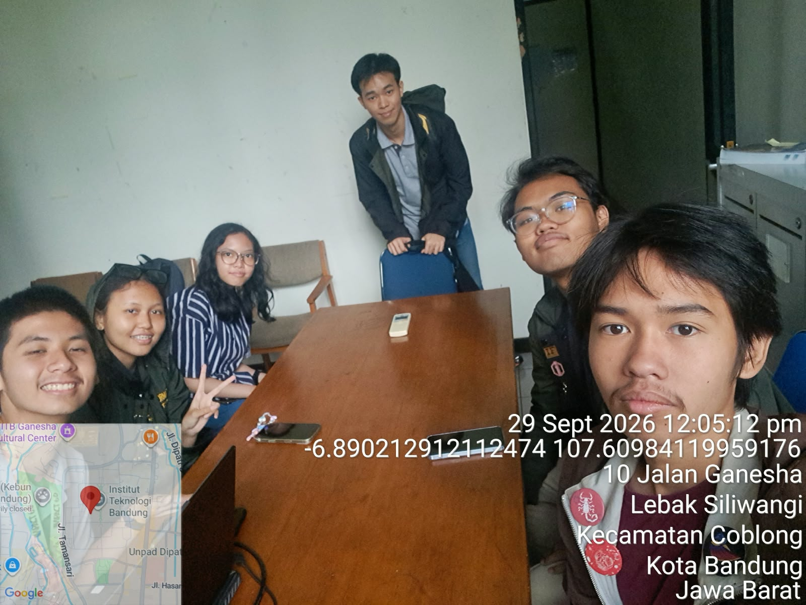

# Form Asistensi

## Tugas Besar IF2150 - Rekayasa Perangkat Lunak

| Informasi | Keterangan |
| --- | --- |
| **Hari** | Minggu |
| **Tanggal** | 20/09/2026 |
| **Kelas** | K-01 |
| **Nomor Kelompok** | G-03  |
| **Nama Kelompok** | MAYOOOOOR  |
| **Nama Perangkat Lunak** | CariJasa |
| **Dokumen** | K01_G03_SKPL.md  |

### Anggota Kelompok

| NIM | Nama |
| --- | --- |
| 13525031 | Revandra Zacky Maharta |
| 13525079 | Danesh Rasyad Damotino |
| 13525088 | Theresia Estelina Ratu Udju |
| 13525127 | Edward Terrance Lie |
| 13525130 | Necia Aurely Greva Dedevi |

### Anggota Kelompok

| NIM | Nama |
|---|---|
| 13525031 | Revandra Zacky Maharta |
| 13525079 | Danesh Rasyad Damotino |
| 13525088 | Theresia Estelina Ratu Udju |
| 13525127 | Edward Terrance Lie |
| 13525130 | Necia Aurely Greva Dedevi |

### Catatan

| Catatan |
| --- |
| 1. 1.6 jelasin pake paragraf per bab ngapain aja  |
| 2. referensi itu isinya dafpus |
| 3. batasan ngomongin batasan softwarenya doang, apa aja yg gabisa dilakuin softwarenya |
| 4. server itu kalau deploy, kalau ga local dan deploy tujuanny biar bs diakses perangkat yg beda dan dikasih domain |
| 5. Pengerjaan di lokal itu bisa selama di satu network sama nambah ip tp database memang tetap harus central |
| 6. message hrs disimpen di database |
| 7. chatroom -> idChatroom, nama room, waktu dibuat, Pengguna -> id entiti yg memetakan pengguna ad di room mana isiny id pengguna n id chatroom, pesan -> idPesan, roomid, senderid, konten |

**Notes for this section:**  
*Catatan dapat dituliskan dalam bentuk paragraf atau poin-poin, disesuaikan saja.* 

## Dokumentasi

<!--  -->

  

  <i>Gambar 1. Dokumentasi kegiatan asistensi.</i>

