<h1>
IF2150 REKAYASA PERANGKAT LUNAK
 
TUGAS 5
 
SPESIFIKASI KEBUTUHAN PERANGKAT LUNAK (SKPL)
</h1>
 

## CariJasa

### Untuk: Mikhael Andrian Yonatan

Dipersiapkan oleh:
| Informasi | Keterangan |
| :--- | :--- |
| Kelas | K-01 |
| Kelompok | G-03  |

| NIM | Nama |
|---|---|
| 13525031 | Revandra Zacky Maharta |
| 13525079 | Danesh Rasyad Damotino |
| 13525088 | Theresia Estelina Ratu Udju |
| 13525127 | Edward Terrance Lie |
| 13525130 | Necia Aurely Greva Dedevi |
---

## Daftar Perubahan

| Revisi | Deskripsi |
| :--- | :--- |
| 1. | Deskripsi Umum Sistem Berubah dari Pembeli menjadi Pengguna Jasa dan penghapusan peran admin sebagai penjaga transaksi|
| 2. | Menghapus Peran Admin sebagai penjaga transaksi dan penyedia jasa untuk melaporkan pengguna lain |
| *C* |  |
| ... |  |

 

# BAB 1: Pendahuluan

## 1.1 Tujuan Penulisan Dokumen
Tuliskan dengan ringkas tujuan dokumen SKPL ini dibuat dan siapa saja yang akan menggunakan dokumen ini.

## 1.2 Lingkup Masalah
Tuliskan dengan ringkas nama aplikasi dan deskripsi singkatnya. Bagian ini maksimal berisi satu paragraf, dapat diringkas dari BAB 1 *Analisis Permasalahan* pada dokumen *Topic Brainstorming*.

## 1.3 Definisi, Istilah, dan Singkatan
Semua definisi dan singkatan yang digunakan dalam dokumen ini beserta penjelasannya.

Tabel 1.3. Definisi Istilah dan Singkatan

| Singkatan, Akronim, atau Istilah | Penjelasan |
| :--- | :--- |
| *P/L* | *Singkatan dari Perangkat Lunak, yaitu aplikasi yang memberikan perintah kepada komputer untuk menjalankan tugas tertentu.* |
| *SKPL* | *Singkatan dari Spesifikasi Kebutuhan Perangkat Lunak, yaitu dokumen yang merangkum kriteria-kriteria yang diperlukan untuk membangun aplikasi menjalankan tugasnya.* |
| *KF* | *Singkatan dari Kebutuhan Fungsional.* |
| *KNF* | *Singkatan dari Kebutuhan Non-Fungsional.* |
| *UC* | *Singkatan dari Use Case.* |
| *EARS* | *Easy Approach to Requirements Syntax, yaitu pola penulisan kebutuhan agar konsisten dan mudah diuji.* |
| *...* | *...* |

## 1.4 Aturan Penomoran
Tuliskan aturan penomoran (ID) yang digunakan dalam dokumen ini. Gunakan pola ID yang **sama** dengan yang sudah dipakai pada dokumen-dokumen sebelumnya, jangan membuat pola baru di dokumen ini.

Tabel 1.4. Aturan Penomoran

| Hal/Bagian | Penomoran | Keterangan |
| :--- | :--- | :--- |
| *Kebutuhan Fungsional* | *KFXX* | |
| *Kebutuhan Non-Fungsional* | *KNFXX* | |
| *Aktor* | *AXX* | |
| *Use Case* | *UCXX* | |
| *Kelas* | *CXX* | |
| *...* | *...* |

## 1.5 Referensi
Dokumentasi P/L yang dirujuk oleh dokumen ini. Referensi dapat berupa buku, panduan, ataupun dokumentasi lain yang dipakai dalam pengembangan P/L ini.

## 1.6 Deskripsi Umum Dokumen (Ikhtisar)
Tuliskan sistematika pembahasan dokumen SKPL ini secara runut (misalnya: BAB 2 membahas deskripsi umum P/L, BAB 3 membahas kebutuhan fungsional dan non-fungsional, dst).

---

# BAB 2: Deskripsi Perangkat Lunak

## 2.1 Deskripsi Umum Sistem
CariJasa adalah perangkat lunak berbasis web responsif yang dirancang untuk memfasilitasi transaksi jasa digital di Indonesia, seperti pemrograman, penyuntingan video, desain grafis, copywriting, dll. Platform ini melibatkan tiga aktor utama, yaitu Pengguna Jasa, Penyedia Jasa, dan Admin Sistem. Alur sistem dimulai dari pendaftaran akun dan pemilihan peran oleh pengguna. Pengguna Jasa dapat mencari jasa berdasarkan kategori serta berdiskusi dengan Penyedia Jasa melalui fitur live chat sebelum membuat pesanan. Setelah pemesanan dilakukan, Penyedia Jasa menerima notifikasi dan mengonfirmasi ketersediaan untuk memproses pekerjaan. Selanjutnya, hasil pekerjaan diserahkan melalui platform untuk ditinjau oleh Pengguna Jasa, baik untuk pengajuan revisi maupun konfirmasi penyelesaian proyek. Alur diakhiri dengan penerusan dana pembayaran kepada Penyedia Jasa oleh sistem. Dalam hal ini, Admin bertindak sebagai pihak yang menangani kendala layanan yang dialami oleh pengguna dan menindaklanjuti laporan yang diberikan. CariJasa difokuskan untuk membantu ekosistem dan pasar lokal sehingga lebih ramah dan relevan terhadap pengguna jasa di Indonesia

## Activity Diagram
### 2.1.1 Autentikasi

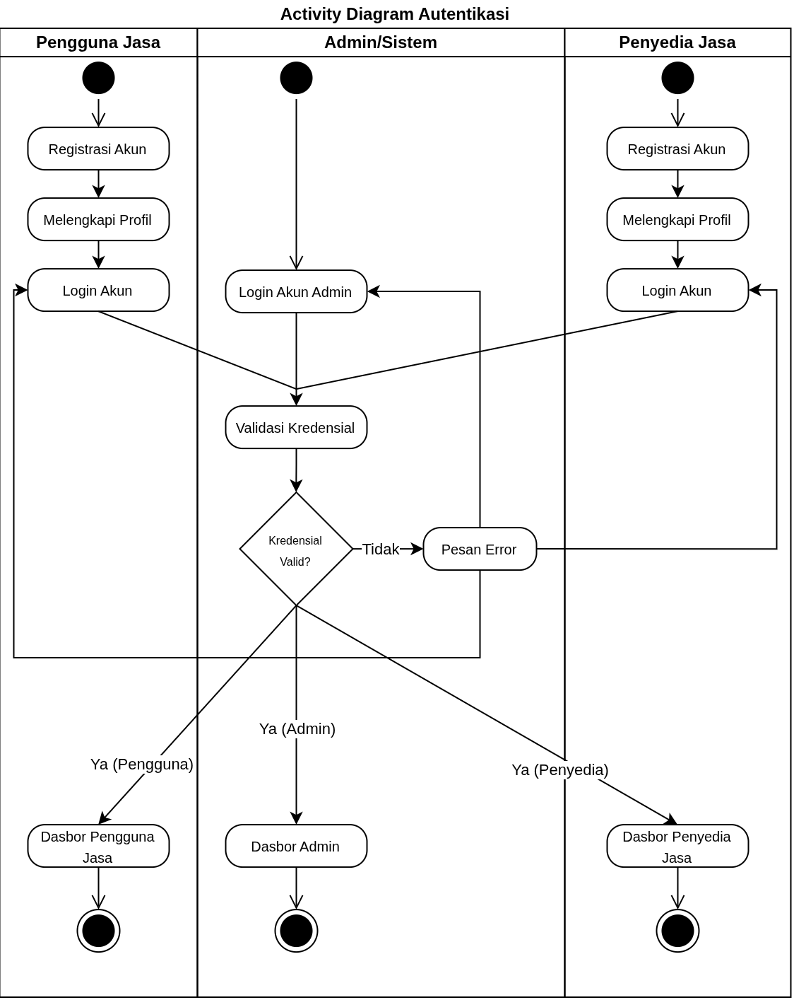

<i>Gambar 2.1 Activity Diagram Autentikasi dari CariJasa</i>

### 2.1.2 Pencarian Layanan

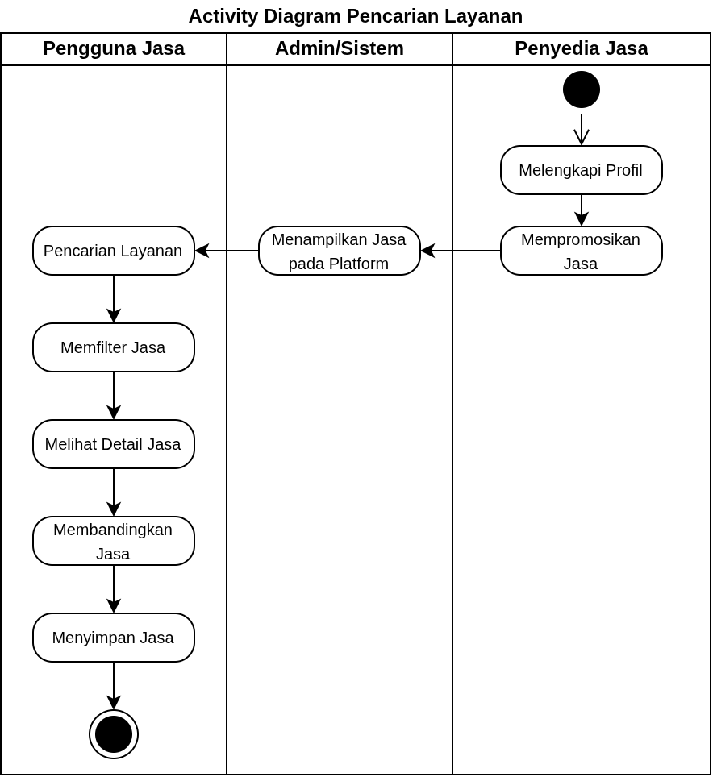

<i>Gambar 2.2 Activity Diagram Pencarian Layanan dari CariJasa</i>

### 2.1.3 Pemesanan dan Transaksi

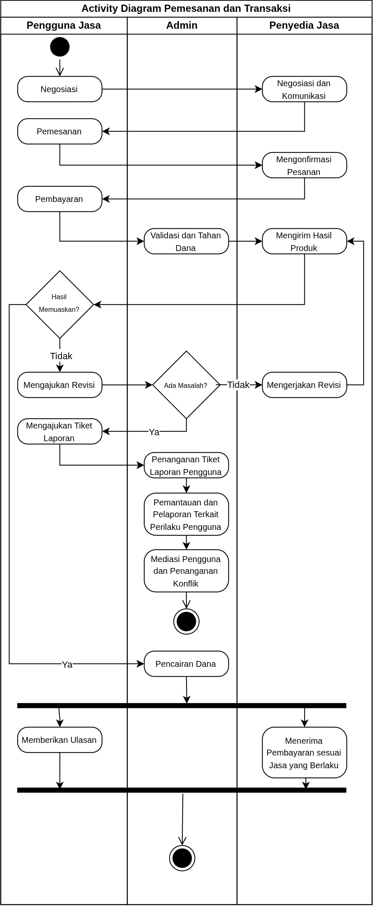

<i>Gambar 2.3 Activity Diagram Pemesanan dan Transaksi dari CariJasa</i>

## 2.2 Deskripsi Umum Perangkat Lunak
---
CariJasa adalah perangkat lunak berbasis web responsif yang dirancang untuk memfasilitasi transaksi jasa digital di Indonesia, seperti pemrograman, penyuntingan video, desain grafis, copywriting, dll. Platform ini melibatkan tiga aktor utama, yaitu Pengguna Jasa, Penyedia Jasa, dan Admin Sistem. Alur sistem dimulai dari pendaftaran akun dan pemilihan peran oleh pengguna. Pengguna Jasa dapat mencari jasa berdasarkan kategori serta berdiskusi dengan Penyedia Jasa melalui fitur *live chat* sebelum membuat pesanan. Proses transaksi pemesanan jasa akan melalui metode rekening bersama, Pengguna Jasa akan melakukan pembayaran terlebih dahulu. Setelah pemesanan dilakukan, Penyedia Jasa menerima notifikasi dan mengonfirmasi ketersediaan untuk memproses pekerjaan. Selanjutnya, hasil pekerjaan diserahkan melalui platform untuk ditinjau oleh Pengguna Jasa, baik untuk pengajuan revisi maupun konfirmasi penyelesaian proyek. Alur diakhiri dengan penerusan dana pembayaran kepada Penyedia Jasa oleh sistem. Dalam hal ini,  Admin bertindak untuk menangani masalah dan kendala layanan yang dialami pengguna. CariJasa difokuskan untuk membantu ekosistem dan pasar lokal sehingga lebih ramah dan relevan terhadap pengguna jasa di Indonesia

## 2.3 Pengguna dan Kebutuhan Pengguna Perangkat Lunak
| Pengguna | Kebutuhan |
| :--- | :--- |
| Penyedia Jasa | Memanfaatkan keterampilan yang dimilikinya untuk menawarkan layanan digital tanpa adanya hubungan kerja formal. Penyedia jasa menampilkan portofolio, mempromosikan jasa, menentukan harga, serta bernegosiasi dan menyelesaikan pesanan (termasuk mengirim draf dan revisi) secara mandiri.  |
| Pengguna Jasa | Membutuhkan layanan digital untuk kebutuhan pribadi maupun pekerjaan. Pengguna jasa menggunakan platform untuk mencari penyedia jasa berdasarkan kriteria spesifiknya (melalui filter, perbandingan, dan fitur simpan jasa), bernegosiasi, melakukan pemesanan serta pembayaran digital, mengajukan revisi, memberikan ulasan, dan mengajukan tiket pengaduan kepada admin. Pengguna jasa dapat ditanyakan mengenai tujuan penggunaan aplikasinya pada saat awal login sehingga menerima rekomendasi jasa dan tampilan antarmuka yang disesuaikan dengan preferensinya. |
| Admin | Pengelola operasional situs yang bertugas memantau aktivitas pengguna dan interaksinya. Admin memberikan respons pada tiket pengaduan, menindaklanjuti pelanggaran sesuai SOP (seperti memblokir atau menghapus akun), bertindak sebagai mediator jika terjadi konflik transaksi, serta mengelola alur keuangan. Admin memiliki hak akses eksklusif terhadap *dashboard* yang mencakup seluruh rekapitulasi data, log aktivitas, dan tiket pengaduan. |

## 2.4 Batasan Perangkat Lunak

### Batasan regulasi/hukum :
1. Sistem yang digunakan harus menjamin keamanan data, kredensial pengguna, informasi transaksi, *brief* dan konten yang dihasilkan, serta komunikasi antar pengguna. Hal ini ditujukan untuk menjamin data pengguna agar tidak terekspos ke publik tanpa perizinan yang sah.
2. Sistem harus memfasilitasi pengguna terutama Pengguna Jasa dalam mengajukan revisi dengan jumlah batas yang wajar sehingga pengguna mendapatkan kualitas terbaik dari uang yang dikeluarkan.
3. Sistem hanya berfungsi sebagai perantara yang menghubungkan penjual jasa dan Pengguna Jasa. Segala bentuk orisinalitas portofolio, karya, dan hasil yang diberikan ditanggungkan kepada masing-masing penjual.
### Keterbatasan sumber daya 
1. Waktu *development* yang terbatas karena dilakukan dalam proses perkuliahan sebagai tugas besar.
2. Ketiadaan biaya atau anggaran yang diberikan dalam melakukan *development*.
3. Penggunaan server atau infrastruktur *deployment* gratis.
4. Keterbatasan jumlah anggota dan kapasitas teknis tim yang melakukan *development*.
5. Keterbatasan pengetahuan terkait rekayasa perangkat lunak bagi beberapa anggota.

### Ruang lingkup solusi :  
1. Sistem hanya terbatas pada sirkulasi pembayaran menggunakan uang  *virtual* tanpa adanya sirkulasi uang ril di dalam aplikasi.
2. Sistem tidak menyediakan layanan customer service secara real time selama 24 jam, layanan customer service hanya dibatasi pada pengajuan tiket atau formulir.
3. Sistem hanya menyediakan komunikasi langsung secara teks, tidak mendukung modul komunikasi dalam bentuk video, maupun audio.
4. Sistem hanya menyediakan beberapa jasa pada kategori utama dalam penawaran jasa.

## 2.5 Lingkungan Operasi Perangkat Lunak
Spesifikasi *operating system* atau lingkungan yang dibutuhkan P/L untuk beroperasi. Bagian ini digunakan untuk memastikan pengguna memiliki spesifikasi yang cukup untuk menjalankan P/L. Misalnya mencakup komponen server, client, OS, DBMS, tetapi tidak menutupi kemungkinan komponen lain.

| Komponen | Spesifikasi |
| :--- | :--- |
| *Server* | *[contoh: Node.js v20, dijalankan pada layanan cloud]* |
| *Client* | *[contoh: Web Browser modern (Chrome, Firefox terbaru)]* |
| *DBMS* | *[contoh: PostgreSQL 15]* |
| *OS* | *[contoh: Cross-platform (Windows/Linux/MacOS) melalui browser]* |
| *...* | *...* |

---

# BAB 3: Deskripsi Kebutuhan Perangkat Lunak

## 3.1 Kebutuhan Fungsional (KF)
Salin ulang **seluruh Kebutuhan Fungsional (KF)** versi terbaru dari BAB 2.1 dokumen *Class Diagram* (sudah versi final dan sudah memakai format EARS). Pastikan ID Kebutuhan (kolom "ID Kebutuhan") juga konsisten dengan ID pada tabel Pemetaan Kebutuhan di dokumen *Requirement Gathering*.

Tabel 3.1. Kebutuhan Fungsional

| ID KF | ID Kebutuhan | Penjelasan |
| :--- | :--- | :--- |
| *KF01* | *R01* | *Ketika pelanggan membuka halaman katalog, sistem harus menampilkan daftar produk yang tersedia.* |
| *KF02* | *R02* | *Ketika pelanggan memilih "Tambah ke Keranjang" pada suatu produk, sistem harus menyimpan produk tersebut ke dalam keranjang pelanggan.* |
| *KF03* | *R03* | *Ketika pelanggan menekan tombol checkout, sistem harus menampilkan pilihan metode pembayaran yang tersedia.* |
| *KF04* | *R04* | *Ketika pelanggan memilih metode pembayaran, sistem harus mengirimkan permintaan otorisasi beserta nominal tagihan dan ID pesanan ke payment gateway (dummy).* |
| *KF05* | *R04* | *Ketika payment gateway (dummy) mengembalikan status pembayaran berhasil, sistem harus memperbarui status pesanan menjadi "Lunas" dan menampilkan notifikasi pembayaran berhasil.* |
| *KF06* | *R05* | *Ketika pelanggan membuka menu riwayat pesanan, sistem harus menampilkan daftar pesanan beserta statusnya.* |
| *KFXX* | *...* | *...* |

## 3.2 Kebutuhan Non-Fungsional (KNF)
Salin ulang Kebutuhan Non-Fungsional dari BAB 2.5 dokumen *Requirement Gathering*, sesuaikan ID Kebutuhan (kolom "ID Kebutuhan") apabila terjadi perubahan penomoran pada BAB 3.1 di atas.

Tabel 3.2. Kebutuhan Non-Fungsional

| ID KNF | ID Kebutuhan | Parameter | Deskripsi Kebutuhan |
| :--- | :--- | :--- | :--- |
| *KNF01* | *R03* | *Reliability* | *Proses transaksi pembayaran harus memenuhi prinsip ACID untuk mencegah terjadinya data tersangkut (lost update) apabila terjadi kegagalan jaringan di tengah proses.* |
| *KNF02* | *R04* | *Security* | *Sistem harus mengenkripsi PIN atau password pengguna menggunakan algoritma SHA-256 sebelum data dikirimkan ke server, serta tidak menyimpannya dalam bentuk plain-text di database.* |
| *...* | *...* | *...* | *...* |

*Silakan pilih parameter yang relevan dengan P/L kalian (Availability, Reliability, Ergonomy, Portability, Memory, Response time, Safety, Security, dsb), tidak perlu semua parameter diisi. Lihat kembali dokumen Requirement Gathering untuk penjelasan tiap parameter.*

---

# BAB 4: Pemodelan Use Case

## 4.1 Identifikasi Aktor
Salin ulang daftar aktor final dari BAB 3.1 dokumen *Use Case & Scenario Use Case* atau *Class Diagram*. Tambahkan ID Aktor mengikuti Aturan Penomoran pada 1.4.

| ID Aktor | Aktor | Deskripsi |
| :--- | :--- | :--- |
| *A01* | *Pelanggan* | *Pengguna yang memesan produk, mengelola keranjang, dan menyelesaikan pembayaran melalui sistem.* |
| *...* | *...* | *...* |

## 4.2 Identifikasi Use Case
Salin ulang daftar Use Case versi terbaru dari BAB 3.2 dokumen *Class Diagram*, pastikan seluruh ID KF yang dirujuk sudah sesuai dengan tabel pada 3.1.

| ID UC | Nama Use Case | Deskripsi Singkat | Aktor | ID KF |
| :--- | :--- | :--- | :--- | :--- |
| *UC01* | *Memesan Produk* | *Pelanggan memilih produk hingga pesanan tersimpan di sistem.* | *Pelanggan* | *KF01, KF02* |
| *UC02* | *Melihat Keranjang* | *Pelanggan melihat daftar item yang telah dipilih sebelum checkout.* | *Pelanggan* | *KF02* |
| *UC03* | *Melakukan Pembayaran* | *Pelanggan menyelesaikan pembayaran atas pesanan yang dibuat.* | *Pelanggan* | *KF03, KF04, KF05* |
| *UC04* | *Memilih Metode Pembayaran* | *Pelanggan memilih metode pembayaran alternatif (kartu atau e-wallet).* | *Pelanggan* | *KF03* |
| *UC05* | *Melihat Riwayat Pesanan* | *Pelanggan melihat daftar pesanan yang pernah dibuat beserta statusnya.* | *Pelanggan* | *KF06* |
| *...* | *...* | *...* | *...* | *...* |

## 4.3 Use Case Diagram
Salin ulang Use Case Diagram dari BAB 3.3 dokumen *Use Case & Scenario Use Case* atau *Class Diagram* (gunakan versi paling akhir/terbaru apabila terdapat perubahan).

<i>Gambar 2. Contoh Use Case Diagram</i>

## 4.4 Skenario Use Case
Salin ulang skenario **setiap** use case (skenario normal dan alternatif) dari BAB 3.4 dokumen *Use Case & Scenario Use Case*, sesuaikan dengan daftar UC final pada 4.2. Jika use case melibatkan lebih dari satu aktor manusia yang benar-benar berinteraksi langsung (misalnya *Kasir* yang memverifikasi transaksi setelah *Pelanggan* membayar), tambahkan kolom aksi tersendiri untuk aktor tersebut di samping kolom "Reaksi Perangkat Lunak". Sistem eksternal otomatis seperti *payment gateway* **bukan aktor**, sehingga interaksinya cukup dituliskan sebagai bagian dari "Reaksi Perangkat Lunak", bukan kolom aktor terpisah.

### 4.4.1 Skenario UC01

**Nama Use Case:** *Memesan Produk*

**Skenario Normal**

| No | Aksi Aktor | Reaksi Perangkat Lunak |
| :--- | :--- | :--- |
| 1 | *Pelanggan memilih produk dari katalog* | *Sistem menampilkan detail produk dan menambahkannya ke keranjang* |
| 2 | *Pelanggan menekan tombol checkout* | *Sistem membuat pesanan baru dari isi keranjang dan menampilkan ringkasan pesanan* |
| ... | *...* | *...* |

**Skenario Alternatif 1: Produk Tidak Tersedia**

| No | Aksi Aktor | Reaksi Perangkat Lunak |
| :--- | :--- | :--- |
| 1 | *Pelanggan memilih produk dari katalog* | *Sistem menampilkan pesan "Produk tidak tersedia" karena stok habis* |
| 2 | *Pelanggan memilih produk lain* | *Sistem kembali ke langkah 1 skenario normal* |
| ... | *...* | *...* |

*Lanjutkan pola 4.4.x ini untuk setiap ID UC pada 4.2, sampai seluruh use case memiliki skenarionya masing-masing.*

---

# BAB 5: Pemodelan Kelas

## 5.1 Identifikasi Kelas

| ID Kelas | Nama Kelas | Deskripsi Kelas | ID Use Case |
| :--- | :--- | :--- | :--- |
| C01 | Pengguna | Menyimpan data diri pengguna, informasi akun, statusAkun, sanksiPengguna, statusOnline, dan kredensial akun | UC01, UC02,UC08, UC13 |
| C02 | PenyediaJasa | Menyimpan Profil Detail dan portofolio milik Penyedia Jasa, daftar penawaran jasa, hasil pekerjaan, status komunikasi *(online, offline, typing)*, serta mengumpulkan hasil revisi | UC01, UC02, UC03, UC04, UC06, UC08, UC10, UC11, UC12, UC13 |
| C03 | PenggunaJasa | Menyimpan Profil umum, pencarian jasa, dan pemesanan jasa, pengajuan revisi, status komunikasi *(online, offline, typing)*, konfirmasi pesanan dan pengajuan revisi, laporan yang dibuat, dan ulasan yang diberikan | UC01, UC02, UC05, UC06, UC07, UC08, UC09, UC12, UC13, UC14 |
| C04 | HalamanRegistrasi |  Menyediakan antarmuka registrasi akun pengguna: form nama, form email, form no telp, form password, pesan error/validasi, tombol daftar | UC01 |
| C05 | LayananRegistrasi | Memproses validasi pengisian data diri akun pengguna | UC01 |
| C06 | HalamanLogin | Menyediakan antarmuka login: input email, input password, pesan error kredensial, tombol login | UC02 |
| C07 | Autentikator | Memvalidasi kredensial login pengguna dan memberikan akses berupa sesi login pengguna jika valid dan pesan error jika salah | UC02 |
| C08 | HalamanPortofolio | Menyediakan antarmuka portofolio: Daftar portofolio, form judul, form deskripsi, upload gambar/dokumen, tombol simpan, pesan validasi, tampilan portofolio yang berhasil ditambahkan. | UC03 |
| C09 | Portofolio | *Menyimpan karya, proyek, dan pengalaman kerja yang diunggah oleh Penyedia Jasa  | UC03 |
| C10 | PengontrolPortofolio | Mengelola logika pengisian portofolio, input dan validasi berkas, hingga pemrosesan dan penyimpanan data portofolio | UC03 |
| C11 | LayananUploadFile| Menangani proses *upload* berkas berupa dokumen atau media ke dalam server, dan memberikan status penanganan prosesnya | UC03, UC04, UC11 |
| C12 | Jasa | Menyimpan Informasi Jasa yang ditawarkan (Harga, deskripsi, dan durasi pengerjaan) | UC04, UC05, UC06, UC07 |
| C13 | HalamanUploadJasa | menyediakan antarmuka untuk mengunggah jasa: form nama jasa, pilihan kategori jasa, form deskripsi jasa, form harga, upload gambar/dokumen, pesan error | UC04 |
| C14 | JasaController | Menangani proses pengisian deskripsi jasa, harga yang ditawarkan, pemasangan kategori, dan availability yang diatur Penyedia Jasa | UC04, UC06 |
| C15 | HalamanPencarian| menyediakan antarmuka pencarian: search bar, filter harga, filter waktu pengerjaan, filter rating, daftar hasil pencarian, pesan error | UC05 |
| C16 | HasilPencarian |  menyediakan antarmuka hasil pencarian: daftar hasil pencarian, nama jasa, harga jasa, kategori jasa, rating, durasi pengerjaan, pesan error| UC05 |
| C17 | LayananPencarian | Melakukan pencarian jasa berdasarkan kata kunci, filter yang digunakan | UC05 |
| C18 | LayananPembandingJasa| Melakukan perbandingan jasa yang diminati pengguna jasa | UC05 |
| C19 | HalamanDetailJasa | Menyediakan antarmuka untuk menampilkan informasi lengkap listing jasa: deskripsi, paket harga, profil penyedia, dan ulasan. | UC06 |
| C20 | *Bookmark* | menyimpan informasi jasa yang menarik bagi pengguna | UC07 |
| C21 | HalamanBookmark |  Menampilkan antarmuka dalam bookmark: daftar jasa tersimpan, pilihan hapus bookmark, notifikasi berhasil disimpan/dihapus | UC07 |
| C22 |  PengontrolBookmark |  Menangani penambahan dan pengurangan jasa yang disimpan pengguna | UC07 |
| C23 | *ChatRoom* | Menyediakan sesi komunikasi antar dua atau lebih pengguna | UC08, UC16 |
| C24 | HalamanChat | Menyediakan antarmuka ruang obrolan: riwayat pesan, input pesan, kirim pesan, pesan error/gagal terkirim, notifikasi pesan | UC08, UC16 |
| C25 | LayananPesanInstan | Mengelola logika komunikasi  seperti, membuat sesi ChatRoom, validasi input pesan, penyimpanan ke dalam basis data, dan status baca pesan | UC08, UC16 |
| C26 | LayananNotifikasiChat | Mengirimkan notifikasi atau pop-up kepada lawan bicara saat pesan masuk | UC08, UC16 |
| C27 | Pesanan | Menyimpan informasi jasa (brief) yang dipesan pengguna dan konfirmasi Penyedia Jasa | UC09, UC10, UC12, UC14 |
| C28 | HalamanPemesanan | Menyediakan antarmuka pemesanan: detail pemesanan yang dipilih, harga, tombol pesan | UC09 |
| C29 | HalamanPembayaran | Menyediakan antarmuka pembayaran: total harga, pilihan metode pembayaran, tombol bayar, status pembayaran, pesan error | UC09 |
| C30 | HalamanRiwayatTransaksi | Menyediakan antarmuka riwayat transaksi: daftar transaksi yang telah dilakukan, harga, status transaksi | UC09, UC14 |
| C31 | PengontrolPesanan  | Menangani pembuatan pesanan baru, total biaya, dan mengatur status pesanan, dan menerima konfirmasi Penyedia Jasa maupun pengguna jasa | UC09, UC10, UC12, UC14 |
| C32 | PengontrolTransaksi  | Mengelola logika transaksi keuangan, konektivitas  sistem pembayaran, validasi pembayaran, dan pembaruan status pembayaran, dan pencairan dana | UC09, UC12, UC14 |
| C33 | MetodePembayaran | Merepresentasikan pilihan metode pembayaran yang tersedia bagi pelanggan | UC09 |
| C34 | RiwayatTransaksi | Menyimpan Informasi Jasa yang telah dipesan beserta status pengerjaannya. | UC09, UC10, UC14 |
| C35 | HalamanKonfirmasi | Menyediakan antarmuka konfirmasi pesanan: daftar pesanan, pilihan tolak/terima pesanan, status pesanan | UC10 |
| C36 | ProdukAkhir| Menyimpan hasil produk akhir yang dikerjakan Penyedia Jasa untuk diperiksa oleh (Pengguna Jasa).  | UC11 |
| C37 | HalamanPengumpulan | Menyediakan antarmuka pengumpulan pesanan: upload gambar/dokumen/link pengerjaan, deskripsi hasil, tombol kirim, pesan error | UC11 |
| C38 | HalamanDeliverables | Menyediakan antarmuka pengumpulan dari sisi pengguna: daftar hasil pekerjaan, tampilan hasil pekerjaan, status pekerjaan, tombol revisi, tombol konfirmasi selesai, pesan error | UC12 |
| C39 | PengajuanRevisi | Menyimpan Permintaan Perbaikan dari Pengguna Jasa saat pekerjaan belum sesuai | UC12 |
| C40 | HalamanRequestRevisi | Menyediakan antarmuka revisi pekerjaan bagi pengguna: detail pekerjaan, input permintaan revisi, informasi mengenai kuota revisi, tombol ajukan revisi, pesan | UC12 |
| C41 | RevisiHandler |  Menangani logika pengajuan revisi, seperti validasi jumlah revisi, kelengkapan deskripsi perbaikan yang diajukan, pengiriman informasi revisi pada Penyedia Jasa, dan notifikasi pada Penyedia Jasa | UC12 |
| C42 | PencairanDana | Menyimpan transaksi pelepasan  dana dari sistem menuju Penyedia Jasa setelah konfirmasi disetujui  | UC12 |
| C43 | TiketLaporan | Menyimpan keluhan, kendala, bukti, dan aduan pengguna untuk ditinjau oleh Admin.  | UC13, UC15, UC16 |
| C44 | HalamanPelaporan | Menyediakan antarmuka untuk melaporkan pengguna: form laporan, pilihan kategori pelanggaran, input deskripsi pelanggaran, upload bukti, tombol kirim laporan, status laporan, nomor tiket, pesan error, dan tanggapan laporan. | UC13 |
| C45 | LaporanHandler  | Menangani proses pengisian laporan, seperti validasi struktur laporan (judul, deskripsi, dan bukti), pembuatan tiket laporan, dan pengiriman notifikasi pada admin, mengambil data laporan, mencatat tanggapan admin, memperbarui status laporan, eksekusi sanksi, dan mengubah status akun terlapor | UC13, UC15, UC16 |
| C46 | Ulasan | Menyimpan feedback dan rating oleh Pengguna Jasa terhadap jasa yang telah dipesan  | UC06, UC14 |
| C47 | HalamanUlasan | Menyediakan antarmuka ulasan bagi pengguna: rating, input komentar, upload dokumentasi, tombol kirim ulasan, pesan error, notifikasi ulasan terkirim | UC14 |
| C48 | UlasanHandler  | Menangani proses pengisian laporan, validasi kelengkapan pengisian, dan penyimpanan data pada basis data server. | UC14 |
| C49 | TanggapanLaporan | Mencatat balasan, analisis internal, dan keputusan peninjauan terkait laporan tersebut. | UC15, UC16 |
| C50 | HalamanPengajuanMediasi  | Menyediakan antarmuka pengajuan mediasi: detail pelaporan, status mediasi, tombol ajukan mediasi, pesan error. | UC16 |
| C51 | MediasiHandler  | Menangani permintaan mediasi, dan membuka RoomChat berisikan admin, penyedia jasa, dan pengguna jasa. | UC16 |
| C52 | Admin | Meninjau laporan pengguna, mempertimbangkan sanksi yang diperlukan, membantu dalam proses mediasi, memberikan tanggapan terkait laporan pengguna | UC15, UC16 |
| C53 | HalamanDashboardAdmin | Menyediakan antarmuka panel kerja khusus bagi Admin untuk meninjau tiket laporan, menetapkan sanksi, dan membuka ruang mediasi | UC15, UC16 |

## 5.2 Diagram Kelas per Use Case
### 5.2.1 Use Case UC01

**Nama Use Case:** Melakukan Registrasi Akun

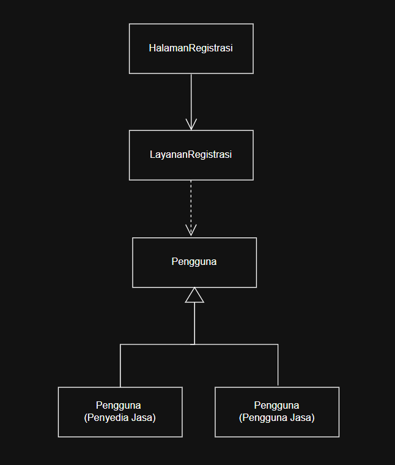

<i>Gambar 5.1 Diagram Kelas Use Case UC01</i>

 

| ID Kelas | Nama Kelas              | Atribut                                                                 | Metode/Operasi                                                   |
|----------|-------------------------|-------------------------------------------------------------------------|------------------------------------------------------------------|
| C01 | Pengguna | nama, email, noTelepon, password, statusOnline, statusAkun,sanksi| buatAkun(), simpanProfil(), login(), setStatusAkun(), setSanksi() | 
| C02 | PenyediaJasa | idPenyediaJasa, daftarPenawaranJasa, pengalaman, prestasi | isiPortofolio(), unggahPortofolio(), tambahPenawaranJasa(), bukaNotifikasiPesanan(), terimaPesanan(), tolakPesanan(), kumpulkanProdukAkhir(), getStatusPengerjaan(), kumpulkanRevisi(), cekPengirimanDana(), getRevisi() |
| C03 | PenggunaJasa | idPenggunaJasa, daftarJasa,  minatkategoriJasa, statusKonfirmasi | cariJasa(), gunakanFilter(), bukaDetailJasa(), bukaDaftarBoomark(), pilihJasa(), isiFormPemesanan(), getStatusPengerjaan(), getDeliverables(), selesaikanPesanan(), AjukanRevisi(), BeriUlasan(), beriPenilaian(), pilihMetodePembayaran() |
| C04      | HalamanRegistrasi       | formRegistrasi, pesanError                                              | tampilkanForm(), kirimRegistrasi(), tampilkanError()              |
| C05      | LayananRegistrasi       | -                                                                       | validasiData(), cekEmail(), cekNoTelepon(), registrasiPengguna() |

### 5.2.2 Use Case UC02

**Nama Use Case:** Melakukan *Login*

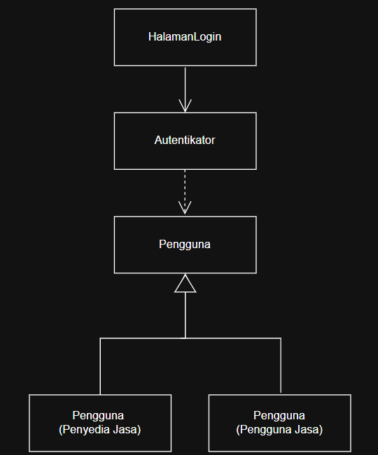

<i>Gambar 5.2 Diagram Kelas Use Case UC02</i>

 

| ID Kelas | Nama Kelas               | Atribut                               | Metode/Operasi                              |
|----------|--------------------------|---------------------------------------|---------------------------------------------|
| C01 | Pengguna | nama, email, noTelepon, password, statusOnline, statusAkun,sanksi| buatAkun(), simpanProfil(), login(), setStatusAkun(), setSanksi() | 
| C02 | PenyediaJasa | idPenyediaJasa, daftarPenawaranJasa, pengalaman, prestasi | isiPortofolio(), unggahPortofolio(), tambahPenawaranJasa(), bukaNotifikasiPesanan(), terimaPesanan(), tolakPesanan(), kumpulkanProdukAkhir(), getStatusPengerjaan(), kumpulkanRevisi(), cekPengirimanDana(), getRevisi(), getProfilDetail() |
| C03 | PenggunaJasa | idPenggunaJasa, daftarJasa,  minatkategoriJasa, statusKonfirmasi | cariJasa(), gunakanFilter(), bukaDetailJasa(), bukaDaftarBoomark(), pilihJasa(), isiFormPemesanan(), getStatusPengerjaan(), getDeliverables(), selesaikanPesanan(), AjukanRevisi(), BeriUlasan(), beriPenilaian(), pilihMetodePembayaran() |
| C06      | HalamanLogin             | inputEmail, inputPassword, pesanError | tampilkanForm(), kirimLogin(), pesanError() |
| C07      | Autentikator             | -                                     | validasiKredensial(), sesiLogin()           |

### 5.2.3 Use Case UC03

**Nama Use Case:** Mengisi Portofolio

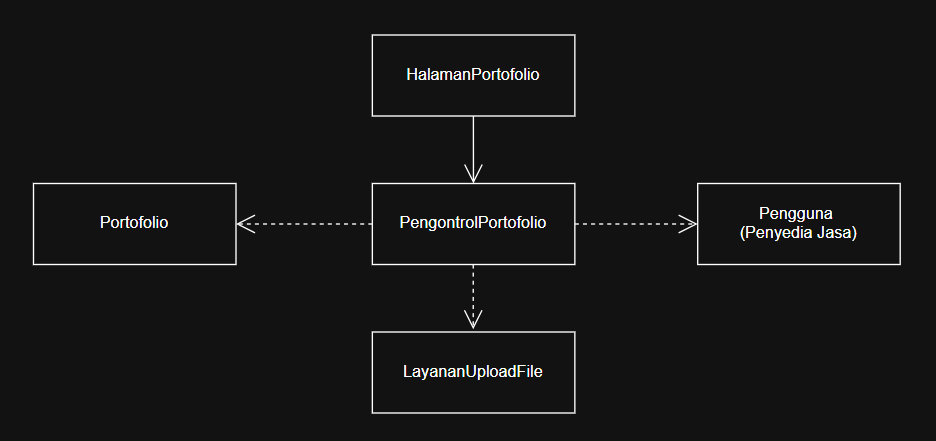

<i>Gambar 5.3 Diagram Kelas Use Case UC03</i>

 

| ID Kelas | Nama Kelas               | Atribut                           | Metode/Operasi                                                               |
|----------|--------------------------|-----------------------------------|------------------------------------------------------------------------------|
| C02 | PenyediaJasa | idPenyediaJasa, daftarPenawaranJasa, pengalaman, prestasi | isiPortofolio(), unggahPortofolio(), tambahPenawaranJasa(), bukaNotifikasiPesanan(), terimaPesanan(), tolakPesanan(), kumpulkanProdukAkhir(), getStatusPengerjaan(), kumpulkanRevisi(), cekPengirimanDana(), getRevisi(), getProfilDetail() |
| C08      | HalamanPortofolio        | formPortofolio, pesanError        | tampilkanPortofolio(), tampilkanForm(), kirimPortofolio(), tampilkanError(), |
| C09      | Portofolio               | judul, deskripsi, berkasPendukung | simpanPortofolio()                                                           |
| C10      | PengontrolPortofolio     | -                                 | validasiInputBerkas(),  SimpanPortofolio()                 |
| C11      | LayananUploadFile        | -                                 | uploadFile(), getStatusUpload(), validasiFormatUkuran(), saveDeliverables() |

### 5.2.4 Use Case UC04

**Nama Use Case:** Mengunggah Penawaran Jasa

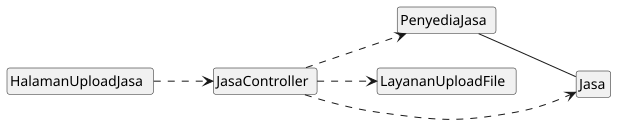

<i>Gambar 5.4 Diagram Kelas Use Case UC04</i>

 

| ID Kelas | Nama Kelas | Atribut | Metode/Operasi |
| :--- | :--- | :--- | :--- |
| C02 | PenyediaJasa | idPenyediaJasa, daftarPenawaranJasa, pengalaman, prestasi | isiPortofolio(), unggahPortofolio(), tambahPenawaranJasa(), bukaNotifikasiPesanan(), terimaPesanan(), tolakPesanan(), kumpulkanProdukAkhir(), getStatusPengerjaan(), kumpulkanRevisi(), cekPengirimanDana(), getRevisi(), getProfilDetail() |
| C11      | LayananUploadFile        | -                                 | uploadFile(), getStatusUpload(), validasiFormatUkuran(), saveDeliverables() |
| C12 | Jasa | idJasa, idPenyediaJasa, namaJasa, deskripsi, kategori, harga, statusAktif | simpanJasa(), dapatkanDetailJasa(), perbaruiJasa(), hapusJasa() |
| C13 | HalamanUploadJasa | formNamaJasa, formKategori, formDeskripsi, formHarga, inputUploadBerkas, tombolUnggah, pesanError | tampilkanForm(), klikUnggah(), tampilkanPesanError(), tampilkanNotifikasiBerhasil() |
| C14 | JasaController | - |ambilDetailJasa(), validasiDataJasa(), simpanPenawaranJasa() |

### 5.2.5 Use Case UC05

**Nama Use Case:** Mencari Penawaran Jasa

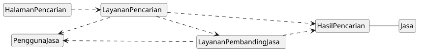

<i>Gambar 5.5 Diagram Kelas Use Case UC05</i>

 

| ID Kelas | Nama Kelas | Atribut | Metode/Operasi |
| :--- | :--- | :--- | :--- |
| C03 | PenggunaJasa | idPenggunaJasa, daftarJasa,  minatkategoriJasa, statusKonfirmasi | cariJasa(), gunakanFilter(), bukaDetailJasa(), bukaDaftarBoomark(), pilihJasa(), isiFormPemesanan(), getStatusPengerjaan(), getDeliverables(), selesaikanPesanan(), AjukanRevisi(), BeriUlasan(), beriPenilaian(), pilihMetodePembayaran() |
| C12 | Jasa | idJasa, idPenyediaJasa, namaJasa, deskripsi, kategori, harga, statusAktif | simpanJasa(), dapatkanDetailJasa(), perbaruiJasa(), hapusJasa() |
| C15 | HalamanPencarian | searchBar, filterHarga, filterDurasi, filterRating, tombolCari, pesanError | tampilkanHalaman(), inputKataKunci(), klikCari(), tampilkanPesanError() |
| C16 | HasilPencarian | daftarListingJasa, tombolBandingkan | tampilkanDaftarHasil(), pilihJasaUntukDibandingkan(), klikBandingkan() |
| C17 | LayananPencarian | - | cariJasaBerdasarkanKeyword(), terapkanFilterPencarian() |
| C18 | LayananPembandingJasa | - | bandingkanSpesifikasiJasa() |

### 5.2.6 Use Case UC06

**Nama Use Case:** Melihat Informasi Jasa

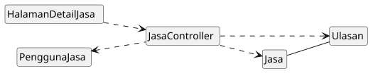

<i>Gambar 5.6 Diagram Kelas Use Case UC06</i>

 

| ID Kelas | Nama Kelas | Atribut | Metode/Operasi |
| :--- | :--- | :--- | :--- |
| C02 | PenyediaJasa | idPenyediaJasa, daftarPenawaranJasa, pengalaman, prestasi | isiPortofolio(), unggahPortofolio(), tambahPenawaranJasa(), bukaNotifikasiPesanan(), terimaPesanan(), tolakPesanan(), kumpulkanProdukAkhir(), getStatusPengerjaan(), kumpulkanRevisi(), cekPengirimanDana(), getRevisi(), getProfilDetail() |
| C03 | PenggunaJasa | idPenggunaJasa, daftarJasa,  minatkategoriJasa, statusKonfirmasi | cariJasa(), gunakanFilter(), bukaDetailJasa(), bukaDaftarBoomark(), pilihJasa(), isiFormPemesanan(), getStatusPengerjaan(), getDeliverables(), selesaikanPesanan(), AjukanRevisi(), BeriUlasan(), beriPenilaian(), pilihMetodePembayaran() |
| C12 | Jasa | idJasa, idPenyediaJasa, namaJasa, deskripsi, kategori, harga, statusAktif | simpanJasa(), dapatkanDetailJasa(), perbaruiJasa(), hapusJasa() |
| C14 | JasaController | - | ambilDetailJasa(), validasiDataJasa(), simpanPenawaranJasa() |
| C46 | Ulasan | idUlasan, idPesanan, idPenyediaJasa,rating, komentar, dokumentasi | simpanUlasan(), getDetailUlasan() |
| C19 | HalamanDetailJasa | tampilanDeskripsi, tampilanHarga, infoProfilPenyedia, tampilanRiwayatUlasan, pesanError | tampilkanDetailJasa(), tampilkanPesanError() |

### 5.2.7 Use Case UC07

**Nama Use Case:** Menggunakan *Bookmark*

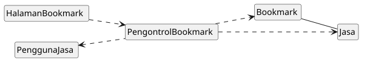

<i>Gambar 5.7 Diagram Kelas Use Case UC07</i>

 

| ID Kelas | Nama Kelas | Atribut | Metode/Operasi |
| :--- | :--- | :--- | :--- |
| C03 | PenggunaJasa | idPenggunaJasa, daftarJasa,  minatkategoriJasa, statusKonfirmasi | cariJasa(), gunakanFilter(), bukaDetailJasa(), bukaDaftarBoomark(), pilihJasa(), isiFormPemesanan(), getStatusPengerjaan(), getDeliverables(), selesaikanPesanan(), AjukanRevisi(), BeriUlasan(), beriPenilaian(), pilihMetodePembayaran() |
| C12 | Jasa | idJasa, idPenyediaJasa, namaJasa, deskripsi, kategori, harga, statusAktif | simpanJasa(), dapatkanDetailJasa(), perbaruiJasa(), hapusJasa() |
| C20 | Bookmark | idBookmark, idPenggunaJasa, idJasa, waktuDisimpan, daftarBookmark | simpanBookmark(), hapusBookmark(), lihatBookmark() |
| C21 | HalamanBookmark | daftarJasaTersimpan, ikonBookmarkAktif, ikonBookmarkNonaktif, tombolHapusBookmark | tampilkanDaftarTersimpan(), klikIkonBookmark(), klikIkonHapus(), tampilkanNotifikasi() |
| C22 | PengontrolBookmark | - | tambahDataBookmark(), hapusDataBookmark(), ambilDaftarBookmarkPengguna() |

### 5.2.8 Use Case UC08

**Nama Use Case:** Melakukan Komunikasi

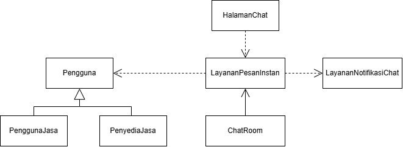

<i>Gambar 5.8 Diagram Kelas Use Case UC08</i>

 

| ID Kelas | Nama Kelas | Atribut | Metode/Operasi |
| :--- | :--- | :--- | :--- |
| C01 | Pengguna | nama, email, noTelepon, password, statusOnline, statusAkun,sanksi| buatAkun(), simpanProfil(), login(), setStatusAkun(), setSanksi() | 
| C02 | PenyediaJasa | idPenyediaJasa, daftarPenawaranJasa, pengalaman, prestasi | isiPortofolio(), unggahPortofolio(), tambahPenawaranJasa(), bukaNotifikasiPesanan(), terimaPesanan(), tolakPesanan(), kumpulkanProdukAkhir(), getStatusPengerjaan(), kumpulkanRevisi(), cekPengirimanDana(), getRevisi() |
| C03 | PenggunaJasa | idPenggunaJasa, daftarJasa,  minatkategoriJasa, statusKonfirmasi | cariJasa(), gunakanFilter(), bukaDetailJasa(), bukaDaftarBoomark(), pilihJasa(), isiFormPemesanan(), getStatusPengerjaan(), getDeliverables(), selesaikanPesanan(), AjukanRevisi(), BeriUlasan(), beriPenilaian(), pilihMetodePembayaran() |
| C23 | ChatRoom | idChatRoom, idAnggota, riwayatPesan, waktuDibuat | getRiwayatPesan() |
| C24 | HalamanChat | idSesiChat, inputPesan, statusKoneksi | tampilkanMenuChat(), tampilkanRiwayatPesan(), inputPesan(), tombolKirimTerklik(), tampilkanPesanError(), tampilkanStatusBelumTerkirim() |
| C25 | LayananPesanInstan | - | buatSesiChat(), validasiInputPesan(), kirimPesan(), simpanKeDatabase(), updateStatusBaca() |
| C26 | LayananNotifikasiChat | - | kirimNotifikasiPesan(), tampilkanPopUpNotifikasi() |

### 5.2.9 Use Case UC09

**Nama Use Case:** Melakukan Pemesanan Jasa

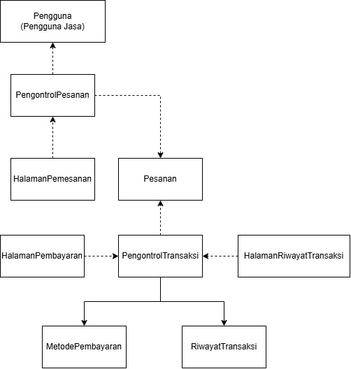

<i>Gambar 5.9 Diagram Kelas Use Case UC09</i>

 

| ID Kelas | Nama Kelas | Atribut | Metode/Operasi |
| :--- | :--- | :--- | :--- |
| C03 | PenggunaJasa | idPenggunaJasa, daftarJasa,  minatkategoriJasa, statusKonfirmasi | cariJasa(), gunakanFilter(), bukaDetailJasa(), bukaDaftarBoomark(), pilihJasa(), isiFormPemesanan(), getStatusPengerjaan(), getDeliverables(), selesaikanPesanan(), AjukanRevisi(), BeriUlasan(), beriPenilaian(), pilihMetodePembayaran() |
| C27 | Pesanan | idPesanan, idPenggunaJasa, idPenyediaJasa, idJasa, brief, totalBiaya, statusPesanan | getDetailPesanan(), setStatusDiproses(), setStatusSelesai() |
| C28 | HalamanPemesanan | idJasaDipilih, briefPemesanan | tampilkanFormPemesanan(), inputBriefPemesanan(), tombolPesanTerklik() |
| C29 | HalamanPembayaran | totalHarga, idMetodePembayaran | tampilkanPilihanPembayaran(), tampilkanRincianPembayaran(), tombolBayarTerklik(), tampilkanNotifikasiBerhasil() |
| C30 | HalamanRiwayatTransaksi | idTransaksi | tampilkanRiwayatTransaksi() |
| C31 | PengontrolPesanan | - | buatPesananBaru(), hitungTotalBiaya(), updateStatusPesanan() |
| C32 | PengontrolTransaksi | - | prosesPembayaran(), validasiPembayaran(), updateStatusPembayaran() |
| C33 | MetodePembayaran | idMetode, namaMetode, nomorRekeningVA | getDetailMetode() |
| C34 | RiwayatTransaksi | idRiwayat, idPesanan, tanggalTransaksi, statusTransaksi | simpanTransaksi() |

### 5.2.10 Use Case UC10

**Nama Use Case:** Melakukan Konfirmasi Pesanan

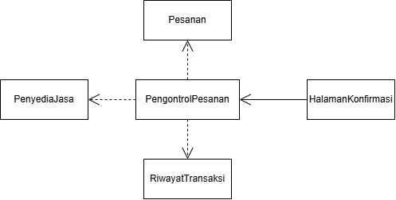

<i>Gambar 5.10 Diagram Kelas Use Case UC10</i>

 

| ID Kelas | Nama Kelas | Atribut | Metode/Operasi |
| :--- | :--- | :--- | :--- |
| C02 | PenyediaJasa | idPenyediaJasa, daftarPenawaranJasa, pengalaman, prestasi | isiPortofolio(), unggahPortofolio(), tambahPenawaranJasa(), bukaNotifikasiPesanan(), terimaPesanan(), tolakPesanan(), kumpulkanProdukAkhir(), getStatusPengerjaan(), kumpulkanRevisi(), cekPengirimanDana(), getRevisi() |
| C27 | Pesanan | idPesanan, idPenggunaJasa, idPenyediaJasa, idJasa, brief, totalBiaya, statusPesanan | getDetailPesanan(), setStatusDiproses(), setStatusSelesai() |
| C31 | PengontrolPesanan | - | buatPesananBaru(), hitungTotalBiaya(), updateStatusPesanan() |
| C32 | PengontrolTransaksi | - | prosesPembayaran(), validasiPembayaran(), updateStatusPembayaran() |
| C33 | MetodePembayaran | idMetode, namaMetode, nomorRekeningVA | getDetailMetode() |
| C34 | RiwayatTransaksi | idRiwayat, idPesanan, tanggalTransaksi, statusTransaksi | simpanTransaksi() |
| C35 | HalamanKonfirmasi | idPesanan, detailBrief | tampilkanDetailPesanan(), tombolTerimaTerklik(), tombolTolakTerklik(), tampilkanStatusPesanan() |

### 5.2.11 Use Case UC11

**Nama Use Case:** Menyerahkan Hasil Pekerjaan

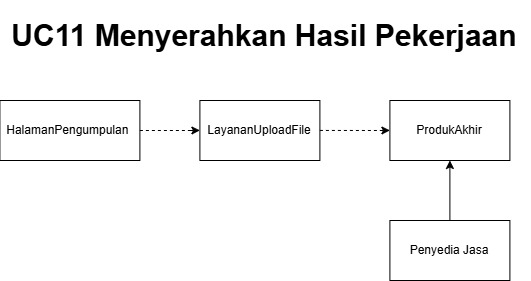

<i>Gambar 5.11 Diagram Kelas Use Case UC11</i>

 

| ID Kelas | Nama Kelas | Atribut | Metode/Operasi |
| :--- | :--- | :--- | :--- |
| C02 | PenyediaJasa | idPenyediaJasa, daftarPenawaranJasa, pengalaman, prestasi | isiPortofolio(), unggahPortofolio(), tambahPenawaranJasa(), bukaNotifikasiPesanan(), terimaPesanan(), tolakPesanan(), kumpulkanProdukAkhir(), getStatusPengerjaan(), kumpulkanRevisi(), cekPengirimanDana(), getRevisi(), getProfilDetail() |
| C11      | LayananUploadFile        | -                                 | uploadFile(), getStatusUpload(), validasiFormatUkuran(), saveDeliverables() |
| C36 | ProdukAkhir | idProdukAkhir, idPesanan, outputpath, deskripsiProdukAkhir, tanggalPengumpulan,  statusPemeriksaan, fileURL | simpanProdukAkhir(), updateStatusPengerjaan(), getDetailJasa() | 
| C37 | HalamanPengumpulan | deskripsiHasil, fileURL, tombolKirim, pesanError  | tampilkanFormPengumpulan(), inputDeskripsiHasil(), unggahDeliverables(), tampilkanPesanError(), kirimHasil(), inputLink(), tampilkanStatusPengiriman() |

### 5.2.12 Use Case UC12

**Nama Use Case:** Mengonfirmasi Hasil Pekerjaan

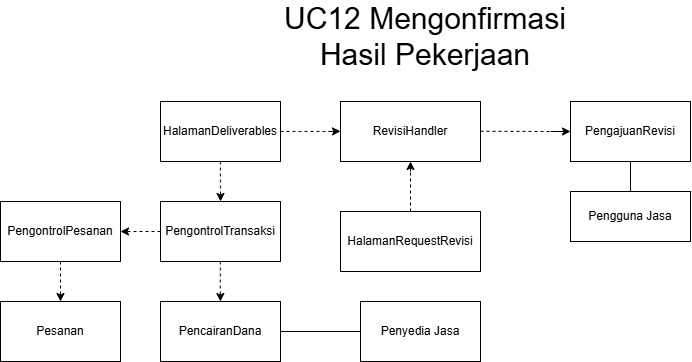

<i>Gambar 5.12 Diagram Kelas Use Case UC12</i>

 

| ID Kelas | Nama Kelas | Atribut | Metode/Operasi |
| :--- | :--- | :--- | :--- |
| C02 | PenyediaJasa | idPenyediaJasa, daftarPenawaranJasa, pengalaman, prestasi | isiPortofolio(), unggahPortofolio(), tambahPenawaranJasa(), bukaNotifikasiPesanan(), terimaPesanan(), tolakPesanan(), kumpulkanProdukAkhir(), getStatusPengerjaan(), kumpulkanRevisi(), cekPengirimanDana(), getRevisi(), getProfilDetail() |
| C03 | PenggunaJasa | idPenggunaJasa, daftarJasa,  minatkategoriJasa, statusKonfirmasi | cariJasa(), gunakanFilter(), bukaDetailJasa(), bukaDaftarBoomark(), pilihJasa(), isiFormPemesanan(), getStatusPengerjaan(), getDeliverables(), selesaikanPesanan(), AjukanRevisi(), BeriUlasan(), beriPenilaian(), pilihMetodePembayaran() |
| C27 | Pesanan | idPesanan, idPenggunaJasa, idPenyediaJasa, idJasa, brief, totalBiaya, statusPesanan | getDetailPesanan(), setStatusDiproses(), setStatusSelesai() |
| C31 | PengontrolPesanan | idPengontrolPesanan | buatPesananBaru(), hitungTotalBiaya(), updateStatusPesanan(), konfirmasiPesanan() |
| C32 | PengontrolTransaksi | idPengontrolTransaksi | prosesPembayaran(), validasiPembayaran(), cairkanDana(), getStatusPencairan(), updateStatusPembayaran() |
| C38 | HalamanDeliverables | deskripsiHasil, fileURL, tombolKonfirmasi, tombolRevisi, jumlahRevisi, pesanError, tombolBantuan, lampiranDeliverables | tampilkanDeliverables(), ajukanRevisi(), konfirmasiPesanan(), tampilkanError, panggilBantuan() |
| C39 | PengajuanRevisi | deskripsiRevisi, jmlRevisiTersedia, lampiranRevisi, idRevisi, idPesanan, statusPengerjaan | setStatusPengerjaan(), getStatusPengerjaan(), setDeskripsiRevisi(), getDeskripsiRevisi(), setjmlRevisi(), getjmlRevisi() setIdRevisi(), getIdPesanan(), getIdRevisi() |
| C40 | HalamanRequestRevisi | formRevisi, detailRevisi, kuotaRevisi, tombolRevisi, pesanUntukPenyedia  | tampilkanformRevisi(), tampilkanFieldPengisianRevisi(), tampilkanKuotaRevisi(), isTombolRevisiPressed(), tampilkanPesan()  |
| C41 | RevisiHandler | - | isJumlahRevisiValid(), isDeskripsiComplete(), sendRevisi(), setNotifikasiRevisi(), updateStatusPengerjaan(), updateIdRevisi()  |
| C42 | PencairanDana | stateTransaksi, statePencairanDana | setKondisiTransaksi(), setPencairanDana() |

### 5.2.13 Use Case UC13

**Nama Use Case:** Melaporkan Pengguna Lain

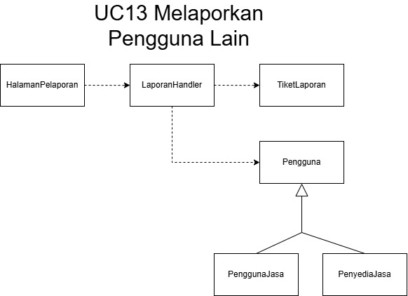

<i>Gambar 5.13 Diagram Kelas Use Case UC13</i>

 

| ID Kelas | Nama Kelas | Atribut | Metode/Operasi |
| :--- | :--- | :--- | :--- |
| C01 | Pengguna | nama, email, noTelepon, password, statusOnline, statusAkun,sanksi| buatAkun(), simpanProfil(), login(), setStatusAkun(), setSanksi() | 
| C02 | PenyediaJasa | idPenyediaJasa, daftarPenawaranJasa, pengalaman, prestasi | isiPortofolio(), unggahPortofolio(), tambahPenawaranJasa(), bukaNotifikasiPesanan(), terimaPesanan(), tolakPesanan(), kumpulkanProdukAkhir(), getStatusPengerjaan(), kumpulkanRevisi(), cekPengirimanDana(), getRevisi(), getProfilDetail() |
| C03 | PenggunaJasa | idPenggunaJasa, daftarJasa,  minatkategoriJasa, statusKonfirmasi | cariJasa(), gunakanFilter(), bukaDetailJasa(), bukaDaftarBoomark(), pilihJasa(), isiFormPemesanan(), getStatusPengerjaan(), getDeliverables(), selesaikanPesanan(), AjukanRevisi(), BeriUlasan(), beriPenilaian(), pilihMetodePembayaran() |
| C43 | TiketLaporan | idTiket, deskripsiLaporan, urlbukti, lampiranBukti, statusTiket, TanggapanAdmin | setIdTiket(), getIdTiket(), setURLBukti(), getURLBukti(), setStatusTiket, UpdateStatusTiket(), getStatusTicket(), setTanggapan(), getTanggapan(), setStatusLaporan()  |
| C44 | HalamanPelaporan | formLaporan, kategoriPelanggaran, deskripsiPelanggaran, kolomBukti, statusLaporan, noTiket, pesanError, tanggapanAdmin | tampilkanFormLaporan(), tampilkanOpsiKategoriPelanggaran(), tampilkanDeskripsiPelanggaran, tampilkanNomorTiket(), tampilkanPesanError(), tampilkanTanggapanAdmin(), tampilkanPesanError() | 
| C45 | LaporanHandler  | - | validasiFormatLaporan(), createTiket(), getStatusTiket(), kirimNotifAdmin(), simpanData(), banPengguna(), skorsPengguna(), kirimTanggapan(), saveTanggapan(), saveLaporan(), updateStatusTiket() | 

### 5.2.14 Use Case UC14

**Nama Use Case:** Memberikan Ulasan terhadap jasa yang dipesan

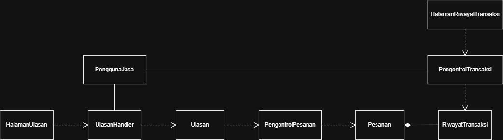

<i>Gambar 5.14. Diagram Kelas Use Case UC14</i>

 

| ID Kelas | Nama Kelas | Atribut | Metode/Operasi |
| :--- | :--- | :--- | :--- |
| C03 | PenggunaJasa | idPenggunaJasa, daftarJasa,  minatkategoriJasa, statusKonfirmasi | cariJasa(), gunakanFilter(), bukaDetailJasa(), bukaDaftarBoomark(), pilihJasa(), isiFormPemesanan(), getStatusPengerjaan(), getDeliverables(), selesaikanPesanan(), AjukanRevisi(), BeriUlasan(), beriPenilaian(), pilihMetodePembayaran() |
| C27 | Pesanan | idPesanan, idPenggunaJasa, idPenyediaJasa, idJasa, brief, totalBiaya, statusPesanan | getDetailPesanan(), setStatusDiproses(), setStatusSelesai() |
| C30 | HalamanRiwayatTransaksi | idTransaksi,daftarPesananSelesai | tampilkanRiwayatTransaksi() |
| C31 | PengontrolPesanan | idPengontrolPesanan | buatPesananBaru(), hitungTotalBiaya(), updateStatusPesanan(), konfirmasiPesanan() |
| C32 | PengontrolTransaksi | idPengontrolTransaksi | prosesPembayaran(), validasiPembayaran(), cairkanDana(), getStatusPencairan(), updateStatusPembayaran() |
| C34 | RiwayatTransaksi | idRiwayat, idPesanan, tanggalTransaksi, statusTransaksi | simpanTransaksi(), updateStatusTransaksi(), getDataRiwayat() |
| C46 | Ulasan | idUlasan, idPesanan, idPenyediaJasa,rating, komentar, dokumentasi | simpanUlasan(), getDetailUlasan() |
| C47 | HalamanUlasan | rating, teksKomentar, fileDokumentasi, pesanError | tampilkanFormUlasan(), inputRatingBintang(), inputKomentar(), unggahDokumentasi(), tampilkanPesanError(), tampilkanNotifikasiBerhasil() |
| C48 | UlasanHandler | - | validasiKelengkapanRating(), validasiFormatBerkas(), validasiPanjangKomentar(), prosesUlasan(), perbaruiRating() |

### 5.2.15 Use Case UC15

**Nama Use Case:** Memproses Laporan

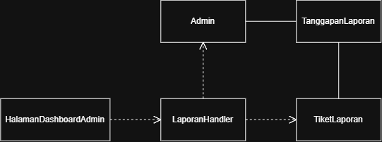

<i>Gambar 5.15. Diagram Kelas Use Case UC15</i>

 

| ID Kelas | Nama Kelas | Atribut | Metode/Operasi |
| :--- | :--- | :--- | :--- |
| C43 | TiketLaporan | idTiket, deskripsiLaporan, urlbukti, lampiranBukti, statusTiket, TanggapanAdmin | setIdTiket(), getIdTiket(), setURLBukti(), getURLBukti(), setStatusTiket, UpdateStatusTiket(), getStatusTicket(), setTanggapan(), getTanggapan(), setStatusLaporan()  |
| C45 | LaporanHandler  | - | validasiFormatLaporan(), createTiket(), getStatusTiket(), kirimNotifAdmin(), simpanData(), banPengguna(), skorsPengguna(), kirimTanggapan(), saveTanggapan(), saveLaporan(), updateStatusTiket() | 
| C49 | TanggapanLaporan | idTanggapan, idTiket, jenisTindakan, catatanTanggapan | catatKeputusanTindakan(), getDetailTanggapan() |
| C52 | Admin | idAdmin, nama | mulaiMediasi(), bukaTiketLaporan(), selesaikanLaporan(), kirimPesanMediasi(), pilihJenisTindakan(), akhiriMediasi() |
| C53 | HalamanDashboardAdmin | daftarTiket, detailTiket, opsiTindakan, pesanError | tampilkanDetailTiket(), inputTindakan(), selesaikanTiket(), mulaiMediasi(), tampilkanPesanError() |

### 5.2.16 Use Case UC16

**Nama Use Case:** Melakukan Proses Mediasi

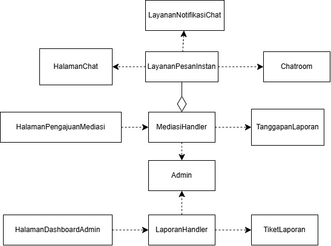

<i>Gambar 5.16. Diagram Kelas Use Case UC16</i>

 

| ID Kelas | Nama Kelas | Atribut | Metode/Operasi |
| :--- | :--- | :--- | :--- |
| C23 | ChatRoom | idChatRoom, idAnggota, riwayatPesan, waktuDibuat | getRiwayatPesan() |
| C24 | HalamanChat | idSesiChat, inputPesan, statusKoneksi | tampilkanMenuChat(), tampilkanRiwayatPesan(), inputPesan(), tombolKirimTerklik(), tampilkanPesanError(), tampilkanStatusBelumTerkirim() |
| C25 | LayananPesanInstan | idLayanan | buatSesiChat(), validasiInputPesan(), kirimPesan(), simpanKeDatabase(), updateStatusBaca() |
| C26 | LayananNotifikasiChat | idNotifikasi | kirimNotifikasiPesan(), tampilkanPopUpNotifikasi() |
| C43 | TiketLaporan | idTiket, deskripsiLaporan, urlbukti, lampiranBukti, statusTiket, TanggapanAdmin | setIdTiket(), getIdTiket(), setURLBukti(), getURLBukti(), setStatusTiket, UpdateStatusTiket(), getStatusTicket(), setTanggapan(), getTanggapan(), setStatusLaporan()  |
| C45 | LaporanHandler  | - | validasiFormatLaporan(), createTiket(), getStatusTiket(), kirimNotifAdmin(), simpanData(), banPengguna(), skorsPengguna(), kirimTanggapan(), saveTanggapan(), saveLaporan(), updateStatusTiket() | 
| C49 | TanggapanLaporan | idTanggapan, idTiket, jenisTindakan, catatanTanggapan | catatKeputusanTindakan(), getDetailTanggapan() |
| C50 | HalamanPengajuanMediasi | detailPelaporan, riwayatPesan, opsiTindakan, pesanError | - |
| C51 | MediasiHandler | idSesiMediasi | inputTindakan(), akhiriMediasi(), tampilkanPesanError(), tampilkanNotifikasiSelesai() |
| C52 | Admin | idAdmin, nama | mulaiMediasi(), bukaTiketLaporan(), selesaikanLaporan(), kirimPesanMediasi(), pilihJenisTindakan(), akhiriMediasi() |
| C53 | HalamanDashboardAdmin | daftarTiket, detailTiket, opsiTindakan, pesanError | tampilkanDetailTiket(), inputTindakan(), selesaikanTiket(), mulaiMediasi(), tampilkanPesanError() |

## 5.3 Diagram Kelas Keseluruhan

<i>Gambar 5.17 Diagram Kelas Keseluruhan</i>

| ID Kelas | Nama Kelas | Atribut | Metode/Operasi |
| :--- | :--- | :--- | :--- |
| C01 | Pengguna | nama, email, noTelepon, password, statusOnline, statusAkun,sanksi| buatAkun(), simpanProfil(), login(), setStatusAkun(), setSanksi() | 
| C02 | PenyediaJasa | idPenyediaJasa, daftarPenawaranJasa, pengalaman, prestasi | isiPortofolio(), unggahPortofolio(), tambahPenawaranJasa(), bukaNotifikasiPesanan(), terimaPesanan(), tolakPesanan(), kumpulkanProdukAkhir(), getStatusPengerjaan(), kumpulkanRevisi(), cekPengirimanDana(), getRevisi() |
| C03 | PenggunaJasa | idPenggunaJasa, daftarJasa,  minatkategoriJasa, statusKonfirmasi | cariJasa(), gunakanFilter(), bukaDetailJasa(), bukaDaftarBoomark(), pilihJasa(), isiFormPemesanan(), getStatusPengerjaan(), getDeliverables(), selesaikanPesanan(), AjukanRevisi(), BeriUlasan(), beriPenilaian(), pilihMetodePembayaran() |
| C04      | HalamanRegistrasi       | formRegistrasi, pesanError                                              | tampilkanForm(), kirimRegistrasi(), tampilkanError()              |
| C05      | LayananRegistrasi       | -                                                                       | validasiData(), cekEmail(), cekNoTelepon(), registrasiPengguna() |
| C06      | HalamanLogin             | inputEmail, inputPassword, pesanError | tampilkanForm(), kirimLogin(), pesanError() |
| C07      | Autentikator             | -                                     | validasiKredensial(), sesiLogin()           |
| C08      | HalamanPortofolio        | formPortofolio, pesanError        | tampilkanPortofolio(), tampilkanForm(), kirimPortofolio(), tampilkanError(), |
| C09      | Portofolio               | judul, deskripsi, berkasPendukung | simpanPortofolio()                                                           |
| C10      | PengontrolPortofolio     | -                                 | validasiInputBerkas(),  SimpanPortofolio()                 |
| C11      | LayananUploadFile        | -                                 | uploadFile(), getStatusUpload(), validasiFormatUkuran(), saveDeliverables() |
| C12 | Jasa | idJasa, idPenyediaJasa, namaJasa, deskripsi, kategori, harga, statusAktif | simpanJasa(), dapatkanDetailJasa(), perbaruiJasa(), hapusJasa() |
| C13 | HalamanUploadJasa | formNamaJasa, formKategori, formDeskripsi, formHarga, inputUploadBerkas, tombolUnggah, pesanError | tampilkanForm(), klikUnggah(), tampilkanPesanError(), tampilkanNotifikasiBerhasil() |
| C14 | JasaController | - |ambilDetailJasa(), validasiDataJasa(), simpanPenawaranJasa() |
| C15 | HalamanPencarian | searchBar, filterHarga, filterDurasi, filterRating, tombolCari, pesanError | tampilkanHalaman(), inputKataKunci(), klikCari(), tampilkanPesanError() |
| C16 | HasilPencarian | daftarListingJasa, tombolBandingkan | tampilkanDaftarHasil(), pilihJasaUntukDibandingkan(), klikBandingkan() |
| C17 | LayananPencarian | - | cariJasaBerdasarkanKeyword(), terapkanFilterPencarian() |
| C18 | LayananPembandingJasa | - | bandingkanSpesifikasiJasa() |
| C19 | HalamanDetailJasa | Menyediakan antarmuka untuk menampilkan informasi lengkap listing jasa: deskripsi, paket harga, profil penyedia, dan ulasan. |
| C20 | Bookmark | idBookmark, idPenggunaJasa, idJasa, waktuDisimpan, daftarBookmark | simpanBookmark(), hapusBookmark(), lihatBookmark() |
| C21 | HalamanBookmark | daftarJasaTersimpan, ikonBookmarkAktif, ikonBookmarkNonaktif, tombolHapusBookmark | tampilkanDaftarTersimpan(), klikIkonBookmark(), klikIkonHapus(), tampilkanNotifikasi() |
| C22 | PengontrolBookmark | - | tambahDataBookmark(), hapusDataBookmark(), ambilDaftarBookmarkPengguna() |
| C23 | ChatRoom | idChatRoom, idAnggota, riwayatPesan, waktuDibuat | getRiwayatPesan(), simpanPesan() |
| C24 | HalamanChat | idSesiChat, inputPesan, statusKoneksi | tampilkanMenuChat(), tampilkanRiwayatPesan(), inputPesan(), tombolKirimTerklik(), tampilkanPesanError(), tampilkanStatusBelumTerkirim() |
| C25 | LayananPesanInstan | - | buatSesiChat(), validasiInputPesan(), kirimPesan(), simpanKeDatabase(), updateStatusBaca() |
| C26 | LayananNotifikasiChat | - | kirimNotifikasiPesan(), tampilkanPopUpNotifikasi() |
| C27 | Pesanan | idPesanan, idPenggunaJasa, idPenyediaJasa, idJasa, brief, totalBiaya, statusPesanan | getDetailPesanan(), setStatusDiproses(), setStatusSelesai() |
| C28 | HalamanPemesanan | idJasaDipilih, briefPemesanan | tampilkanFormPemesanan(), inputBriefPemesanan(), tombolPesanTerklik() |
| C29 | HalamanPembayaran | totalHarga, idMetodePembayaran | tampilkanPilihanPembayaran(), tampilkanRincianPembayaran(), tombolBayarTerklik(), tampilkanNotifikasiBerhasil() |
| C30 | HalamanRiwayatTransaksi | idTransaksi | tampilkanRiwayatTransaksi() |
| C31 | PengontrolPesanan | - | buatPesananBaru(), hitungTotalBiaya(), updateStatusPesanan() |
| C32 | PengontrolTransaksi | - | prosesPembayaran(), validasiPembayaran(), updateStatusPembayaran() |
| C33 | MetodePembayaran | idMetode, namaMetode, nomorRekeningVA | getDetailMetode() |
| C34 | RiwayatTransaksi | idRiwayat, idPesanan, tanggalTransaksi, statusTransaksi | simpanTransaksi() |
| C35 | HalamanKonfirmasi | idPesanan, detailBrief | tampilkanDetailPesanan(), tombolTerimaTerklik(), tombolTolakTerklik(), tampilkanStatusPesanan() |
| C36 | ProdukAkhir | idProdukAkhir, idPesanan, outputpath, deskripsiProdukAkhir, tanggalPengumpulan,  statusPemeriksaan, fileURL | simpanProdukAkhir(), updateStatusPengerjaan(), getDetailJasa() | 
| C37 | HalamanPengumpulan | deskripsiHasil, fileURL, tombolKirim, pesanError  | tampilkanFormPengumpulan(), inputDeskripsiHasil(), unggahDeliverables(), tampilkanPesanError(), kirimHasil(), inputLink(), tampilkanStatusPengiriman() |
| C38 | HalamanDeliverables | deskripsiHasil, fileURL, tombolKonfirmasi, tombolRevisi, jumlahRevisi, pesanError, tombolBantuan, lampiranDeliverables | tampilkanDeliverables(), ajukanRevisi(), konfirmasiPesanan(), tampilkanError, panggilBantuan() |
| C39 | PengajuanRevisi | deskripsiRevisi, jmlRevisiTersedia, lampiranRevisi, idRevisi, idPesanan, statusPengerjaan | setStatusPengerjaan(), getStatusPengerjaan(), setDeskripsiRevisi(), getDeskripsiRevisi(), setjmlRevisi(), getjmlRevisi() setIdRevisi(), getIdPesanan(), getIdRevisi() |
| C40 | HalamanRequestRevisi | formRevisi, detailRevisi, kuotaRevisi, tombolRevisi, pesanUntukPenyedia  | tampilkanformRevisi(), tampilkanFieldPengisianRevisi(), tampilkanKuotaRevisi(), isTombolRevisiPressed(), tampilkanPesan()  |
| C41 | RevisiHandler | - | isJumlahRevisiValid(), isDeskripsiComplete(), sendRevisi(), setNotifikasiRevisi(), updateStatusPengerjaan(), updateIdRevisi()  |
| C42 | PencairanDana | stateTransaksi, statePencairanDana | setKondisiTransaksi(), setPencairanDana() |
| C43 | TiketLaporan | idTiket, deskripsiLaporan, urlbukti, lampiranBukti, statusTiket, TanggapanAdmin | setIdTiket(), getIdTiket(), setURLBukti(), getURLBukti(), setStatusTiket, UpdateStatusTiket(), getStatusTicket(), setTanggapan(), getTanggapan(), setStatusLaporan()  |
| C44 | HalamanPelaporan | formLaporan, kategoriPelanggaran, deskripsiPelanggaran, kolomBukti, statusLaporan, noTiket, pesanError, tanggapanAdmin | tampilkanFormLaporan(), tampilkanOpsiKategoriPelanggaran(), tampilkanDeskripsiPelanggaran, tampilkanNomorTiket(), tampilkanPesanError(), tampilkanTanggapanAdmin(), tampilkanPesanError() | 
| C45 | LaporanHandler  | - | validasiFormatLaporan(), createTiket(), getStatusTiket(), kirimNotifAdmin(), simpanData(), banPengguna(), skorsPengguna(), kirimTanggapan(), saveTanggapan(), saveLaporan(), updateStatusTiket() |
| C46 | Ulasan | Menyimpan feedback dan rating oleh Pengguna Jasa terhadap jasa yang telah dipesan |
| C47 | HalamanUlasan | rating, teksKomentar, fileDokumentasi, pesanError | tampilkanFormUlasan(), inputRatingBintang(), inputKomentar(), unggahDokumentasi(), tampilkanPesanError(), tampilkanNotifikasiBerhasil() |
| C48 | UlasanHandler | - | validasiKelengkapanRating(), validasiFormatBerkas(), validasiPanjangKomentar(), prosesUlasan(), perbaruiRating() |
| C49 | TanggapanLaporan | idTanggapan, idTiket, jenisTindakan, catatanTanggapan | catatKeputusanTindakan(), getDetailTanggapan() |
| C50 | HalamanPengajuanMediasi | detailPelaporan, riwayatPesan, opsiTindakan, pesanError | - |
| C51 | MediasiHandler | idSesiMediasi | inputTindakan(), akhiriMediasi(), tampilkanPesanError(), tampilkanNotifikasiSelesai() |
| C52 | Admin | idAdmin, nama | mulaiMediasi(), bukaTiketLaporan(), selesaikanLaporan(), kirimPesanMediasi(), pilihJenisTindakan(), akhiriMediasi() |
| C53 | HalamanDashboardAdmin | daftarTiket, detailTiket, opsiTindakan, pesanError | tampilkanDetailTiket(), inputTindakan(), selesaikanTiket(), mulaiMediasi(), tampilkanPesanError() |

---

# BAB 6: Traceability
Salin ulang tabel Traceability dari BAB 5 dokumen *Class Diagram*, cocokkan setiap Kebutuhan Fungsional, Use Case, dan Kelas yang saling terkait.

| ID Kelas | ID Use Case | ID KF |
| :--- | :--- | :--- |
| *C01* | *UC01, UC05* | *KF01, KF06* |
| *C02* | *UC01, UC03, UC05* | *KF01, KF02, KF05, KF06* |
| *C03* | *UC01, UC02* | *KF01, KF02* |
| *...* | *...* | *...* |

---

# Referensi
- Diagram UML: [https://www.drawio.com/](https://www.drawio.com/), [https://staruml.io/](https://staruml.io/)
