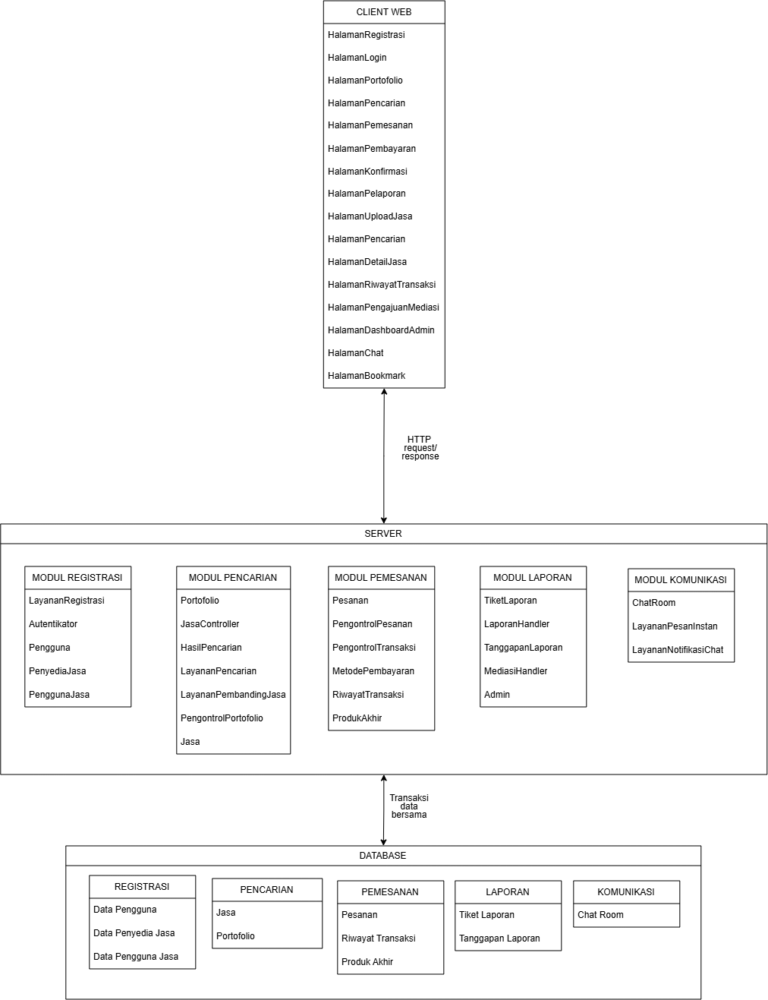
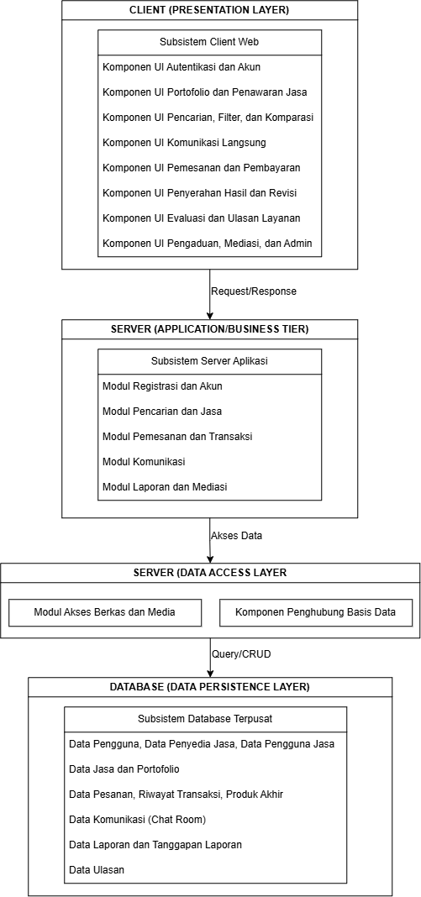

<h1>
IF2150 REKAYASA PERANGKAT LUNAK
 
TUGAS 6
 
ARSITEKTUR PERANGKAT LUNAK (APL)
</h1>
 

## CariJasa

### Untuk: Mikhael Andrian Yonathan

Dipersiapkan oleh:

| Informasi | Keterangan |
| --- | --- |
| Kelas | K-01 |
| Kelompok | G05  |
| Nama Kelompok | MAYOOOOOR  |

| NIM | Nama |
|---|---|
| 13525031 | Revandra Zacky Maharta |
| 13525079 | Danesh Rasyad Damotino |
| 13525088 | Theresia Estelina Ratu Udju |
| 13525127 | Edward Terrance Lie |
| 13525130 | Necia Aurely Greva Dedevi |

---

 
 

# BAB 1: Style/Pattern Arsitektur Acuan

Pada bagian ini, tentukan *architectural style* atau *pattern* yang menjadi acuan untuk aplikasi yang Anda kembangkan. Misalnya *layered architecture*, *client-server*, *repository*, *pipe and filter architecture*, atau MVC (*Model-View-Controller*).

## 1.1 Sytle Arsitektur Perangkat Lunak

### 1.1.1 Layered Architecture 
Layered Architecture adalah arsitektur yang membagi perangkat lunak menjadi beberapa *layer* (sub-bagian) berdasarkan masing-masing tanggung jawabnya. Setiap *layer* akan menyediakan *service* (layanan) bagi *layer* di atasnya dan menggunakan service dari layer di bawahnya melalui *interface* yang ditetapkan. Namun, layer dibawahnya tidak dapat menggunakan services dari layer di atasnya. Arsitektur ini dgunakan saat UI, business rule, dan akses penyimpanan membutuhkan batas (*boundary*) yang jelas untuk pengembangan implementasi di masa depan (*Scalability*)

Pada *Layered Architecture*
#### 1. Presentation Layer 

*Layer* yang meng-handle tampilan user interface dan interaksi (input dan tampilan informasi) ke pada user. 
Contohnya : 
- Halawan Web.
- Tampilan Mobile App.
- Desktop GUI 

#### 2. Business Layer
*Layer* yang memproses algoritma dan logika utama aplikasi, seperti logika bisnis, workflow, dan pemrosesan request dari user. Umumnya berada pada komponen controller
Contohnya : 
- Logika Validasi 
- Kalkulasi
- Algoritma Pemrosesan Query Pengguna

#### 3. Data Access Layer / Persistence Layer
*Layer* yang menerima data, menyimpan, dan mengatur data yang akan diletakkan di dalam database. Layer ini juga memastikan pemisahan terhadap hal-hal penting dalam data.
Contoh : 
- Query Database
- Caching
- API

#### 4. Database Layer
*Layer* penyimpanan data sesungguhnya tempat informasi disimpan. Biasanya berisikan data untuk masing-masing entitas yang dibuat.

Contoh : 
- Database Relasional (SQL, PostgreSQL)
- NoSQL (MongoDB)

### 1.1.2 Client-Server Achitecture
Client-Server Architecture adalah sebuah pola arsitektur perangkat lunak yang membagi sistem menjadi dua bagian utama, yaitu *client* dan *server*. Kedua belah pihak saling berkomunikasi dan bertukar data melalui sebuah protokol jaringan, misalnya HTTP. Dalam penggunaannya, *client* yang biasanya berupa antarmuka pengguna seperti *web browser* atau aplikasi *mobile*, bertugas untuk mengirimkan *request* sesuai dengan keperluannya. Sementara itu, *server* yang merupakan tempat pemrosesan dan penyimpanan data, bertugas menerima *request*, memprosesnya, lalu mengirimkan kembali *response* kepada *client*.

## 1.2 Alasan Pemilihan Style Arsitektur Perangkat Lunak 

### 1.2.1 Layered Architecture 

Perangkat Lunak CariJasa memiliki karakteristik berupa satu aplikasi web yang memiliki beberapa fitur terpisah yang digunakan untuk menjalankan layanan dengan baik. Perangkat lunak ini memerlukan beberapa karakteristik utama, seperti  Reliability, Security, dan Maintanaibility. Reliability diperlukan agar proses pencarian dapat dieksekusi dengan cepat dan tepat. Selain itu, perangkat lunak juga harus memastikan setiap respons dari server serta transaksi berjalan dengan baik. Kemudian, Security juga diperlukan karena setiap transaksi yang dilakukan berkaitan dengan ekonomi (uang) yang dipercayakan Pengguna Jasa maupun Penyedia Jasa, beserta keamanan kredensialnya. Terakhir, perangkat lunak juga harus dapat dikelola untuk memastikan keberjalana setiap fitur dengan baik. Oleh karena itu, diperlukan berbagai unit testing yang perlu dilakukan untuk setiap fitur yang ada. 

Perangkat Lunak CariJasa juga memiliki alur proses bisnis. Alur dimulai dengan registrasi pengguna, baik Pengguna Jasa, maupun Penyedia Jasa. Lalu Pengguna akan diminta untuk mengisi data diri dan portofolio (untuk Penyedia Jasa). Kemudian Pengguna Jasa dapat langsung mencari jasa yang mereka inginkan melalui search bar yang disediakan, juga menyimpan jasa yang menarik menggunakan *bookmark*. Penyedia Jasa dapat membuat postingan terkait jasa yang mereka tawarkan agar dapat digapai oleh pengguna. Kemudian, Pengguna Jasa dapat berkomunikasi melalui chat instan untuk bertanya sekaligus bernegosiasi kepada Penyedia Jasa. Setelah kedua pihak sepakat, Pengguna Jasa dapat melakukan transaksi serta pemesanan yang kemudian akan diproses dan dikerjakan oleh Penyedia Jasa. Setelah produk akhir dikirim, pengguna jasa dapat mengajukan revisi ataupun mengonfirmasi hasil pekerjaan yang dibuat. Setelah selesai, maka pengguna jasa dapat memberikan ulasan maupun laporan kepada admin lewat fitur ticketing. 

Dengan segala kebutuhan dan alur bisnis tersebut, *layered architecture* dipilih dengan alasan 

#### 1. Pemisahan Tanggung Jawab : 
Arsitektur ini membagi  sistem ke dalam lapisan yang jelas, seperti presentation layer, business layer, data access layer, dan database layer. Komponen ini, akan memastikan logika bisnis setiap fitur saling independen dan tidak tercampur aduk

#### 2. Kemudahan Pengujian :
Dengan perangkat lunak dibagi menjadi berbagai layer, developer dapat lebih mudah untuk melakukan tracing dan unit testing untuk setiap fitur yang dibuat. Hal ini akan memudahkan developer untuk memastikan keberjalanan tiap fitur berjalan secara simultan

#### 3. Keamanan yang lebih terjamin
Karena dilakukan pemisahan akses dan interaksi dari pengguna. Kondisi ini akan memperkecil risiko rusaknya integritas data, dan keamanan dalam transaksi secara ekonomi

### 1.2.2 Client-Server Achitecture
1. Pengguna yang bertindak sebagai pihak *client* tidak perlu menanggung beban pemrosesan sistem pada perangkat mereka, *client* cukup menggunakan antarmuka untuk mengirimkan berbagai *request*, seperti pencarian, pemesanan, ataupun pengunggahan data, lalu beban komputasi mayoritas ditanggung oleh pihak *server*.
2. Untuk platform yang menangani berbagai data penting seperti informasi akun, transaksi, dan berkas, Client-Server Achitecture menempatkan *server* sebagai pusat penyimpanan dan logika utama. Hal tersebut memastikan setiap *request* yang dikirim oleh *client* dikelola dengan standar keamanan dan aturan yang sama sehingga integritas dan standar data tetap terjaga.
3. Dapat menghubungkan banyak pengguna yang tersebar di berbagai lokasi yang berbeda. Dengan memanfaatkan protokol jaringan seperti HTTP, sistem memungkinkan terjadinya komunikasi dan sinkronisasi data antarpengguna melalui perantara *server* sehingga interaksi seperti pertukaran pesan dan pengiriman notifikasi dapat berjalan dengan lancar.

### 1.2.3 Alasan Digabung
Kedua Sudut Pandang ini dibutuhkan karena keduanya berada di tingkat operasi yang berbeda. Client-Server Architecture lebih berfokus pada pengembangan di tingkat global, mulai dari interaksi dengan client hingga memproses interaksi dari client. Sedagkan, Layered Architecture lebih berfokus pada menjamin ketersediaan fitur, kemudahan pengujian, hingga manajemen dalam penggunaan server. Dengan menggabungkan kedua arsitektur ini, pembuatan perangkat lunak akan menjadi lebih rapi dan terstruktur.

## 1.3 Penerapan Style Arsitektur P/L
### 1.3.1 Diagram Layered Architecture 

<i>Gambar 1.3.1 Diagram Layered Architecture</i>

### 1.3.2 Diagram Client-Server Architecture

<i>Gambar 1.3.2 Diagram Client-Server Architecture</i>
  
  
Tabel 1.1. Lingkungan Operasi Perangkat Lunak

| Komponen | Spesifikasi |
| :--- | :--- |
| Server | Node.js v22 dengan Next.js, dijalankan secara lokal (localhost) |
| Client | Web Browser Modern berbasis Chromium (Chrome, Firefox terbaru) |
| DBMS | PostgreSQL 15 pada Supabase sebagai basis data terpusat |
| OS | Cross-platform (Windows/Linux/MacOS) melalui browser |

---

# BAB 2: Identifikasi Komponen / Modul / Subsistem

Tabel 2.1. Identifikasi Komponen/Modul/Subsistem
| Nama Komponen/Modul/Subsistem | Kelas yang Dicakup (SKPL) | Jenis | Penjelasan |
| :--- | :--- | :--- | :--- |
| Subsistem Client Web | C04 (HalamanRegistrasi), C06 (HalamanLogin), C08 (HalamanPortofolio), C13 (HalamanUploadJasa), C15 (HalamanPencarian), C16 (HasilPencarian), C19 (HalamanDetailJasa), C21 (HalamanBookmark), C24 (HalamanChat), C28 (HalamanPemesanan), C29 (HalamanPembayaran), C30 (HalamanRiwayatTransaksi), C35 (HalamanKonfirmasi), C37 (HalamanPengumpulan), C38 (HalamanDeliverables), C40 (HalamanRequestRevisi), C44 (HalamanPelaporan), C47 (HalamanUlasan), C50 (HalamanPengajuanMediasi), C53 (HalamanDashboardAdmin) | CLIENT (PRESENTATION LAYER) | Menjalankan seluruh halaman tampilan web dan menerima input aksi pengguna di peramban. |
| Komponen UI Autentikasi dan Akun | C04 (HalamanRegistrasi), C06 (HalamanLogin) | CLIENT (PRESENTATION LAYER) | Menampilkan formulir pendaftaran dan autentikasi masuk akun pengguna. |
| Komponen UI Portofolio dan Penawaran Jasa | C08 (HalamanPortofolio), C13 (HalamanUploadJasa) | CLIENT (PRESENTATION LAYER) | Menampilkan formulir pembuatan jasa baru dan unggah portofolio pekerja. |
| Komponen UI Pencarian, Filter dan Komparasi | C15 (HalamanPencarian), C16 (HasilPencarian), C19 (HalamanDetailJasa), C21 (HalamanBookmark) | CLIENT (PRESENTATION LAYER) | Menampilkan pencarian, saringan hasil, detail, simpanan, dan pembanding jasa. |
| Komponen UI Komunikasi Langsung | C24 (HalamanChat) | CLIENT (PRESENTATION LAYER) | Menampilkan ruang percakapan obrolan langsung antar-pengguna. |
| Komponen UI Pemesanan dan Pembayaran | C28 (HalamanPemesanan), C29 (HalamanPembayaran), C30 (HalamanRiwayatTransaksi), C35 (HalamanKonfirmasi) | CLIENT (PRESENTATION LAYER) | Menampilkan formulir pemesanan, halaman pembayaran, riwayat transaksi, dan persetujuan pesanan. |
| Komponen UI Penyerahan Hasil dan Revisi | C37 (HalamanPengumpulan), C38 (HalamanDeliverables), C40 (HalamanRequestRevisi) | CLIENT (PRESENTATION LAYER) | Menampilkan pengiriman berkas hasil kerja dan formulir permintaan perbaikan pesanan. |
| Komponen UI Evaluasi dan Ulasan Layanan | C47 (HalamanUlasan) | CLIENT (PRESENTATION LAYER) | Menampilkan formulir pemberian nilai bintang serta ulasan pekerjaan. |
| Komponen UI Pengaduan, Mediasi dan Admin | C44 (HalamanPelaporan), C50 (HalamanPengajuanMediasi), C53 (HalamanDashboardAdmin) | CLIENT (PRESENTATION LAYER) | Menampilkan formulir laporan aduan, ruang mediasi sengketa, dan dasbor kerja admin. |
| Subsistem Server Aplikasi | C01 (Pengguna), C02 (PenyediaJasa), C03 (PenggunaJasa), C05 (LayananRegistrasi), C07 (Autentikator), C09 (Portofolio), C10 (PengontrolPortofolio), C11 (LayananUploadFile), C12 (Jasa), C14 (JasaController), C17 (LayananPencarian), C18 (LayananPembandingJasa), C20 (Bookmark), C22 (PengontrolBookmark), C23 (ChatRoom), C25 (LayananPesanInstan), C26 (LayananNotifikasiChat), C27 (Pesanan), C31 (PengontrolPesanan), C32 (PengontrolTransaksi), C33 (MetodePembayaran), C34 (RiwayatTransaksi), C36 (ProdukAkhir), C39 (PengajuanRevisi), C41 (RevisiHandler), C42 (PencairanDana), C43 (TiketLaporan), C45 (LaporanHandler), C46 (Ulasan), C48 (UlasanHandler), C49 (TanggapanLaporan), C51 (MediasiHandler), C52 (Admin) | SERVER (APPLICATION / BUSINESS TIER) | Mengolah logika sistem, aturan bisnis, alur transaksi, dan kendali data di server. |
| Modul Registrasi dan Akun | C01 (Pengguna), C02 (PenyediaJasa), C03 (PenggunaJasa), C05 (LayananRegistrasi), C07 (Autentikator), C52 (Admin) | SERVER (BUSINESS LAYER) | Mengurus pendaftaran akun, cek login kata sandi, dan pembagian hak akses pengguna. |
| Modul Pencarian dan Jasa | C09 (Portofolio), C10 (PengontrolPortofolio), C12 (Jasa), C14 (JasaController), C17 (LayananPencarian), C18 (LayananPembandingJasa), C20 (Bookmark), C22 (PengontrolBookmark) | SERVER (BUSINESS LAYER) | Mengurus penayangan jasa, pencarian kata kunci, perbandingan paket, dan simpanan jasa. |
| Modul Pemesanan dan Transaksi | C27 (Pesanan), C31 (PengontrolPesanan), C32 (PengontrolTransaksi), C33 (MetodePembayaran), C34 (RiwayatTransaksi), C36 (ProdukAkhir), C39 (PengajuanRevisi), C41 (RevisiHandler), C42 (PencairanDana) | SERVER (BUSINESS LAYER) | Mengatur siklus pesanan, keamanan titip uang, alur perbaikan tugas, dan pelepasan dana. |
| Modul Komunikasi | C23 (ChatRoom), C25 (LayananPesanInstan), C26 (LayananNotifikasiChat) | SERVER (BUSINESS LAYER) | Mengatur pengiriman pesan teks langsung dan penyampaian tanda notifikasi obrolan. |
| Modul Laporan dan Mediasi | C43 (TiketLaporan), C45 (LaporanHandler), C46 (Ulasan), C48 (UlasanHandler), C49 (TanggapanLaporan), C51 (MediasiHandler) | SERVER (BUSINESS LAYER) | Mengatur tiket aduan kendala, ruang obrolan penengah, ulasan penilaian, dan sanksi akun. |
| Modul Akses Berkas dan Media | C11 (LayananUploadFile) | SERVER (DATA ACCESS LAYER) | Mengatur validasi ukuran serta proses unggah dan unduh berkas media penyimpanan. |
| Komponen Penghubung Basis Data | Akses Basis Data (PostgreSQL) | SERVER (DATA ACCESS LAYER) | Menyediakan koneksi dan eksekusi perintah data antara logika server dan basis data. |
| Subsistem Database Terpusat | C01, C02, C03, C09, C12, C20, C23, C27, C33, C34, C36, C39, C42, C43, C46, C49 | DATABASE (DATA PERSISTENCE LAYER) | Menyimpan seluruh catatan data sistem secara permanen dalam satu basis data terpusat. |
| Data Pengguna, Data Penyedia Jasa, Data Pengguna Jasa | C01 (Pengguna), C02 (PenyediaJasa), C03 (PenggunaJasa) | DATABASE (DATA PERSISTENCE LAYER) | Menyimpan data profil akun pengguna, akun pekerja, akun pembeli, dan status akun. |
| Data Jasa dan Portofolio | C09 (Portofolio), C12 (Jasa), C20 (Bookmark) | DATABASE (DATA PERSISTENCE LAYER) | Menyimpan data daftar jasa penawaran, karya portofolio, dan daftar jasa yang disimpan. |
| Data Pesanan, Riwayat Transaksi, Produk Akhir | C27 (Pesanan), C33 (MetodePembayaran), C34 (RiwayatTransaksi), C36 (ProdukAkhir), C39 (PengajuanRevisi), C42 (PencairanDana) | DATABASE (DATA PERSISTENCE LAYER) | Menyimpan data pesanan kerja, pembayaran, riwayat transaksi, berkas hasil, dan perbaikan. |
| Data Komunikasi (Chat Room) | C23 (ChatRoom) | DATABASE (DATA PERSISTENCE LAYER) | Menyimpan data ruang percakapan dan seluruh rekaman riwayat pesan teks obrolan. |
| Data Laporan dan Tanggapan Laporan | C43 (TiketLaporan), C49 (TanggapanLaporan) | DATABASE (DATA PERSISTENCE LAYER) | Menyimpan data tiket laporan masalah pengguna, bukti aduan, dan keputusan tindakan admin. |
| Data Ulasan | C46 (Ulasan) | DATABASE (DATA PERSISTENCE LAYER) | Menyimpan data skor bintang penilaian pembeli, komentar evaluasi, dan bukti hasil kerja. |

---

# BAB 3: Model Arsitektur Perangkat Lunak

## 3.1 Logical View

Logical View dapat menunjukkan bagian-bagian utama dalam sistem beserta fungsi dan hubungan antarkomponennya. View ini sesuai untuk aplikasi yang dikembangkan karena dapat memperlihatkan pembagian tanggung jawab setiap komponen sehingga alur kerja sistem dapat terlihat dengan lebih jelas.

<i>Gambar 3.1 Diagram Logical View</i>

---

## 3.2 Development View (Package Diagram)
Development view akan mendeskripsikan organisasi statis kode dalam package modul, subsistem, dan dependensi di dalam penerapannya. 

Package diagram adalah diagram yang menampilkan perencanaan dan pengorganisasikan elemen, modul, *package* dalam sebuah proyek perangkat lunak. Package diagram akan menampilkan structure dan dependensi antar subsistem maupun modul serta menampilkan perbedaan sudut pandang dari sistem.

<i>Gambar 3.2 Diagram Development View</i>

# Referensi

- Sommerville, I. (2016). *Software Engineering* (10th ed.). Pearson. Chapter 6: *Architectural Design*: [https://software-engineering-book.com/slides/](https://software-engineering-book.com/slides/)
- Diagram arsitektur: [https://www.drawio.com/](https://www.drawio.com/), [https://staruml.io/](https://staruml.io/)
