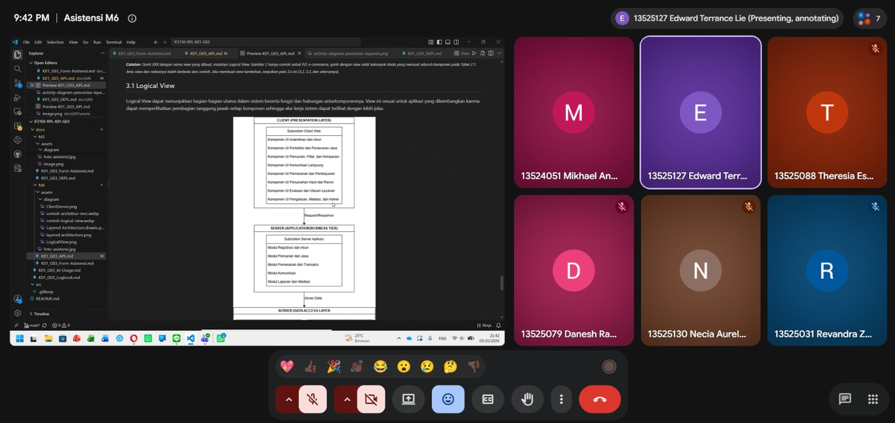

# Form Asistensi

## Tugas Besar IF2150 - Rekayasa Perangkat Lunak

| Informasi | Keterangan |
| --- | --- |
| **Hari** | Senin |
| **Tanggal** | 05/10/2026 |
| **Kelas** | K-01 |
| **Nomor Kelompok** | G-03  |
| **Nama Kelompok** | MAYOOOOOR  |
| **Nama Perangkat Lunak** | CariJasa |
| **Dokumen** | K01_G03_SKPL.md  |

### Anggota Kelompok

| NIM | Nama |
| --- | --- |
| 13525031 | Revandra Zacky Maharta |
| 13525079 | Danesh Rasyad Damotino |
| 13525088 | Theresia Estelina Ratu Udju |
| 13525127 | Edward Terrance Lie |
| 13525130 | Necia Aurely Greva Dedevi |

### Catatan

| Catatan |
| --- |
| 1. Entitas di business layer hanya dipakai untuk transit data, method ditaruh di data access layer. |
| 2. Beban kerja dibagi ke client untuk tampilan dan validasi awal, tetapi server dan database tetap ada *checker*. |
| 3. Database tidak perlu dikelompokkan (di Client-Server), satukan semua saja. Nanti ada tabel entitas dan tabel relasi. |
| 4. Bagian pengguna sebaiknya dipecah menjadi tabel pengguna, tabel penyedia jasa, dan tabel pengguna jasa yang nantinya saling terhubung. |
| 5. Database terpusat nantinya menggunakan Supabase. |
| 6. Model arsitektur cukup menampilkan logical view dan development view. |

**Notes for this section:**  
*Catatan dapat dituliskan dalam bentuk paragraf atau poin-poin, disesuaikan saja.* 

## Dokumentasi

<!--  -->

  

  <i>Gambar 1. Dokumentasi kegiatan asistensi.</i>

